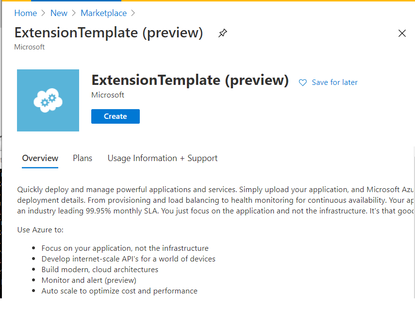
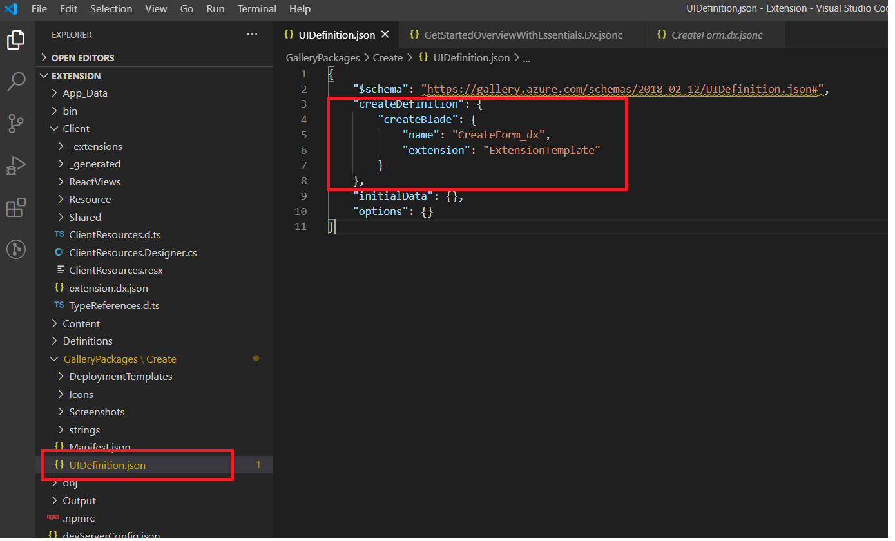

* [Getting Started with the Portal SDK](#getting-started-with-the-portal-sdk)
    * [Installing the Azure Portal SDK](#getting-started-with-the-portal-sdk-installing-the-azure-portal-sdk)
    * [Creating and running an Extension](#getting-started-with-the-portal-sdk-creating-and-running-an-extension)
    * [Exploring the Extension](#getting-started-with-the-portal-sdk-exploring-the-extension)
        * [Marketplace Create Experience](#getting-started-with-the-portal-sdk-exploring-the-extension-marketplace-create-experience)
        * [All services & browse integration](#getting-started-with-the-portal-sdk-exploring-the-extension-all-services-browse-integration)
        * [Resource Menu Blade](#getting-started-with-the-portal-sdk-exploring-the-extension-resource-menu-blade)
        * [Adding a Blade](#getting-started-with-the-portal-sdk-exploring-the-extension-adding-a-blade)
    * [Next steps](#getting-started-with-the-portal-sdk-next-steps)
    * [Questions?](#getting-started-with-the-portal-sdk-questions)
    * [FAQ:](#getting-started-with-the-portal-sdk-faq)
        * [I receive a "this site is not secure" or "your connection is not private" error when running the extension](#getting-started-with-the-portal-sdk-faq-i-receive-a-this-site-is-not-secure-or-your-connection-is-not-private-error-when-running-the-extension)
        * [The portal is never loaded so the extension has not sideloaded](#getting-started-with-the-portal-sdk-faq-the-portal-is-never-loaded-so-the-extension-has-not-sideloaded)
        * [I'm stuck. Where can I find help?](#getting-started-with-the-portal-sdk-faq-i-m-stuck-where-can-i-find-help)

# Getting Started with the Portal SDK

The Azure Portal SDK includes everything you need to build extensions for the portal. Included are variety of tools and samples that help developers build extensions on top of the framework.  There are three common experiences for Azure resources - All services integration and browse, create and  resource management. This guide will walk you through creating your first extension and running that extension.

## Installing the Azure Portal SDK

- Perform the [one time configuration steps](top-ap-cli.md#one-time-configuration-steps)
- [Optional] if using Visual Studio 2019 see [What are the IDE specific installs required for Visual Studio?](top-ap-cli.md#FAQ)

## Creating and running an Extension

1. Install the Azure Portal Developer CLI `npm install -g @microsoft/azureportalcli`

**Note**:
- To snap to a specific version include the version i.e `npm install -g @microsoft/azureportalcli@5.302.64701`.
- If @microsoft/azureportalcli is not found or you are not seeing authentication issues e.g `npm ERR! code E401` coming from npm you need to perform the one time authentication step as follows:

    -  click 'connect to feed' [button on this page](https://msazure.visualstudio.com/One/_packaging?_a=feed&feed=AzurePortal)

    - select npm in the left nav of the dialog that opens
    - follow the instructions in the dialog. If done correctly the PAT (secret) should be added to a .npmrc in your c:\users\youralias\.npmrc this file with the PAT should not be checked in and should be treated as a secret. The .npmrc file in  Extension\\.npmrc will not have a PAT but will have the registry.  Authentication should now succeed.

2. To create a new extension, run the following command -

    `ap new -n Microsoft_Azure_YourExtension -o ./targetdirectory`

3. To launch your extension:

- Run the command prompt **as administrator** > cd ./src/Default/Extension > run command `ap start`
- Or, Visual Studio Code **as administrator**: `Ctl+Shift+P > Tasks: Run Task > npm: start`
- Or, Visual Studio **as administrator** > Open `/src/Default.sln` in Visual Studio *as Admin* > Press F5.

4. Your extension will now be side loaded into the production portal. The portal will prompt you to allow your side loaded extension. Click allow.

Congratulations! You've just created your first extension.
You will find that the project template has implemented many of the key components of an extension.

- Marketplace Gallery Integration (How customers create resources of your resource type)
- All services integration and browse (How customers find your service and browse resources they have created of your resource type)
- Resource Menu Blade (How customers use and manage resources they have created)

## Exploring the Extension

### Marketplace Create Experience

The marketplace offers users a consistent way to browse and search the set of curated items that they can purchase/create.  If you plan on selling resources in the portal then you will need to integrate into the marketplace by building and publishing a package to the marketplace service. This section will walk you through the basics of the marketplace.

In the browser that has the portal and your side loaded extension, go to the marketplace by:

1. Clicking `+ Create a resource`
1. Then, click `See more in Marketplace`.

	

Then click the `Local Development` category. A marketplace item will appear that matches the name you selected when creating your project.

Click the gallery item `ExtensionTemplate` to launch the gallery items details blade.

The code to define the gallery package which provided the above experience is located in the GalleryPackages directory of the Extension project. It includes all the categorization, text, and images that you've seen so far.

When you click the `Create` button the portal will open the blade that is defined in GalleryPackages/Create/UIDefinition.json.

When you clicked `Create` the following `CreateForm_dx` from the project template is shown. This is a basic implementation of create that asks the user to specify the common Azure Resource properties.

The JSON that implements the create blade above is located in Client/Resource/Create/CreateForm.dx.jsonc. Note that the blade name "CreateForm_dx" matches the name in the UIDefinition.json file.

Fill out the create form and click New to actually create a resource.
For more information on creating gallery packages and create forms see the [gallery documentation](https://aka.ms/portalfx/gallery).
Now that you have created a resource it is time to explore how users will find that resource via the browse experience.

### All services &amp; browse integration

The first place to integrate your new experience in the Azure portal is to have a presence in the [All Service](https://portal.azure.com/?feature.customportal=false#allservices) list and global search. This is how customers find your service. To have a presence in the Azure Portal All Services list and other entry points such as the global search bar in the Portal, an asset has be to defined. An asset represents a service in Azure and most assets map to an ARM resource type.

In this new extension you have created, there is an existing asset called "My resources". You can find this asset in the all services list and the global search in the Portal -

The definition for this asset can be found at `../Client/Assets/ResourceAsset.dx.json`. You can modify the `assetType` JSON object to edit the asset.

Once a customer clicks into an asset, it takes the customer to a view called Browse. This view lets customers browse through all resources for a given resource type and drill into a particular resource. The data for browse is powered by [Azure resource graph](https://azure.microsoft.com/features/resource-graph/). A custom Azure resource graph query can be specified in the `assetType.browse` JSON object.

When a customer clicks on a particular resource, it will launch the Resource menu blade and the overview for the resource. We will explore the Resource Menu in subsequent sections of this doc.

### Resource Menu Blade

If you are building an extension for an Azure service then it's likely you have built a resource provider that exposes a top-level resource (e.g. Virtual Machine, Storage account).

If that's the case then the resource menu blade is a great starting point. The idea is that after the user selects a particular resource from the browse experience they land on a menu blade that has a mixture of standard resource features (e.g. activity log, role based access control, Support, etc) and service-specific features (e.g. Tables in a storage account). This section walks through the basics.

Many of the standard Azure experiences such as tags, locks, and access control have been automatically injected into your menu.

The definition for this resource can be found at `../Client/Assets/ResourceAsset.dx.json`. You can modify the `assetType.menu` JSON object to edit the resource menu. Each resource menu item opens a blade on the right that can be specified in the `blade` object.

### Adding a Blade

Blades are the main unit of UX that can be built in the Portal. They are pages that can be loaded in the portal. A lot of popular views in the Portal can be built by just defining a simple JSON file. One such example is the Overview blade available at `../Client/Assets/Views/ResourceOverviewWithEssentials.Dx.jsonc`.

To learn more about all the popular views that can be built by authoring just a JSON file, please refer to [this doc](top-declarative.md).

If your resource provider has published Azure REST API specs [(check here)](https://github.com/Azure/azure-rest-api-specs), we likely have views and asset definitions already generated on your behalf. [Browse the GeneratedExtension repo](https://msazure.visualstudio.com/One/_git/AzureUX-GeneratedExtension?path=/src/views) for generated extension resources under your resource provider & api version. You can copy these generated views, asset definitions and proxyasset definitions into your extension repo & edit and ship them.

[Click here to learn more about UX Auto Generation](top-extensions-autogeneration.md)

If the view you are trying to build is unique and is not one of the standard views that can be built by just authoring a JSON file, you can build your own view using React. You can learn more about React views [here](react-index.md).

## Next steps

- You are now ready to start developing your Azure Portal extension. Use `ap build` to build your extension, `ap serve` to run the local server, and `ap watch` to watch for changes and enable compile on save. You can learn more about AP CLI commands [here](top-ap-cli.md).
- You can also add auto-generated dx views and asset definitions into your extension. Learn more [here](top-extensions-autogeneration.md).

## Questions?

Ask questions on: [stackoverflow.microsoft.com](https://stackoverflow.microsoft.com/questions/tagged?tagnames=ibiza), for a set of tags supported by the Azure Portal team see [supported tags](https://aka.ms/portalfx/stackoverflow-sla-tags)

## FAQ:

### I receive a &quot;this site is not secure&quot; or &quot;your connection is not private&quot; error when running the extension

Example in Microsoft Edge:

Example in chrome Chrome:
Your connection is not private
Attackers might be trying to steal your information from localhost (for example, passwords, messages, or credit cards). Learn more
NET::ERR_CERT_AUTHORITY_INVALID

Solution:

- Save the certificate to disk by clicking those areas highlighted in red.

    

- Open the certificate from disk and install the certificate

    

- For `Store Location` select `Local Machine` and click Next
- Leave the remaining defaults selected and click through to finish.
- Terminate all browser instances in taskmgr and F5 again.

### The portal is never loaded so the extension has not sideloaded

This is generally a popup blocker. After running F5 if you only have one tab open to `https://localhost:44300` as opposed to two tabs then it is likely that your popup blocker is stopping the first tab from launching the second tab that loads the portal and sideloads your extension. To solve this simply enable `https://localhost:44300` in your browsers popup blocker.

### I&#39;m stuck. Where can I find help?

SOLUTION: There are a few ways to get help.
- Read the documentation located at [https://aka.ms/portalfx/docs](https://aka.ms/portalfx/docs).
- Read and experiment with the samples that are shipped with the SDK. They are located at `\My Documents\PortalSDK\FrameworkPortal\Extensions\SamplesExtension` directory.  The samples extension is F5'able locally on your development machine.  There is also a deployed version [here](https://aka.ms/portalfx/samples). Sections, tabs, and other controls can be found in the playground located at https://aka.ms/portalfx/playground.
- Read the [debugging guide](top-extensions-debugging.md).

If you are unable to find an answer, reach out to the Ibiza team at [Stackoverflow Ibiza](https://stackoverflow.microsoft.com/questions/tagged?tagnames=ibiza). For a list of topics and stackoverflow tags, see [supported tags](https://aka.ms/portalfx/stackoverflow-sla).
