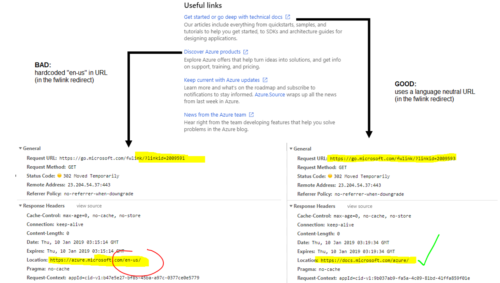

<a name="localization"></a>
## Localization

The Azure Portal is localized and globalized on two dimensions: the display language and the format culture. The display language is used to determine the language of the UI text strings. The format culture is used to determine the culture formatting of dates and currency. The portal uses a combination of heuristics and user settings to determine both these values for a given user. These values are provided to an extension at the time it is loaded. The heuristics used is open to modifications in the future to improve user experience.

The display language will be one of the 19 languages below. All extensions are required to provide UI text strings for all of the 19 languages.

| Language              	| Culture Code 	|
|-----------------------	|--------------	|
| English               	| en           	|
| German                	| de           	|
| Spanish               	| es           	|
| French                	| fr           	|
| Italian               	| it           	|
| Japanese              	| ja           	|
| Indonesian				| id			|
| Korean                	| ko           	|
| Portuguese (Brazil)   	| pt-BR        	|
| Russian               	| ru           	|
| Chinese (Simplified)  	| zh-Hans      	|
| Chinese (Traditional) 	| zh-Hant      	|
| Czech                 	| cs           	|
| Dutch                 	| nl           	|
| Hungarian             	| hu           	|
| Portuguese (Portugal) 	| pt-PT        	|
| Polish                	| pl           	|
| Swedish               	| sv           	|
| Turkish               	| tr           	|

For more information about internationalization requirements for your extension and the process to get the extension localized see [http://aka.ms/AzureGR](http://aka.ms/AzureGR). For onboarding localization, please reach out to the [DevRel Global Experiences Localization team](mailto:drlocprodpm@microsoft.com). 

<a name="localization-localizing-build"></a>
### Localizing build

The Azure Portal SDK provides localization support in two different flavors.

1. Resx + Satellite Resx

	1. The primary English `resx` must be in the folder that contains TypeScript of the extension. It's relative location in the folder determines the AMD module id of the set of strings. The name of the `resx` file must not contain any "." characters.
	2. A satellite `resx` file for the 17 non-English languages must be place in the same folder as the primary `resx` file. The name of the `resx` file will end with a "." followed by the language. For example, if your extension has a primary `resx` file named `ClientResources.resx`, then the satellite `resx` for Japanese will be named `ClientResources.ja.resx`.

1. Resx + Lcl files

Information regarding `lcl` files can be found [here](https://microsoft.sharepoint.com/teams/WAG/EngSys/Implement/OneBranch/Localization.aspx?a=1).

<a name="localization-consuming-localized-strings-in-typescript"></a>
### Consuming localized strings in TypeScript

During the compilation of an extension, the Azure Portal SDK parses the `resx` files inside the TypeScript folder and generates a TypeScript declaration file that contains the typing information about the localized strings available at runtime. If your extension has a primary `resx` named `ClientResources.resx`, then the SDK will generate a `ClientResources.d.ts` file.

To refer to the string in TypeScript, the module for the resource must first be imported. This allows for static typing to ensure the requested string exists at compile time:

```ts
import * as ClientResources from "ClientResources";
...
this.subtitle(ClientResources.hubsLensTitle);
```

There are many cases where you will refer to a string directly from `PDL`. The compiler needs to understand which module contains the string, as well as the resource key:

```xml
<Lens Name="PartsLens" Title="{Resource partsLensTitle, Module=ClientResources}">
```

<a name="localization-testing-localization"></a>
### Testing localization

The framework supports simple pseudo-localization of client side strings. This can be used to verify that your strings are coming from the `.resx` files, but it doesn't verify that your localization process is setup correctly.

This can be enabled by adding the following query string parameter:

[`https://portal.azure.com?l=qps-ploc`](https://portal.azure.com?l=qps-ploc)

You can force the portal to run in a specific language. This can be used to verify that the end-to-end localization process is setup correctly for a given language. Note: you may have to clear user settings for the language to switch successfully:

[`https://portal.azure.com?l=en`](https://portal.azure.com?l=en)

It may be helpful at development time to use pseudo-localization to ensure that new features are properly localized.

<a name="localization-marketplace"></a>
### Marketplace

Packages submitted to the Azure Marketplace must be localized as well. For more infoarmation, read [localization in the gallery](/gallery-sdk/generated/index-gallery.md#localization).

<a name="localization-language-and-format-culture-detection-apis"></a>
### Language and format culture detection APIs

You can access the user's current display language and format culture using the following TypeScript:

```ts
import * as Globalization from "MsPortalFx/Globalization";
var displayLanguage = Globalization.displayLanguage;
var formatCulture = Globalization.formatCulture;
```

This is exposed publically through the module `MsPortalFx/Globalization`. The Globalization API is a wrapper for the native [Javascript library - Intl](https://developer.mozilla.org/en-US/docs/Web/JavaScript/Reference/Global_Objects/Intl).

<a name="localization-handling-localization-for-links-to-documentation"></a>
### Handling localization for links to documentation

The Azure portal and extensions are making increasing use of links to other sites for documentation, including [docs.microsoft.com](https://docs.microsoft.com/), [azure.microsoft.com](https://azure.microsoft.com/), MS Learn and blogs.

When linking to docs, use "language neutral" URLs (e.g. "docs.microsoft.com/azure" rather than "docs.microsoft.com/en-us/azure") to ensure non-English users have a good experience whenever the destination site supports this (docs.microsoft.com, azure.microsoft.com and MSLearn support this). If the destination site does not support language detection, you need to adapt the destination URL based on current language.

When sending customers to docs.microsoft.com/azure.microsoft.com/MSLearn, let these external sites figure the customer's language preference. There is no requirement to match the Portal language. Besides being by far the easiest to implement and hard to get wrong, it's also a great customer experience as it allows a customer to have a preference for e.g. seeing Portal in one language and Docs in another.

Note: This recommendation is specific to links to external sites. When content from a site other than Portal is integrated (via iframe) in the Portal experience, its language should match the portal language.

<a name="localization-handling-localization-for-links-to-documentation-creating-a-link-to-a-doc"></a>
#### Creating a link to a doc

1. For external links to docs.microsoft.com/azure.microsoft.com/MSLearn always use language-neutral destination URLs as specified above. Once you have this language neutral URL, create a FWLink for the URL you would like to link to using the [URL Manager Tool](https://sftools.trafficmanager.net/am/redirection/home?options=host:go.microsoft.com). Make sure you are using `go.microsoft.com` as the Host when you create this link.
1. If you own an Azure extension, let your [localization contact](http://aka.ms/AzureGR) know that this content is being linked to in the portal to possibly prioritize localization of the linked content.
1. Verify that the link works correctly. Inspect the link to ensure they do NOT have hard-coded langugage in them (`docs.microsoft.com/en-us/azure` is bad, `docs.microsoft.com/azure` is good)
1. For FWLink redirects, inspect HTTP traffic and look for hard-coded language during the initial redirect response as shown below.




<a name="localization-formatting-numbers-currencies-and-dates"></a>
### Formatting numbers, currencies and dates

The Globalization Formatters enable you to easily format numbers, currencies, and dates for different cultures in JavaScript.

<a name="localization-formatting-numbers-currencies-and-dates-number-and-currency-formatter"></a>
#### Number and currency formatter

The syntax for number formating is `Globalization.NumberFormat.create([options])` where -

`options` - optional. An object with some or all of the following properties:

* `style` - The formatting style to use. Possible values are "decimal" for plain number formatting, "currency" for currency formatting, and "percent" for percent formatting; the default is "decimal".
* `currency` - The currency to use in currency formatting. Possible values are the ISO 4217 currency codes, such as "USD" for the US dollar, "EUR" for the euro, or "CNY" for the Chinese RMB. There is no default value; if the style is "currency", the currency property must be provided.
* `currencyDisplay` - How to display the currency in currency formatting. Possible values are "symbol" to use a localized currency symbol such as €, "code" to use the ISO currency code, "name" to use a localized currency name such as "dollar"; the default is "symbol".
* `useGrouping` - Whether to use grouping separators, such as thousands separators or thousand/lakh/crore separators. Possible values are true and false; the default is true.
* `minimumIntegerDigits` - The minimum number of integer digits to use. Possible values are from 1 to 21; the default is 1.
* `minimumFractionDigits` - The minimum number of fraction digits to use. Possible values are from 0 to 20; the default for plain number and percent formatting is 0; the default for currency formatting is the number of minor unit digits provided by the ISO 4217 currency code list (2 if the list doesn't provide that information).
* `maximumFractionDigits` - The maximum number of fraction digits to use. Possible values are from 0 to 20; the default for plain number formatting is the larger of minimumFractionDigits and 3; the default for currency formatting is the larger of minimumFractionDigits and the number of minor unit digits provided by the ISO 4217 currency code list (2 if the list doesn't provide that information); the default for percent formatting is the larger of minimumFractionDigits and 0.
* `minimumSignificantDigits` - The minimum number of significant digits to use. Possible values are from 1 to 21; the default is 1.
* `maximumSignificantDigits` - The maximum number of significant digits to use. Possible values are from 1 to 21; the default is minimumSignificantDigits.

Note: The following properties fall into two groups: `minimumIntegerDigits`, `minimumFractionDigits`, and `maximumFractionDigits` in one group, `minimumSignificantDigits` and `maximumSignificantDigits` in the other. If at least one property from the second group is defined, then the first group is ignored.

**Examples**

Basic usage -

```ts
import * as Globalization from "MsPortalFx/Globalization";
var number = 123456.789;

// User locale is 'de-DE'
// German uses comma as decimal separator and period for thousands
console.log(Globalization.NumberFormat.create().format(number));
// → 123.456,789

// User locale is 'ar-EG'
// Arabic in most Arabic speaking countries/regions uses real Arabic digits
console.log(Globalization.NumberFormat.create().format(number));
// → ١٢٣٤٥٦٫٧٨٩

// User locale is 'en-IN'
// India uses thousands/lakh/crore separators
console.log(Globalization.NumberFormat.create().format(number));
// → 1,23,456.789

// User locale is 'zh-Hans-CN-u-nu-hanidec' with Chinese decimal numbering system
// the nu extension key requests a numbering system, e.g. Chinese decimal
console.log(Globalization.NumberFormat.create().format(number));
// → 一二三,四五六.七八九
```

Using options -

```ts
import * as Globalization from "MsPortalFx/Globalization";
var number = 123456.789;

// request a currency format
// User locale is 'de-DE'
console.log(Globalization.NumberFormat.create({ style: 'currency', currency: 'EUR' }).format(number));
// → 123.456,79 €

// the Japanese yen doesn't use a minor unit
// User locale is 'ja-JP'
console.log(Globalization.NumberFormat.create({ style: 'currency', currency: 'JPY' }).format(number));
// → ￥123,457

// limit to three significant digits
// User locale is 'en-IN'
console.log(Globalization.NumberFormat.create({ maximumSignificantDigits: 3 }).format(number));
// → 1,23,000
```

<a name="localization-formatting-numbers-currencies-and-dates-date-formatter"></a>
#### Date Formatter

The syntax for number formating is `Globalization.DateTimeFormat.create([options])` where -

`options` - optional. An object with some or all of the following properties:

* `localeMatcher` - The locale matching algorithm to use. Possible values are "lookup" and "best fit"; the default is "best fit".
* `timeZone` - The time zone to use. The only value implementations must recognize is "UTC"; the default is the runtime's default time zone. Implementations may also recognize the time zone names of the IANA time zone database, such as "Asia/Shanghai", "Asia/Kolkata", "America/New_York".
* `hour12` - Whether to use 12-hour time (as opposed to 24-hour time). Possible values are true and false; the default is locale dependent.
* `formatMatcher` - The format matching algorithm to use. Possible values are "basic" and "best fit"; the default is "best fit". See the following paragraphs for information about the use of this property.The following properties describe the date-time components to use in formatted output, and their desired representations. Implementations are required to support at least the following subsets:
	* weekday, year, month, day, hour, minute, second
	* weekday, year, month, day
	* year, month, day
	* year, month
	* month, day
	* hour, minute, second
	* hour, minute

	Implementations may support other subsets, and requests will be negotiated against all available subset-representation combinations to find the best match. Two algorithms are available for this negotiation and selected by the `formatMatcher` property: A fully specified "basic" algorithm and an implementation dependent "best fit" algorithm.
    * weekday - The representation of the weekday. Possible values are "narrow", "short", "long".
    * Era - The representation of the era. Possible values are "narrow", "short", "long".
    * Year - The representation of the year. Possible values are "numeric", "2-digit".
    * Month - The representation of the month. Possible values are "numeric", "2-digit", "narrow", "short", "long".
    * Day - The representation of the day. Possible values are "numeric", "2-digit".
    * Hour - The representation of the hour. Possible values are "numeric", "2-digit".
    * Minute - The representation of the minute. Possible values are "numeric", "2-digit".
    * Second - The representation of the second. Possible values are "numeric", "2-digit".
    * timeZoneName - The representation of the time zone name. Possible values are "short", "long".

	The default value for each date-time component property is undefined, but if all component properties are undefined, then year, month, and day are assumed to be "numeric".


**Examples**

Using DateTimeFormat -

```ts
import * as Globalization from "MsPortalFx/Globalization";
var date = new Date(Date.UTC(2012, 11, 20, 3, 0, 0));
// formats below assume the local time zone of the locale

// America/Los_Angeles for the US
// US English uses month-day-year order
// User locale is 'en-US'
console.log(Globalization.DateTimeFormat.create().format(date));
// → "12/19/2012"

// British English uses day-month-year order
// User locale is 'en-GB'
console.log(Globalization.DateTimeFormat.create().format(date));
// → "20/12/2012"

// Korean uses year-month-day order
// User locale is 'ko-KR'
console.log(Globalization.DateTimeFormat.create().format(date));
// → "2012. 12. 20."

// Arabic in most Arabic speaking countries/regions uses real Arabic digits
// User locale is 'ar-EG'
console.log(Globalization.DateTimeFormat.create().format(date));
// → "٢٠‏/١٢‏/٢٠١٢"

// for Japanese, applications may want to use the Japanese calendar, where 2012 was the year 24 of the Heisei era
// User locale is 'ja-JP-u-ca-japanese' using the Japanese calendar
console.log(Globalization.DateTimeFormat.create().format(date));
// → "24/12/20"
```

Using options -

```ts
import * as Globalization from "MsPortalFx/Globalization";
var date = new Date(Date.UTC(2012, 11, 20, 3, 0, 0));

// request a weekday along with a long date // User locale is 'de-DE'
var options = { weekday: 'long', year: 'numeric', month: 'long', day: 'numeric' };
console.log(Globalization.DateTimeFormat.create(options).format(date));
// → "Donnerstag, 20. Dezember 2012"

// an application may want to use UTC and make that visible // User locale is 'en-US' options.timeZone = 'UTC';
options.timeZoneName = 'short';
console.log(Globalization.DateTimeFormat.create(options).format(date));
// → "Thursday, December 20, 2012, GMT"

// sometimes you want to be more precise // User locale is 'en-AU'
options = {
hour: 'numeric', minute: 'numeric', second: 'numeric',
timeZoneName: 'short'
};
console.log(Globalization.DateTimeFormat.create(options).format(date));
// → "2:00:00 pm AEDT"

// sometimes even the US needs 24-hour time // User locale is 'en-US'
options = {
year: 'numeric', month: 'numeric', day: 'numeric',
hour: 'numeric', minute: 'numeric', second: 'numeric',
hour12: false
};
console.log(date.toLocaleString(options));
// → "12/19/2012, 19:00:00"
```
