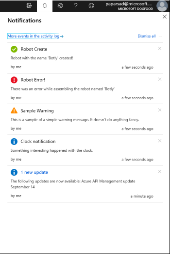

<a name="notifications"></a>
## Notifications

A notification is a short message that informs the user about an event that has occurred, or may occur, in the system. Notifications contain useful and relevant information.

The Notifications menu aggregates messages across all portal extensions and cloud-connected services. It does this by using local client notifications. Messages can be informational, warnings, or errors, as in the following image.



If you are using one of the older, PDL-based Notifications APIs, use the Notifications v3 upgrade guide located [here](/portal-sdk/generated/portalfx-notifications-upgrade.md) to convert your code to a newer edition.

<a name="notifications-notification-statuses"></a>
### Notification statuses

The following list contains the correct statuses for notifications -

**Information:** Successful or non-critical updates, like state changes, that do not require action on the part of the user. Some examples are stopped websites and services.

**Warning:** Problem or issue that might require attention, or could result in a more critical error. One example is a certificate that is about to expire. Urgent problem or condition that needs immediate action or attention.

**Error:** Problem or condition that should be investigated, like data loss.

<a name="notifications-best-practices-for-notifications"></a>
### Best Practices for notifications

- Avoid publishing notifications that users will not care about, or will not act on to resolve an issue.

- Avoid using multiple notifications when a single notification will suffice.

- Do not use notifications too often. Use them as sparingly as possible.

- Be as specific as possible, and follow the voice and tone guidelines when defining notifications. Notifications might be referenced out of context. Consequently, generic messages may not make sense or may not provide enough information leaving the user confused.

- Associate notifications with assets or blades, and ensure there is a clear next-action. When a notification is clicked, the related asset or blade is opened. If a notification does not have an asset or a related blade, it is essentially a useless dead-end.

<a name="notifications-client-notifications"></a>
### Client notifications

- Local client notifications are only visible in the current browser session. When the browser is refreshed or closed , all local client notifications are lost.

- Only use local client notifications if the error originates on the client and does not apply to other users.

- If you need to open a different blade based on asset metadata, or open a blade from another extension, use a deeplink or the more reliable BladeReference. If you need to open a different blade for a specific message, the extension should change the associated asset/deeplink before updating the notification.

<a name="notifications-one-time-notification"></a>
### One-time notification

The design of the extension may require one-time notifications that are not part of a long-running operation and do not result in server events. In these instances, the extension should publish a notification with the title, description, status, and linked asset or deeplink to their service. When the notification is clicked, the associated asset or deeplink will be opened.

To link a notification to an asset, the extension specifies the asset details, as in the following example-

```
import { CompletedStatus, publishNotification } from "Fx/Notification";
publishNotification({
    title: resx.myEvent.title,
    description: resx.myEvent.description,
    status: CompletedStatus.Information,
    linkTo: `#asset/${ExtensionDefinition.definitionName}/${ExtensionDefinition.AssetTypes.MyAsset.name}/${assetId}`,
});
```
The above applies to any valid deeplink.

To link a notification to a blade directly, the extension specifies the blade details, as in the following code-

```
import { BladeReference } from "Fx/Composition";
import { CompletedStatus, publishNotification } from "Fx/Notification";
publishNotification({
    title: resx.myEvent.title,
    description: resx.myEvent.description,
    status: CompletedStatus.Information,
    linkTo: new BladeReference({
        extension: "extensionName",
        blade: "BladeName",
        parameters: {
            bladeInputProperty1: "bladeInput1"
        }
    }),
});
```

To link a notification to a full external url, the extension specifies the URI, as in the following code-

```
import { CompletedStatus, publishNotification } from "Fx/Notification";
publishNotification({
    title: resx.myEvent.title,
    description: resx.myEvent.description,
    status: MsPortalFx.Hubs.Notifications.NotificationStatus.Information,
    uri: "https://www.bing.com"
});
```

For details on notifications you can update, or even longer running processes where the Portal will need to poll on your behalf before updating the notification, see these more in-depth docs:

For Knockout: [here](https://eng.ms/docs/products/azure-portal-framework-ibizafx/development/notifications/notifications-api)

For ReactView: [here](https://eng.ms/docs/products/azure-portal-framework-ibizafx/development/notifications/notifications-reactviews-api)
