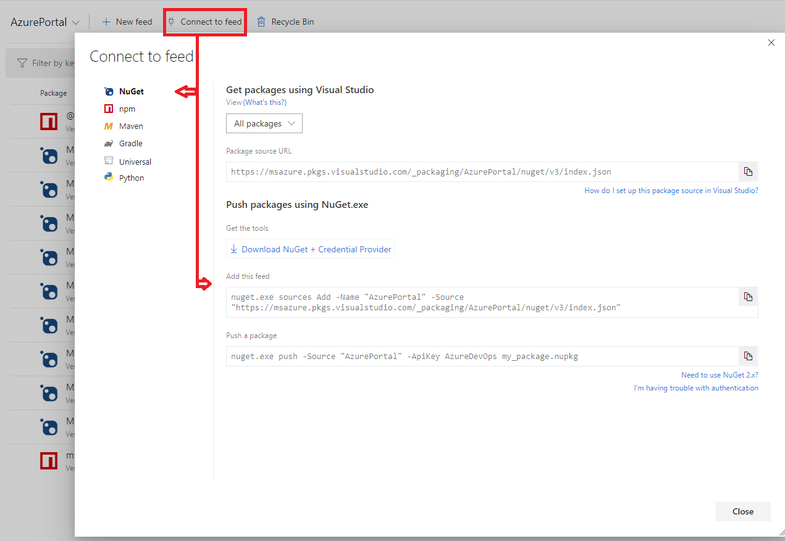

# Azure Portal SDK packages

## Updating your extension to a newer version of the SDK

Updating your extensions version of the Azure Portal SDK simply involves updating the versions of the NuGet packages and node modules that the extension references and updating any content files, such as *.d.ts and *.pde, that those packages deliver.

### Updating your NuGet Packages

* In Visual Studio
1. In Visual Studio open your Solution and select `Tools > NuGet Package Manager > Manage NuGet packages for Solution…`.
1. Select all `Microsoft.Portal.*` NuGet packages.
1. Click `Update`.
1. Copy over `/Content` files to get latest `*.d.ts` and `*.pde` files.
1. Build and fix any breaking changes, as described in [Breaking changes](https://aka.ms/portalfx/breaking).

* In Visual Studio Code
1. If you want to be specific about what packages and versions to update
   * update your /Extension/packages.config to contain the target versions you want to consume
   * delete your /packages folder that contains the old versions expanded packages
   * in vs code run `npm run restore` task run
   * update your \*.csproj with references to the new package path where you are referencing them. (this is required as versions are in the folder names).
1. If you want to update everything and have your \*.csproj automatically updated
   * run `nuget.exe update ./Extension/packages.config` supplying the path to your package config. NuGet CLI details are [here](https://docs.microsoft.com/en-us/nuget/tools/cli-ref-update)
1. Copy over `/Content` files to get latest `*.d.ts` and `*.pde` files.
1. Build and fix any breaking changes, as described in [Breaking changes](https://aka.ms/portalfx/breaking).

* In CoreXT
1. Find the latest SDK version number for your target environment from the SDK [downloads document](https://aka.ms/portalfx/downloads).
1. Update your `package.config` to the latest version of the SDK.
1. Run `init.cmd`.
    **NOTE**: Your $(Pkg*) references in your `csproj` file should automatically update to point at the newest restored NuGet.
1. Copy over `/Content` files to get latest `*.d.ts` and `*.pde` files.
    **NOTE**:  CoreXT does not copy content files. Typically, internal teams use either a `<Target />` or a `NuGetContentRestore` task to rehydrate the Content files from their CxCache.
1. Build and fix any breaking changes, as described in [Breaking changes](https://aka.ms/portalfx/breaking).

## Package References

The Azure Portal SDK ships framework assemblies, tools and test framework files as NuGet packages and node modules. In addition extension teams ship PDE files as NuGet packages that allow extensions to invoke blades and parts from other extensions at runtime. For more information about sharing extension PDE files as NuGet packages, see [portalfx-pde-publish.md](portalfx-pde-publish.md).

### Configure NuGet package sources for development

In order to download the NuGet packages required for extension development connect to an Azure DevOps Artifact registry choose a configuration that applies to your extension development context.

#### Microsoft Internal NuGet Feed

Portal SDK NuGet packages are published to an internal Azure DevOps Artifact registry.

NuGet packages are published to the [Official feed](https://msazure.visualstudio.com/One/_packaging?_a=feed&feed=AzurePortal) for internal consumers and then mirrored to the [AzurePortal feed](https://msazure.visualstudio.com/One/_packaging?_a=feed&feed=AzurePortal).
For internal teams depending on your internal build system the configuration of how to consume this feed will vary.  For the latest guidance on consuming the feed within your build system, consult your build system's documentation. For those using 1ES systems, see the NuGet in 1ES guide located at [https://www.1eswiki.com/wiki/NuGet_in_1ES](https://www.1eswiki.com/wiki/NuGet_in_1ES).

Third party extensions should use the AzurePortal feed. To connect

1. navigate to the [Azure Portal Artifact feed](https://msazure.visualstudio.com/One/_packaging?_a=feed&feed=AzurePortal)
1. Click `Connect to Feed`
1. Select `NuGet`
1. Follow instructions in `Add this feed`

### One time setup to Configure NPM registry for development

Portal SDK Node Modules are only published to Microsoft internal NPM registries. Once onboarded you will need to add a reference to the [Azure Portal Artifact feed](https://msazure.visualstudio.com/One/_packaging?_a=feed&feed=AzurePortal).

1. navigate to the [Azure Portal Artifact feed]
1. Click `Connect to Feed`
1. Select `NPM`
1. Follow instructions in `Install or restore packages using NPM`

**Note**: Do not commit your Personal Access Token (PAT). If done correctly your PAT will reside in a .npmrc in your %userprofile% not within your repo.

### Available Packages

Packages used by extension developers are separated into the following categories.

* [Development](#development)
* [Publishing in the marketplace](#publishing-in-the-marketplace)
* [Testing](#testing)
* [Shared Packages](#shared-packages)
* [Deprecated packages](#deprecated-packages)

The following sections describe the various packages by category. All packages are available in the referenced package source. Some packages are shipped as NuGet packages, and others as Node modules.  All packages in the following tables are NuGet packages unless they are annotated to be a node module.

### Development

After installation, NuGet packages that are used for development can be viewed in the `packages.config` file or in the NuGet **Package Manager** tool in **Visual Studio**.  Node modules can be viewed  in `package.json`.

| Package | Purpose |
| ------- | ------- |
| [@microsoft/hostingservice (node module)](https://msazure.visualstudio.com/One/_packaging?_a=package&feed=AzurePortal&package=%40microsoft%2Fportalhostingservice&protocolType=Npm&version=1.182.2201) | Contains local version of hosting service for dev/debug runtime used during extension development. |
| [Microsoft.Portal.Tools](https://msazure.visualstudio.com/One/_packaging?_a=package&feed=AzurePortal&package=Microsoft.Portal.Tools&protocolType=NuGet&version=5.0.302.26601) | 	Contains PDC, Ev2 generator, precompiler, build target files (.target), Definition files, and TypeScript compiler. |
| [Microsoft.Portal.Framework](https://msazure.visualstudio.com/One/_packaging?_a=package&feed=AzurePortal&package=Microsoft.Portal.Framework&protocolType=NuGet&version=5.0.302.26601) | Contains framework assemblies required for extension development. |
| [Microsoft.Portal.Security.AadCore](https://msazure.visualstudio.com/One/_packaging?_a=package&feed=AzurePortal&package=Microsoft.Portal.Security.AadCore&protocolType=NuGet&version=5.0.302.26601)	| Contains AAD module used for auth. |

### Publishing in the marketplace

| Package | Purpose |
| ------- | ------- |
| [Microsoft.Azure.Gallery.AzureGalleryUtility](https://msazure.visualstudio.com/One/_packaging?_a=package&feed=AzurePortal&package=Microsoft.Azure.Gallery.AzureGalleryUtility&protocolType=NuGet&version=5.1.0.19) | Contains tools to package, upload and update gallery items in the Azure Portal marketplace.|
| [Microsoft.Azure.Gallery.Common](https://msazure.visualstudio.com/One/_packaging?_a=package&feed=AzurePortal&package=Microsoft.Azure.Gallery.Common&protocolType=NuGet&version=5.1.0.19) | Common packages used by Microsoft.Azure.Gallery.AzureGalleryUtility|

### Testing

| Package | Purpose | Document |
| ------- | ------- | -------- |
| [msportalfx-test](https://aka.ms/portalfx/msportalfx-test/package) (node module) | Provides APIs for authoring UI-based test cases with Selenium in TypeScript. |
| [@microsoft/azureportal-ut](https://msazure.visualstudio.com/One/_packaging?_a=package&feed=AzurePortal&package=@microsoft/azureportal-ut&protocolType=Npm&version=5.302.26601) (node module)	| Provides APIs for authoring Unit Tests against extension code in TypeScript. Includes runtime, APIs, test runner support, trx and junit output for CI and code coverage reporting. See [top-extensions-unit-test.md](top-extensions-unit-test.md) for more details. |
| [Microsoft.Portal.TestFramework](https://msazure.visualstudio.com/One/Azure%20Portal/_packaging?feed=Official%40Local&package=Microsoft.Portal.TestFramework&protocolType=NuGet&_a=package) | Provides APIs for writing UI-based test cases with Selenium authored in CSharp. For more information about using the test framework, see [top-extensions-csharp-test-framework.md](top-extensions-csharp-test-framework.md). |
| [Microsoft.Portal.TestFramework.UnitTest](https://msazure.visualstudio.com/One/_packaging?_a=package&feed=AzurePortal&package=Microsoft.Portal.TestFramework.UnitTest&protocolType=NuGet&version=5.0.302.26601) | The [@microsoft/azureportal-ut](https://msazure.visualstudio.com/One/_packaging?_a=package&feed=AzurePortal&package=@microsoft/azureportal-ut&protocolType=Npm&version=5.302.26601)  node module shipped in a NuGet package for those that cannot consume the internal package source that is located at [here](https://msazure.visualstudio.com/One/_packaging?_a=package&feed=AzurePortal&package=@microsoft/azureportal-ut&protocolType=Npm&version=5.302.26601), or are on CoreXT or similar IDE's that require offline/disconnected builds. For more information about unit testing, see [top-extensions-unit-test.md](top-extensions-unit-test.md). |

### Shared packages

Portal Definition Exports, or PDE's, are extensions that are maintained by teams other than the Ibiza team and your team. These extensions are available for your use. This list of packages are contributed to by extension developers who are exposing functionality from their extension by way of shipping their PDE. The absence of an extension package from the list does not imply that the package does not exist, or does not ship. To verify whether an extension ships a NuGet package, reach out to the respective teams at [portalfx-extensions-contacts.md](portalfx-extensions-contacts.md) or [https://aka.ms/portalfx/uservoice](https://aka.ms/portalfx/uservoice).

| Package | Purpose | Document |
| ------- | ------- | -------- |
| [Microsoft.Portal.Extensions.KeyVault](https://msazure.visualstudio.com/One/_packaging?feed=AzurePortal&_a=package&package=Microsoft.Portal.Extensions.KeyVault&protocolType=NuGet) | Blades and parts shared by the KeyVault extension. | [portalfx-pde-keyvault.md](portalfx-pde-keyvault.md) |
| [Microsoft.Portal.Extensions.AAD](https://msazure.visualstudio.com/One/_packaging?feed=AzurePortal&_a=package&package=Microsoft.Portal.Extensions.AAD&protocolType=NuGet) | Blades and parts shared by the AAD extension. | [portalfx-pde-adrbac.md](portalfx-pde-adrbac.md) |
| [Microsoft.Portal.Extensions.Billing](https://msazure.visualstudio.com/One/_packaging?feed=AzurePortal&_a=package&package=Microsoft.Portal.Extensions.Billing&protocolType=NuGet) | Blades and parts shared by the Billing extension. | [portalfx-pde-billing.md](portalfx-pde-billing.md) |
| [Microsoft.Portal.Extensions.Hubs](https://msazure.visualstudio.com/One/_packaging?feed=AzurePortal&_a=package&package=Microsoft.Portal.Extensions.Hubs&protocolType=NuGet) | Blades and parts shared by the Hubs extension. | [portalfx-hubsextension-pde.md](portalfx-hubsextension-pde.md) |
| [Microsoft.Portal.Extensions.Insights](https://msazure.visualstudio.com/One/_packaging?feed=AzurePortal&_a=package&package=Microsoft.Portal.Extensions.Insights&protocolType=NuGet) | Blades and parts shared by the Insights extension. | [portalfx-pde-azureinsights.md](portalfx-pde-azureinsights.md) |
| [Microsoft.Portal.Extensions.Monitoring](https://msazure.visualstudio.com/One/_packaging?feed=AzurePortal&_a=package&package=Microsoft.Portal.Extensions.Monitoring&protocolType=NuGet) | Blades and parts shared by the Monitoring extension. | [portalfx-pde-monitoring.md](portalfx-pde-monitoring.md) |

### Deprecated packages

The following NuGet packages have been deprecated. Do not use these packages when building new extensions.

| Package | Purpose |
| ------- | ------- |
| Microsoft.Portal.Azure.Website | Sideload your extension instead, as specified in [top-extensions-sideloading.md](top-extensions-sideloading.md). |
| Microsoft.Portal.Azure.WebsiteNoAuth | Sideload your extension instead, as specified in [top-extensions-sideloading.md](top-extensions-sideloading.md). |
| Microsoft.Portal.Framework.Scripts | Use Microsoft.Portal.TestFramework.UnitTest instead, as specified in [top-extensions-unit-test.md](top-extensions-unit-test.md). |
| Microsoft.Portal.Tools.Etw | The recommended practice is to use the Extension Hosting Service as specified in [top-extensions-hosting-service.md](top-extensions-hosting-service.md) instead of custom deployment, as specified in [top-extensions-custom-deployment.md](top-extensions-custom-deployment.md). If you are self-hosting your extension, then this package provides the `EtwRelatedFilesUtility.exe` tool and sample configurations.  |
| Microsoft.Portal.TypeMetadata | Author typemetadata directly instead of using this package, as specified in [portalfx-data-typemetadata.md#non-generated-type-metadata](portalfx-data-typemetadata.md#non-generated-type-metadata). |
| [Microsoft.Portal.Tools.ContentUnbundler](https://msazure.visualstudio.com/One/Azure%20Portal/_packaging?feed=Official%40Local&package=Microsoft.Portal.Tools.ContentUnbundler&protocolType=NuGet&_a=package) | This NuGet has been deprecated. The recommended practice is to generate HostingService artifacts as part of native build. [Extension Hosting Service](top-extensions-hosting-service.md). |
