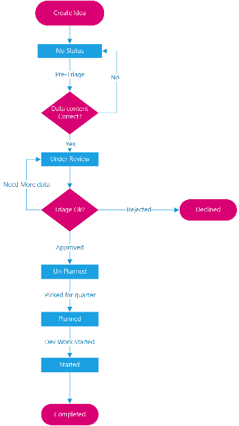
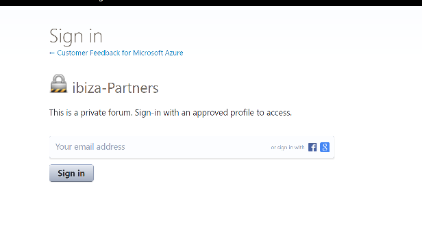

# Partner Request Process

The Partner Request process allows you to ask the Ibiza team for Framework improvements. 

We use a Uservoice forum, located at [https://aka.ms/portalfx/uservoice](https://aka.ms/portalfx/uservoice).  It allows you to post and vote on improvements. We consult this list for semester planning and try to get to the most impactful items. We do not get to all of them since requests come from over 100 partners.  The Uservoice process is not a substitute for working directly with our PM team for urgent or business critical requests.

 Once you submit, vote, or comment on an idea you will get email updates when we update the status. The following is a diagram of the process used to file a new request.

1. To get access to the [Uservoice forum](https://aka.ms/portalfx/uservoice), you need to sign-up at Uservoice with your "@microsoft.com" address. If you have not logged in with a Microsoft account, you will see the following screen.
    
    

1. Post the title for your idea by entering it in the box labeled "How can we improve Azure Portal Experience for customers?".

1. The screen will display ideas that may be similar to yours. Make sure your idea is unique by comparing it to the existing ones. If the idea exists, you can increase its the priority by "Voting". Ideas with more votes have a higher probability of being addressed.

1. If your idea is unique, you can enter a description and category previous to clicking the "Post idea" button. You may also want to update the title.

**NOTE**: Adding more details or attaching files in the Description box can lead to better understanding and potentially more votes.

1. The status of the item is initially marked "**blank**".  After we have prioritized an item and feel that it contains sufficient data to be acted upon, we will update the status, as in the following image.

    

    If an item needs more data, or is declined, then we will email you during the prioritization process.  The status of the items will be marked  "**In Progress**" after the Ibiza team begins the implementation process.

## How the Ibiza team prioritizes requests

The Ibiza team reviews [Uservoice](https://aka.ms/portalfx/uservoice)  ideas once per week. We will consider implementing the items that have received the most votes or align with existing priorities as bandwidth permits. We also assign a higher priority to requests that unblock a scenario that is required to complete a benchmark usability task. For more urgent requests, please contact <a href="mailto:ibizafxpm@microsoft.com">ibizafxpm@microsoft.com</a> to engage with PMs on our team.