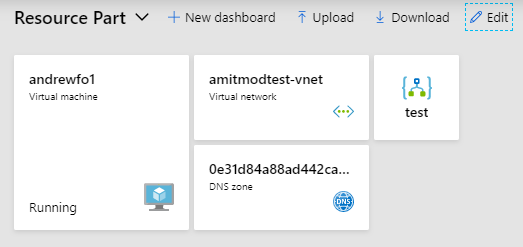

<a name="resourcepart"></a>
## ResourcePart

The ResourcePart is a part provided by the portal framework for the purpose of pinning ARM resources to dashboards.  Using the resource part to represent pinned resources improves the load times for customer dashboards because the extension which owns the resource is not loaded. For example if 5 resources of different types are pinned using extension provided parts then when the dashboard loads the portal must load 5 different extensions.   However if all 5 extensions are using the resource part which is located in the HubsExtension then the only extension required to be loaded is the Hubs.

Extensions can use this part for pinning their resource blades and parts with very little investment. There is the additional benefit that this reduces the amount of code that extensions need to maintain.



<a name="resourcepart-pinning-resources-from-browse"></a>
### Pinning resources from browse

The browse experience can use this part for pinning resources.   This simply requires that the PartName in a AssetType in PDL be "{ResourcePart}".

`\Client\V1\ResourceTypes\Document\Author.pdl`

```xml

<AssetType Name="Author"
           ViewModel="{ViewModel Name=AuthorViewModel, Module=./Document/AssetViewModels/AuthorViewModel}"
           CompositeDisplayName="{Resource AssetTypeNames.Author, Module=ClientResources}"
           Icon="{Svg File=../../../Svg/Documents/author.svg}"
           BladeName="AuthorBlade"
           PartName="{ResourcePart}">

```


<a name="resourcepart-pinning-a-blade"></a>
### Pinning a blade

Blades which represent a resource can also be pinned with the resource part.  This is supported for both noPDL blades and legacy blades.  The blades only required parameter must be named 'id' and a string type.  To pin a modern noPDL blade simply return a part reference for the ResourcePart from the [onPin method](top-blades-advanced.md#making-your-blade-pinnable-to-a-dashboard) as in this example:

`Client\V2\ResourceTypes\VirtualServer\Composition\Web\Blade.ts`

```typescript

public onPin() {
    const { parameters } = this.context;
    return PartReferences.forExtension("HubsExtension").forPart("ResourcePart").createReference({ parameters: parameters });
}

```

The blade must also have the @Pinnable decorator declared.

Legacy blades which were writting in PDL can also be pinned with the ResourcePart.  As with noPDL blades there must be 1 paramter named 'id'.

```xml
       <TemplateBlade Name="AuthorBlade" .. Pinnable="True".. >
          ..
           <PinnedResourcePart />
```

<a name="resourcepart-redirecting-existing-parts-on-dashboards"></a>
### Redirecting existing parts on dashboards

If this is a existing asset type for which the ResourcePart is replacing a custom part then a redirect will also need to be added.   The redirect will change these custom part instances on dashboards to be the new ResourcePart type.  The redirect is declared in PDL.   It can be located in any PDL file though for organizational purposes it would best to place it in the same file which the AssetType is declared.   The PDL to redirect existing pinned parts to the new ResourcePart looks like this:

`\Client\V1\ResourceTypes\Document\Author.pdl`

```xml

<RedirectPart Name="AuthorPart">
  <ResourcePart />
</RedirectPart>

```

<a name="resourcepart-displaying-resource-status"></a>
### Displaying resource status

This step is optonal.  You can choose to have the resource part to display the resource status by following the instructions below.  The resource part queries the Azure Resource Graph (ARG) for resource status.  However status is calculated differently for each resource type.   Furthermore the status value is not localized.   The extension needs to provide a ARG query that contains the status property.  Furthermore the status column needs to be specified in the resource browse settings.

<a name="resourcepart-displaying-resource-status-authoring-a-arg-query"></a>
#### Authoring a ARG query

In the portal SDK ARG queries are saved in text files with the .kml extension.  ARG queries are very similar Kusto queries.  The portal has a ARQ query blade which can be used to author and test the query.

https://portal.azure.com/#blade/HubsExtension/ARGQueryBlade

Once you have a query which contains a status column create a .kml file and save it there.  Typically you would want to save this file in the same location where the pdl file which contains your AssetType is located.  A sample *unlocalized* query would look like this:

```
where type == 'microsoft.test/virtualservers' |
extend status = properties.status
```

<a name="resourcepart-displaying-resource-status-adding-the-arg-query-to-the-resource-type"></a>
#### Adding the ARG query to the resource type

The ARG query needs to be added to the AssetType.   You need to specify four things.

* The name of the file that contains your newly created query
* The column(s) you to share with the new ARG browse experience
* The default columns to display in browse
* The name of the status column (for consumption by the resource part)

Here is a sample AssetType which has these.   This sample is also included in the SDK samples

```xml
  <AssetType Name="VirtualServer"
             ...
             PartName="{ResourcePart}">
    <Browse Type="ResourceType"
            UseCustomConfig="true"
            UseSupplementalData="true"
            Query="{Query File=./VirtualServerQuery.kml}"
            DefaultColumns=" status">
      <Summary StatusColumn="status" />
      <Column Name="status"
            DisplayName="{Resource Columns.VirtualServer.status, Module=ClientResources}"
            Description="{Resource Columns.VirtualServer.statusDescription, Module=ClientResources}"
            Format="String"
            WidthInPixels="80" />
    </Browse>
```

<a name="resourcepart-displaying-resource-status-localizing-strings-in-the-query"></a>
#### Localizing strings in the query

ARG does not return localized strings.   However at compile time the Portal SDK has the ability to replace values in the query with localized strings contained in the extensions resx file. The syntax for referencing a localized string in the query is similar to the syntax used in PDL.   Here is a sample query that uses the [case()](https://kusto.azurewebsites.net/docs/query/casefunction.html) operator to convert strings to localized values.

```
where type == 'microsoft.test/printers'
| extend model = properties.model
| extend status = case(
    tolower(properties.status) == 'working', '{{Resource Status.Printer.working, Module=ClientResources}}',
    tolower(properties.status) == 'jammed', '{{Resource Status.Printer.jammed, Module=ClientResources}}',
    tolower(properties.status) == 'damaged', '{{Resource Status.Printer.damaged, Module=ClientResources}}',
    tolower(properties.status) == 'out-of-paper', '{{Resource Status.Printer.outOfPaper, Module=ClientResources}}',
    'Unknown')
```

