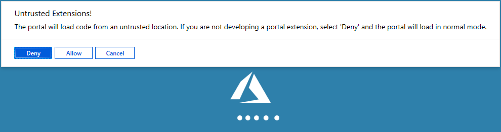
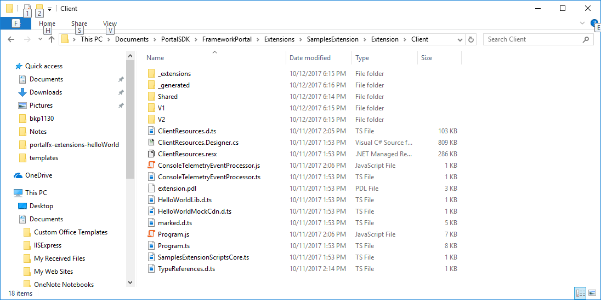

<a name="portal-extension-samples"></a>
# Portal Extension Samples

<a name="portal-extension-samples-overview"></a>
## Overview

The Azure Portal team ships many samples that extension developers can use to learn.

When you install the Portal SDK, located at [http://aka.ms/portalfx/download](http://aka.ms/portalfx/download), the samples are installed as well. The source for the samples is located in the `Documents\PortalSDK\FrameworkPortal\Extensions\SamplesExtension` folder.

Samples Extension can be downloaded, built and side loaded to portal from the [AzureUX-SamplesExtension](https://msazure.visualstudio.com/One/_git/AzureUX-SamplesExtension) repo.

For the latest controls we have developed a new playground, located at  [https://aka.ms/portalfx/playground](https://aka.ms/portalfx/playground). The playground gives you a listing of all the recommended controls as well as a sample page for each control. The sample pages  have documentation for each option and view model property, and they will let you see a working copy of the control and try out different control options.

For help you can ask a question in the internal StackOverflow tool located at [https://stackoverflow.microsoft.com/questions/tagged?tagnames=ibiza](https://stackoverflow.microsoft.com/questions/tagged?tagnames=ibiza). The Ibiza team monitors certain tags as defined in [portalfx-stackoverflow.md](portalfx-stackoverflow.md).

<a name="portal-extension-samples-overview-clone-build-and-run-your-local-samples-extension"></a>
### Clone, Build and Run your local samples extension

 Clone the template repo

    a. `git clone https://msazure.visualstudio.com/DefaultCollection/One/_git/AzureUX-SamplesExtension`

1. [Optional] To snap to a specific version of the template in this example SDK version 5.0.302.19601

    a. `git fetch --tags`

    a. `git checkout 5.0.302.19601` **Note** replace with version of the framework you which to snap to.

1. Navigate to the `/src/` folder in your AzureUX-SamplesExtension repository.
1. From the command prompt, run `ap start`.
1. Note at this point check if your browser has blocked popups and enable for localhost.
1. Your extension will now be side loaded into the production portal. The portal will prompt you to allow your side loaded extension. Click allow and you will be redirected to the samples extension.



<a name="portal-extension-samples-v1-versus-v2"></a>
## V1 versus V2

The samples are structured into two directories, **V1** and **V2**, as in the following example.

 

<a name="portal-extension-samples-v1-versus-v2-v2"></a>
### V2

The samples in the **V2** directories use the most recent patterns. They contain the collection of new APIs that are meant to be the only set of APIs needed to develop an Ibiza extension that performs well and is accessible.

The **V2** samples address the following API areas.

* New variations TemplateBlade, FrameBlade, MenuBlade

* Blade-opening and closing `container.openBlade`, among others

* no-PDL TypeScript decorators that define all recommended Blade/Part variations

* Forms that do not use **V1** EditScope. For more information about EditScope, see [portalfx-legacy-editscopes.md](portalfx-legacy-editscopes.md).

<a name="portal-extension-samples-v1-versus-v2-v1"></a>
### V1

The **V1** APIs use APIs that support previous UX patterns, are becoming obsolete, or are less commonly used.  The **V1** APIs are also more difficult to use than the new APIs, for both the UX design and  the associated APIs.

The following **V1** concepts should not be used when **V2** APIs can be used instead.

* Blades that contain Parts
* **V1** Blade-opening -- Selectable/SelectableSet APIs
* EditScope
* Fixed-width Blades
* **V1** Forms that use EditScope
* ParameterCollector/ParameterProvider
* PDL

**NOTE**: Building the **V2** support is still in process, therefore  the previously-listed **V1** concepts are not completely deprecated. For example, the source code for small, medium, and large blades is located in the `<dir>\Client\V1\Blades\BladeWidth`  directory. In the meantime, use **V1** APIs in places where a **V2** replacement is not evident.

 
<a name="portal-extension-samples-frequently-asked-questions"></a>
## Frequently asked questions


<!-- TODO:  FAQ Format is ###Link, ***title***, Description, Solution, 3 Asterisks -->
<a name="portal-extension-samples-frequently-asked-questions-samples-will-not-compile"></a>
### Samples will not compile

***How do I fix this?***

 DESCRIPTION:  

  By default, the samples are not aware of whether V1 or V2 is being used, or whether the IDE options match the version. There may be an error message TS1219.  Errors may also occur based on the version of the SDK.

 SOLUTION: 

 Add a `tsconfig.json` file to the project that specifies that decorators are experimental, as in the following code.

 ```cs
 {
  "compilerOptions": {
    "noImplicitAny": false,
    "noEmitOnError": true,
    "removeComments": false,
    "sourceMap": true,
    "target": "es5",
    "experimentalDecorators": true
  },
  "exclude": [
    "node_modules"
  ]
}
 ```
 
 For more information, see [https://stackoverflow.com/questions/35460232/using-of-typescript-decorators-caused-errors](https://stackoverflow.com/questions/35460232/using-of-typescript-decorators-caused-errors).

 * * *

<a name="portal-extension-samples-frequently-asked-questions-cannot-launch-iis"></a>
### Cannot launch IIS

*** Unable to launch the Microsoft Visual Studio IIS Express Web server***

DESCRIPTION:

Failed to register URL "https://localhost:44306/" for site "SamplesExtension" application "/". Error description: Cannot create a file when that file already exists. (0x800700b7)

SOLUTION: 

Terminate IIS express processes in Task Manager and press F5 again.

* * *
