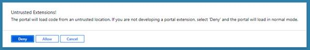
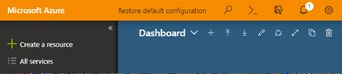

<a name="overview"></a>
## Overview
   
Side loading lets you run a local development version of your extension against the production portal on a per user basis. This is the recommended approach for your dev / test loop. 

<a name="quick-reference-by-example"></a>
## Quick Reference by Example

Both `ap serve` and `ap start` will compose a side load uri and load the browser for you [https://aka.ms/portalfx/apclidoc](https://aka.ms/portalfx/apclidoc).  If you are manually composing it see the following examples.

* Sideload single extension from localhost

	`https://portal.azure.com/?feature.canmodifyextensions=true#?testExtensions={"Microsoft_Azure_Demo":"https://localhost:1339/demo"}`

* Sideload multiple extensions from localhost

	`https://portal.azure.com/?feature.canmodifyextensions=true#?testExtensions={"Microsoft_Azure_Demo":"https://localhost:1339/demo","Microsoft_Azure_AnotherExtension":"https://localhost:1340/anotherextension" }`

* Sideload extension that is deployed on hosting service in friendly name or stage

	`https://portal.azure.com?feature.canmodifystamps=true&Microsoft_Azure_Demo=friendlyname`

* Sideload extension running on, or mapped to, domain other than localhost

  ```typescript

    MsPortalImpl.Extension.registerTestExtension({ 
      name: "Microsoft_Azure_Demo", 
      uri: "https://someotherdomain.com:44301 " }
  );
  ```

<a name="automatically-sideloading-step-by-step"></a>
## Automatically sideloading step by step

<a name="automatically-sideloading-step-by-step-step-1"></a>
### Step 1

Run `ap serve` or ap `start`.

<a name="manually-sideloading-step-by-step"></a>
## Manually Sideloading step by step

<a name="manually-sideloading-step-by-step-step-1-1"></a>
### Step 1

Register the extension for side loading using one of the following two methods.

* If the extension is running on localhost. This is the recommended and most common method of sideloading an extension.

	The query string and fragment can only be used if the extension is on the localhost and is served over SSL.  

	Skip to [Step 2](#step-2-accept-the-allow-dialog) if the Azure Portal Extension project template for **Visual Studio** was used to scaffold the initial extension. The scaffolded extension will automatically compose a side-loading query string and fragment when running the web project.  

	To manually compose your query string and fragment, continue as follows.

	The following is the syntax of a query string that can be used to load an extension by using the address bar in the browser.

	`https://<environment>/?feature.canmodifyextensions=true#?testExtensions={"<extensionName>":"https://localhost:<portNumber>/<extensionHostingServiceName>"}`

	where

	* **environment**: Portal environment in which to load the extension. Portal environments are `portal.azure.com`, `rc.portal.azure.com`, `ms.portal.azure.com`, and `df.onecloud.azure-test.net`.

	* **feature.canmodifyextensions**: set to true to support loading untrusted extensions.  This feature flag grants permission to the Portal to load extensions from URLs other than the ones that are typically used by customers. It triggers an additional Portal UI that indicates that the Portal is running with untrusted extensions.

	* **extensionName**: Matches the name of the extension, without the angle brackets, as specified in the `<Extension>` element in the `extension.pdl` file.

	* **portNumber**: Optional. The port number where the extension is hosted on the endpoint that serves the extension, as in the following example: `https://localhost:1339/demo`
	
	* **extensionHostingServiceName**: The value of property `extensionHostingServiceName` in devServerConfig.json

	Example

	The following complete URL was built using the previous syntax to sideload the extension named "Microsoft_Azure_Demo" into `portal.azure.com`, to run on localhost port 1339. It registers the extension only for the current user session.

	`https://portal.azure.com/?feature.canmodifyextensions=true#?testExtensions={"Microsoft_Azure_Demo":"https://localhost:1339/demo"}`

	On occasion your changes may span multiple extensions. The following demonstrates how to sideload multiple extensions running on localhost.

	`https://portal.azure.com/?feature.canmodifyextensions=true#?testExtensions={"Microsoft_Azure_Demo":"https://localhost:1339/demo","Microsoft_Azure_AnotherExtension":"https://localhost:1340/anotherextension" }`

* If the extension is deployed using a friendly name in Hosting Service.

	Format

	`https://portal.azure.com?feature.canmodifystamps=true&<extensionName>=<friendlyNameOrStage>`

	Example

	The following example loads the version of `Microsoft_Azure_Demo` that was deployed to the hosting service using the friendly name "somenewfeature".

	`https://portal.azure.com?feature.canmodifystamps=true&Microsoft_Azure_Demo=somenewfeature`

	For more information about testing extensions in the hosting service, see [top-extensions-hosting-service.md#friendly-names-and-sideloading](top-extensions-hosting-service.md#friendly-names-and-sideloading).

<a name="manually-sideloading-step-by-step-step-2-accept-the-allow-dialog"></a>
### Step 2 Accept the allow dialog

Click on the `Allow` button to sideload the extension, as in the following image.


	
<a name="manually-sideloading-step-by-step-step-3-verify-that-the-extension-side-loaded"></a>
### Step 3 Verify that the extension side loaded

Press  `ctl+alt+d` and click "Open Debug Hub". Locate the name of the sideloaded extension in the Debug pane.

<a name="manually-sideloading-step-by-step-step-4-test-and-debug-your-extension"></a>
### Step 4 Test and debug your extension

For general information about debugging and testing, see [top-extensions-debugging.md](top-extensions-debugging.md).

For information about debugging switches or feature flags, see [top-extensions-flags.md](top-extensions-flags.md).

<a name="manually-sideloading-step-by-step-step-5-restore-default-configuration"></a>
### Step 5 Restore default configuration

If you used the `registerTestExtension` method, restore the original extension configuration for your user by clicking the "Restore default configuration", as in the following image.
	
 

	
To do this programmatically, run the following from the browser's Developer Tools console.

`MsPortalImpl.Extension.unregisterTestExtension ("<extensionName>");`
	 
Example 
 
`MsPortalImpl.Extension.unregisterTestExtension ("Microsoft_Azure_Demo");`
 

 ## Frequently asked questions


<!-- TODO:  FAQ Format is ###Link, ***title***, Description, Solution, 3 Asterisks -->

<a name="manually-sideloading-step-by-step-portal-never-shows-up"></a>
### Portal never shows up

***When sideloading via the query string or fragment or via F5 the tab with the portal never shows up.***

SOLUTION: 

Check that your browser's popup blocker is not blocking the second tab from being loaded.

* * *

<a name="manually-sideloading-step-by-step-extension-will-not-sideload"></a>
### Extension will not sideload

***My Extension fails to side load and I get an ERR_INSECURE_RESPONSE in the browser console***


In this case the browser is trying to load the extension but the SSL certificate from localhost is not trusted.

SOLUTION:

Install/trust the certificate.

Please checkout the stackoverflow post: [https://stackoverflow.microsoft.com/questions/15194/ibiza-extension-unable-to-load-insecure](https://stackoverflow.microsoft.com/questions/15194/ibiza-extension-unable-to-load-insecure)

Items that are specifically status codes or error messages can be located in [portalfx-extensions-status-codes.md](portalfx-extensions-status-codes.md).

* * *

<a name="manually-sideloading-step-by-step-sandboxed-iframe-security"></a>
### Sandboxed iframe security

***I get an error 'Security of a sandboxed iframe is potentially compromised by allowing script and same origin access'. How do I fix this?***

You need to allow the Azure Portal to frame your extension URL. For more information, see[portalfx-deployment-sovereign.md#allowedparentframe](portalfx-deployment-sovereign.md#allowedparentframe).

* * *


<a name="manually-sideloading-step-by-step-sideloading-in-chrome"></a>
### Sideloading in Chrome

***Ibiza sideloading in Chrome fails to load parts***
    
Enable the `allow-insecure-localhost` flag, as described in [https://stackoverflow.microsoft.com/questions/45109/ibiza-sideloading-in-chrome-fails-to-load-parts](https://stackoverflow.microsoft.com/questions/45109/ibiza-sideloading-in-chrome-fails-to-load-parts)

* * *

<a name="manually-sideloading-step-by-step-where-are-the-faq-s-for-general-extension-debugging"></a>
### Where are the FAQ&#39;s for general extension debugging?

The FAQs for debugging extensions is located at [portalfx-extensions-faq-debugging.md](portalfx-extensions-faq-debugging.md).

* * *

<a name="manually-sideloading-step-by-step-are-gallery-packages-sideloaded"></a>
### Are gallery packages sideloaded?

When configured correctly gallery packages from the extension running on localhost are sideloaded and made available in the portal at  `+ Create a resource >  see all > Local Development`  if your gallery packages are not showing up there see [https://github.com/Azure/portaldocs/blob/master/gallery-sdk/generated/index-gallery.md#gallery-package-development-and-debugging](https://github.com/Azure/portaldocs/blob/master/gallery-sdk/generated/index-gallery.md#gallery-package-development-and-debugging).

* * *

<a name="manually-sideloading-step-by-step-how-do-i-mark-automated-tests-as-test-synthetic-traffic-so-that-it-does-not-show-up-in-reporting"></a>
### How do I mark automated tests as test/synthetic traffic so that it does not show up in reporting?

Automated tests that run against a production environment should be marked as test/synthetic traffic. Use one of the following options to accomplish this.

1. Add the TestTraffic phrase to the userAgentString field. Replace TeamName and Component in the following example with the appropriate values, without the angle brackets.
TestTraffic-<TeamName>-<Component>

1. Set the query string parameter to feature.UserType=test. This setting excludes test traffic from our reports.

* * *

<a name="manually-sideloading-step-by-step-i-need-to-load-my-extension-from-a-domain-other-than-localhost"></a>
### I need to load my extension from a domain other than localhost

We recommend that you sideload using localhost, as specified in [top-extensions-sideloading.md#step-1](top-extensions-sideloading.md#step-1). But if you do have scenarios where you need to sideload the extension that is  not running on localhost, or is mapped by using a `hosts` file to a named domain, use the `registerTestExtension` API. 

To do so use the following instead of Step 1.

While sideloading using a query string and fragment is only supported for extensions running on `localhost`, registering an extension with the `registerTestExtension` API can be used for both `localhost` and other domains.

To load an extension, extension developers can use the following approach.

1. Sign in to a production account at https://portal.azure.com?feature.canmodifyextensions=true

1. Click F12 to open the Developer Tools in the browser

1. Run one of the following commands in the browser console to register a custom extension.

    ```typescript
    // use this command if the changes should persist 
    //  until the user restores default settings or
    //  executes MsPortalImpl.Extension.unregisterTestExtension("<extensionName>")
    MsPortalImpl.Extension.registerTestExtension({ 
    name: "<extensionName>", 
    uri: "https://<endpoint>:<portNumber>" }
    );
    ```
    Or, 
        
    ```typescript
    // use this command if the extension should be registered 
    //   only for the current Portal load
    MsPortalImpl.Extension.registerTestExtension({
    name: "<extensionName>",
    uri: "https://<endpoint>:<portNumber>" }, 
    <temporary>);
    ```
    
    where

    * **extensionName**: Matches the name of the extension, without the angle brackets, as specified in the <Extension> element in the `extension.pdl` file.

    * **portNumber**: Optional. The port number where the extension is hosted on the endpoint that serves the extension, as in the following example: `https://localhost:44300/`.
        
    * **temporary**: Optional. Boolean value that registers the extension in the Portal for a specific timeframe. A value of `true` means that the registered extension will persist only for the current session. A value of `false` means that the registered extension is valid across sessions. This state is saved in the browser's local storage. The default value is `false`. 

    Example

    To register an extension named `Microsoft_Azure_Demo` that is running on `https://somemachinename` for sideloading in user settings that  persist for the current user across multiple sessions, use: 

    ``` typescript
        MsPortalImpl.Extension.registerTestExtension({ name: "Microsoft_Azure_Demo", uri: "https://somemachinename" });
    ``` 
    
    To register an extension running on some other domain, or to register an extension that was mapped by using a hosts file to some domain, use the following code.  Note that supplying `,true` will register the extension only for the current session.

    ```
        MsPortalImpl.Extension.registerTestExtension({ name:  "<extensionName>", uri: "https://some.hosts.mapped.domain"}, true);
    ```

1. Reload the portal by navigating to `https://portal.azure.com?feature.canmodifyextensions=true&clientOptimizations=false`. 

**NOTE**: The `hosts` file is located at `c:\windows\system32\drivers\etc\hosts`.

* * * 

<a name="manually-sideloading-step-by-step-can-i-sideload-into-onestb"></a>
### Can I sideload into onestb?

Onebox-stb has been deprecated. Please do not use it. Instead sideload directly into df, mpac or production.

* * *

<a name="manually-sideloading-step-by-step-how-can-i-side-load-my-extension-with-obsolete-bundles"></a>
### How can I side load my extension with obsolete bundles?

See [https://aka.ms/portalfx/obsoletebundles](https://aka.ms/portalfx/obsoletebundles).

* * *

