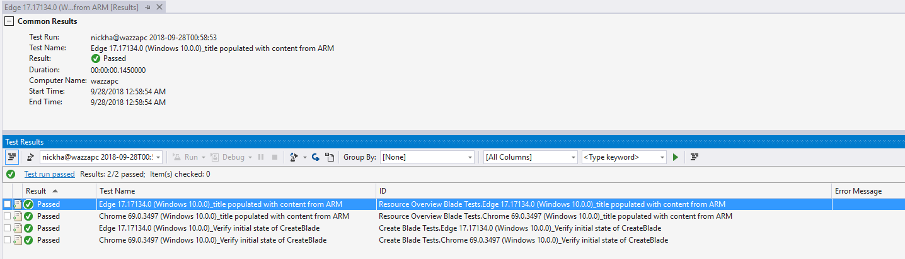
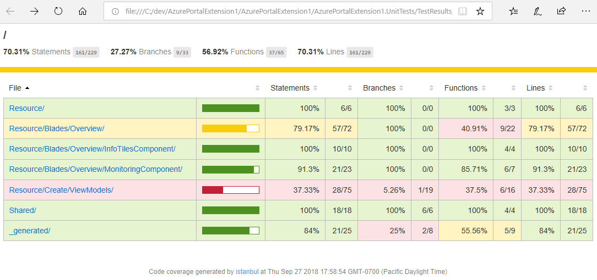
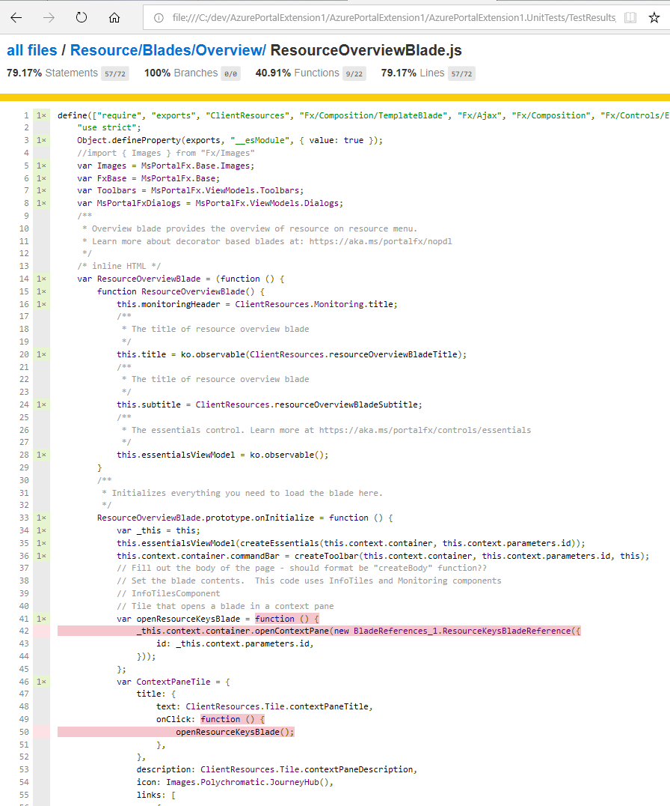

<a name="unit-test-framework"></a>
# Unit Test Framework
Covered in this document:

- Creating a project from the template repository.
- Creating a project from scratch.
- CI: test results output to CI accepted formats JUNIT, TRX, other.
- Code Coverage: where to find your code coverage output.

<a name="unit-test-framework-getting-started-with-the-azureux-templateextension"></a>
## Getting Started with the AzureUX-TemplateExtension

1.  Follow the [getting started guide](https://aka.ms/portalfx/gettingstarted).

<a name="unit-test-framework-creating-a-project-from-scratch-with-visual-studio-code"></a>
## Creating a project from scratch with Visual Studio Code

Before getting started with this step by step:
- if building a new extension from scratch its simpler/faster to start with the above project template rather then following the step by step.
- if adding a UT project to an existing extension you can still just scaffold the content from above then follow this guide for customizing the config to point to your existing extension.

This tutorial will provide you step by step instructions for creating a UnitTest project for your Azure Portal Extension.  The resulting folder structure will look like the following:

```

+-- Extension
+-- Extension.UnitTests
|   +-- test/CreateBlade.test.ts
|   +-- test/ResourceOverviewBlade.test.ts
|   +-- test-main.js
|   +-- karma.conf.js
|   +-- azureportal-ut.config.json
|   +-- package.json
|   +-- tsconfig.json
    +-- .npmrc

// The build and code generation will add the following
|   +-- _generated
|     +-- Ext
|     +-- Fx
|   +-- Output

```

Note:
* This document uses relative paths to indicate where you should add each file relative to the root of your test folder e.g ./package.json indicates adding an package.json at the root of your test project folder Extension.UnitTests/package.json
* All code snippets provided are for `Microsoft.Portal.Tools.targets` if you are using it's predecessor `Microsoft.Portal.Tools.targets` see the [FAQ](#FAQ) at the bottom of this document.

<a name="unit-test-framework-creating-a-project-from-scratch-with-visual-studio-code-dev-build-time-configuration"></a>
### Dev/Build time configuration

<a name="unit-test-framework-creating-a-project-from-scratch-with-visual-studio-code-dev-build-time-configuration-add-npmrc"></a>
#### Add ./.npmrc

@microsoft/azureportal-ut is available from the internal AzurePortal Registry.  To configure your project to use this registry add the following:

Add a ./.npmrc file

```

registry=https://msazure.pkgs.visualstudio.com/_packaging/AzurePortal/npm/registry/
always-auth=true

```

<a name="unit-test-framework-creating-a-project-from-scratch-with-visual-studio-code-dev-build-time-configuration-add-package-json"></a>
#### Add ./package.json

* Add the ./package.json

```json

{
  "name": "extension-ut",
  "version": "1.0.0",
  "description": "",
  "main": "index.js",
  "scripts": {
    "restore": "npm install --no-color --no-optional",
    "build": "npm run restore && gulp generateAmdModuleFromResx --no-color --gulpfile=./node_modules/@microsoft/azureportal-ut/gulpfile.js --silent --cwd ./ && tsc -p tsconfig.json",
    "test": "npm run build && karma start",
    "test-ci": "npm run build && karma start --single-run --no-colors"
  },
  "keywords": [
    "unittest"
  ],
  "author": "Microsoft",
  "license": "MIT",
  "dependencies": {},
  "devDependencies": {
    "@types/chai": "4.1.7",
    "@types/mocha": "7.0.2",
    "@types/nconf": "0.10.0",
    "@types/sinon": "7.5.2",
    "chai": "4.2.0",
    "gulp": "4.0.0",
    "gulp-concat": "2.6.1",
    "karma": "^5.0.2",
    "karma-chai": "0.1.0",
    "karma-chrome-launcher": "2.2.0",
    "karma-coverage": "1.1.2",
    "karma-edge-launcher": "0.4.2",
    "karma-mocha": "2.0.0",
    "karma-mocha-reporter": "2.2.5",
    "karma-junit-reporter": "1.2.0",
    "karma-requirejs": "1.1.0",
    "karma-trx-reporter": "0.4.0",
    "mocha": "7.1.2",
    "@microsoft/azureportal-ut": "file:../../packages/Microsoft.Portal.TestFramework.UnitTest.$(CURRENT_BUILD_VERSION)/microsoft-azureportal-ut-$(NPM_CURRENT_BUILD_VERSION).tgz",
    "nconf": "0.10.0",
    "requirejs": "2.3.6",
    "sinon": "7.2.3",
    "typescript": "~4.1.2"
  }
}


```

    In the package.json you can see we're using mocha and chai but you can choose your own test and assertion framework.

1. Update ./package.json to refer directly to @microsoft/azureportal-ut i.e rather then using the file:// syntax simply specify `"@microsoft/azureportal-ut" : "5.302.VersionOfSdkYouAreUsing"` (notice difference in versioning, no 0 as minor version)

1. run the following command.

    ```

    npm install --no-optional

    ```

Note:
* If you receive auth errors against the internal NPM feed see the "Connect to feed" instructions [here](https://msazure.visualstudio.com/One/Azure%20Portal/_packaging?feed=AzurePortal&_a=feed)

<a name="unit-test-framework-creating-a-project-from-scratch-with-visual-studio-code-dev-build-time-configuration-add-azureportal-ut-config-json"></a>
#### add ./azureportal-ut.config.json

azureportal-ut.config.json defines paths to those files needed by the @microsoft/azureportal-ut node module to generate everything under `./_generated/*`.

add ./azureportal-ut.config.json with the following:

```json

{
    "UTNodeModuleRootPath": "./node_modules/@microsoft/azureportal-ut",
    "GeneratedAssetRootPath": "./_generated",
    "ResourcesResxRootDirectory": "../Extension/Client"
}


```
Customize the paths to those of your extension. The definition of each key in the config is as follows:

- `UTNodeModuleRootPath`: the root path to where the @microsoft/azureportal-ut node module was installed.
- `GeneratedAssetRootPath`: the root path to save all assets that will be generated e.g your resx to js AMD module so you can use resource strings directly in your test.
- `ResourcesResxRootDirectory`: extension client root directory that contains all *.resx files. These will be used to generate js AMD string resource modules into `GeneratedAssetRootPath` and the associated require config.

Note:
* If your official build environment uses different paths then your dev environment you can override them either by using command line arguments or environmental variables.  The @microsoft/azureportal-ut gulpfile will search in the following order command line argument > environmental variable > ./azureportal-ut.config.json file.  An example of overriding an item for an official build via a command line argument `gulp --UTNodeModuleResolutionPath ./some/other/location`

<a name="unit-test-framework-creating-a-project-from-scratch-with-visual-studio-code-dev-build-time-configuration-add-a-test"></a>
#### Add a test

Add a CreateBlade test to ./test/CreateBlade.test.ts.  This demonstrates how to provide the provisioning context to your CreateBlade that portal would normally provide via your gallery package. You can modify this example for your own extension.

```typescript

import { CreateBlade } from "Resource/Create/CreateBlade";
import * as sinon from "sinon";
import { TemplateBladeHarness } from "@microsoft/azureportal-ut/Harness";

describe("Create Blade Tests", () => {
  let server: sinon.SinonFakeServer;

  beforeEach(function () {
    server = sinon.fakeServer.create();
    server.respondImmediately = true;
  });

  afterEach(function () {
    server.restore();
  });

  it("Verify initial state of CreateBlade", () => {
    return TemplateBladeHarness.initializeBlade(CreateBlade, {
      parameters: null,
      blade: new CreateBlade(),
      provisioningContext: {
        initialValues: { locationNames: [], subscriptionIds: [] },
        telemetryId: "",
        provisioningConfig: {
          dashboardPartReference: {
            dashboardPartKeyId: "id",
            options: {
              extensionName: "ExtensionTemplate",
            },
            partName: "ResourcePart",
            parameters: null,
          },
        },
        marketplaceItem: null,
      },
      beforeOnInitializeCalled: (blade) => {
        console.log("Add any before on init tests here");
      },
      afterOnInitializeCalled: (blade) => {
        console.log("Add any after on init tests here");
      },
    }).then((blade) => {
      console.log("Add any init complete tests here");
    });
  });
});


```

Add a TemplateBlade test to ./test/ResourceOverviewBlade.test.ts.  You can modify this example for your own extension.

```typescript

import { assert } from "chai"; // type issues with node d.ts and require js d.ts so using chai
import { Parameters, ResourceOverviewBlade } from "Resource/Blades/Overview/ResourceOverviewBlade";
import * as ClientResources from "ClientResources";
import * as sinon from "sinon";
import { TemplateBladeHarness } from "@microsoft/azureportal-ut/Harness";

describe("Resource Overview Blade Tests", () => {
  let server: sinon.SinonFakeServer;

  beforeEach(function () {
    server = sinon.fakeServer.create();
    server.respondImmediately = true;
  });

  afterEach(function () {
    server.restore();
  });

  it("title populated with content from ARM", () => {
    // arrange
    const resourceId = "/subscriptions/0c82cadf-f711-4825-bcaf-44189e8baa9f/resourceGroups/sdfsdfdfdf/providers/Providers.Test/statefulIbizaEngines/asadfasdff";
    server.respondWith((request) => {
      if (request.url.startsWith(`${MsPortalFx.getEnvironmentValue("armEndpoint")}/batch`)
        && JSON.parse(request.requestBody).requests[0].url.endsWith(`${resourceId}?api-version=${MsPortalFx.getEnvironmentValue("armApiVersion")}`)) {
        request.respond(200, { "Content-Type": "application/json" }, JSON.stringify({
          "responses": [
            {
              "httpStatusCode": 200,
              "content": {
                "id": `${resourceId}`,
                "name": "bar",
                "type": "Providers.Test/statefulIbizaEngines",
                "location": "East Asia",
                "properties": {},
              },
            },
          ],
        }));
      } else {
        request.respond(404, null, "not mocked");
      }
    });

    const bladeParameters: Parameters = { id: resourceId };
    // options for the blade under test. optional callbacks beforeOnInitializeCalled, afterOnInitializeCalled and afterRevealContentCalled
    // can be supplied to execute custom test code

    // get blade instance with context initialized and onInitialized called
    return TemplateBladeHarness.initializeBlade(ResourceOverviewBlade, {
      parameters: bladeParameters,
      blade: new ResourceOverviewBlade(),
      afterOnInitializeCalled: (blade) => {
        console.log("after on init called");
      },
      beforeOnInitializeCalled: (blade) => {
        console.log("before on init called");
      },
      afterRevealContentCalled: (blade) => {
        console.log("after reveal called");
      },
    }).then((resourceBlade) => {

      assert.equal(resourceBlade.title(), "bar");
      assert.equal(resourceBlade.subtitle, ClientResources.resourceOverviewBladeSubtitle);
    });
  });
});


```

<a name="unit-test-framework-creating-a-project-from-scratch-with-visual-studio-code-dev-build-time-configuration-compile-your-test-project"></a>
#### Compile your test project

1. To compile your test and for dev time intellisense you will need a ./tsconfig.json

    ```json

    {
    "compileOnSave": true,
    "compilerOptions": {
        "baseUrl": ".",
        "experimentalDecorators": true,
        "module": "amd",
        "jsx": "react",
        "noImplicitAny": true,
        "noImplicitThis": true,
        "noUnusedLocals": true,
        "outDir": "./Output",
        "rootDir": ".",
        "sourceMap": false,
        "strictBindCallApply": true,
        "moduleResolution": "node",
        "lib": [
            "dom",
            "es2015.promise",
            "es2015.iterable",
            "es5",
            "scripthost"
        ],
        "target": "es5",
        "paths": {
            "@microsoft/azureportal-ut/*": [
                "./node_modules/@microsoft/azureportal-ut/lib/*"
            ],
            "*": [
                "../Extension/Output/Content/Scripts/*",
                "*"
            ]
        }
    },
    "references": [
        {
            "path": "../Extension"
        }
    ],
    "exclude": [],
    "include": [
        "../Extension/Definitions/*",
        "../Extension/Output/typings/ClientResources.d.ts",
        "../Extension/ReactDefinitions/ReactViewUnitTestTypings.d.ts",
        "test/**/*",
    ]
}


    ```

    Update the paths in the tsconfig.json to for your specific extension paths.

1. Build your extension
1. run the following command to build your tests

    ```

    npm run build

    ```

<a name="unit-test-framework-creating-a-project-from-scratch-with-visual-studio-code-runtime-configuration"></a>
### Runtime configuration

Now that your tests are building, add the following to run your tests.

<a name="unit-test-framework-creating-a-project-from-scratch-with-visual-studio-code-runtime-configuration-configure-require-and-mocha-using-add-test-main-js"></a>
#### Configure Require and Mocha using add test-main.js

requirejs and mocha need to know where all your modules are located for your extension and any frameworks that you are using.

add a ./test-main.js file as the main entrypoint for your app

```javascript

window.fx.environment.armEndpoint = "https://management.azure.com";
window.fx.environment.armApiVersion = "2014-04-01";

const allTestFiles = []
if (window.__karma__) {
    const TEST_REGEXP = /^\/base\/Extension.UnitTests\/Output\/.*(spec|test)\.js$/i;
    // Get a list of all the test files to include
    Object.keys(window.__karma__.files).forEach(function (file) {
        if (TEST_REGEXP.test(file)) {
            // Normalize paths to RequireJS module names.
            // If you require sub-dependencies of test files to be loaded as-is (requiring file extension)
            // then do not normalize the paths
            const normalizedTestModule = file.replace(/^\/base\/Extension.UnitTests\/|\.js$/g, "")
            allTestFiles.push(normalizedTestModule)
        }
    });
}

mocha.setup({
    ui: "bdd",
    timeout: 60000,
    ignoreLeaks: false,
    globals: []
});

rjs = require.config({
    // Karma serves files under /base, which is the basePath from your config file
    baseUrl: window.__karma__ ? "/base/Extension.UnitTests" : "",
    paths: {
        "_generated": "../Extension/Output/Content/Scripts/_generated",
        "Resource": "../Extension/Output/Content/Scripts/Resource",
        "Shared": "../Extension/Output/Content/Scripts/Shared",
        "sinon": "node_modules/sinon/pkg/sinon",
        "chai": "node_modules/chai/chai",
    },
    // dynamically load all test files
    deps: allTestFiles,

    // kickoff karma or mocha
    callback: window.__karma__ ? window.__karma__.start : function () { return mocha.run(); }
});


```

Update for your specific extension paths.

<a name="unit-test-framework-creating-a-project-from-scratch-with-visual-studio-code-runtime-configuration-configure-your-test-runner"></a>
#### Configure your test runner

In this example we will using karmajs as a test runner.  It provides a rich plugin ecosystem for watch based compile on save based dev/test cycles, test reporting and code coverage to name a few.

add a file named ./karma.conf.js

```javascript

  // Karma configuration
// Generated on Fri Feb 16 2018 15:06:08 GMT-0800 (Pacific Standard Time)

module.exports = function (config) {
    let process = require("process");

    config.set({

        // base path that will be used to resolve all patterns (eg. files, exclude)
        basePath: "../",

        // frameworks to use
        // available frameworks: https://npmjs.org/browse/keyword/karma-adapter
        frameworks: ["mocha"],

        plugins: [
            require("karma-mocha"),
            require("karma-mocha-reporter"),
            require("karma-edge-launcher"),
            require("karma-coverage"), // Include if you want coverage
            require("karma-chrome-launcher"),
            require("karma-junit-reporter"),  // Include if you want junit reporting
            require("karma-trx-reporter")   // Include if you want trx reporting
        ],
        // list of files / patterns to load in the browser
        files: [
            // chai assertion framework.
            { pattern: "Extension.UnitTests/node_modules/chai/**/*.js", included: false },
            // sinonjs used for mocking xhr.
            { pattern: "Extension.UnitTests/node_modules/sinon/**/*.js", included: false },
            // aggregate script of portal bundles required for test.
            "Extension.UnitTests/node_modules/@microsoft/azureportal-ut/lib/FxScripts.js",
            // karma requirejs adapter required to successfully load requirejs in karma.
            "Extension.UnitTests/node_modules/karma-requirejs/lib/adapter.js",
            // generated require configs for extension resx files.
            { pattern: "Extension.UnitTests/_generated/Ext/**/*RequireConfig.js", included: true },
            // @microsoft/azureportal-ut test harness and other test scripts you may load within a unit test.
            { pattern: "Extension.UnitTests/node_modules/@microsoft/azureportal-ut/lib/*.js", included: false },
            // portal framework scripts.
            { pattern: "Extension.UnitTests/node_modules/@microsoft/azureportal-ut/lib/fx/Content/Scripts/**/*.js", included: false },
            // reserved directory for generated content for framework.
            { pattern: "Extension.UnitTests/_generated/Fx/**/*.js", included: false },
            // generated content for extension.
            { pattern: "Extension.UnitTests/_generated/Ext/**/*.js", included: false },
            // make available compiled tests from tsconfig.json outDir
            { pattern: "Extension.UnitTests/Output/**/*.js", included: false },
            // make available all client extension code that unit tests will use.
            { pattern: "Extension/Output/Content/Scripts/**/*.js", included: false },
            // the entrypoint for running unit tests.
            "Extension.UnitTests/test-main.js",
        ],

        client: {
            mocha: {
                reporter: "html",
                ui: "bdd"
            }
        },

        // list of files / patterns to exclude
        exclude: [
        ],

        // preprocess matching files before serving them to the browser
        // available preprocessors: https://npmjs.org/browse/keyword/karma-preprocessor
        preprocessors: {
            "./Extension/Output/Content/Scripts/**/*.js": "coverage",
        },

        // available reporters: https://npmjs.org/browse/keyword/karma-reporter
        reporters: ["mocha", "trx", "junit", "coverage"],

        // the default trx configuration
        trxReporter: { outputFile: "./TestResults/test-results.trx", shortTestName: false },

        junitReporter: {
            outputDir: "./Extension.UnitTests/TestResults", // results will be saved as $outputDir/$browserName.xml
            outputFile: "test-results.xml", // if included, results will be saved as $outputDir/$browserName/$outputFile
            suite: "Extension.UnitTests", // suite will become the package name attribute in xml testsuite element
            useBrowserName: true, // add browser name to report and classes names
            nameFormatter: undefined, // function (browser, result) to customize the name attribute in xml testcase element
            classNameFormatter: undefined, // function (browser, result) to customize the classname attribute in xml testcase element
            properties: {} // key value pair of properties to add to the <properties> section of the report
        },

        mochaReporter: {
            showDiff: true
        },

        coverageReporter: {
            type: "html",
            dir: "./Extension.UnitTests/TestResults/coverage/"
        },

        // web server port
        port: 9876,

        // enable / disable colors in the output (reporters and logs)
        colors: true,

        // level of logging
        // possible values: config.LOG_DISABLE || config.LOG_ERROR || config.LOG_WARN || config.LOG_INFO || config.LOG_DEBUG
        logLevel: config.LOG_INFO,

        // enable / disable watching file and executing tests whenever any file changes
        autoWatch: true,

        // start these browsers
        // available browser launchers: https://npmjs.org/browse/keyword/karma-launcher
        browsers: ["Chrome_No_Sandbox", "Edge"],

        customLaunchers: {
            Chrome_No_Sandbox: {
                base: 'Chrome',
                flags: ['--no-sandbox']
            }
        },
        // Continuous Integration mode
        // if true, Karma captures browsers, runs the tests and exits
        singleRun: false,

        // Concurrency level
        // how many browser should be started simultaneous
        concurrency: Infinity,
    })
}


```

Update for your specific extension paths.

<a name="unit-test-framework-creating-a-project-from-scratch-with-visual-studio-code-runtime-configuration-run-your-tests"></a>
#### Run your tests

You can run your tests with `npm run test`.  This command is specified in packages.json and will start karmajs in your configured target browser(s) in watch mode.  This is particularly useful when used in conjunction with compile on save allowing for an efficient inner dev loop i.e dev > compile > automatic test execution, in short any change to your extension src and test project src will be automatically compiled (due to tsconfig.json setup) and then tests will automatically (due to karma.conf.js). The net result is real time feedback on what tests you've broken as you modifying extension code.

Using karmajs for a single test run useful for scenarios such as running in CI

`npm run test-ci` launches karmajs in your configured target browsers for a single run.

Note that the karma.conf.js is configured to run your tests in both in Edge and Chrome. You may also pick and choose additional browsers via the launcher plugins [documented here](https://karma-runner.github.io/2.0/config/browsers.html).

<a name="unit-test-framework-creating-a-project-from-scratch-with-visual-studio-code-test-results"></a>
### Test Results

In dev scenarios the test results from running your tests via karmajs are available in the console output. In addition to the console output reporters have been added to `karma.conf.js` to provide formats that are useful to CI scenarios.

<a name="unit-test-framework-creating-a-project-from-scratch-with-visual-studio-code-test-results-test-output-for-ci"></a>
#### Test Output for CI

By Default the project template/steps above will generate a project configured to produce JUNIT and TRX output. This should be useful for most CI environments. The content will be output under ./TestResults/**/*.xml|trx.  To configure the output paths update karma.conf.js. For more plugins for outputing in a format your CI environment supports see [karmajs official docs](https://karma-runner.github.io/2.0/index.html).

Note:
* TRX and JUNIT output are generated when running `npm run test` or `npm run test-ci` via karmajs and its karma.conf.js.
* drop the TRX or JUNIT reporter that is not needed for your CI environment.



<a name="unit-test-framework-creating-a-project-from-scratch-with-visual-studio-code-test-results-code-coverage"></a>
#### Code Coverage

By Default the project template/steps above will generate a project configured that also produces code coverage using karma-coverage. The content will be output under ./TestResults/Coverage/**/index.html



Note:
* coverage results are generated when running  `npm run test` or `npm run test-ci` via karmajs its karma.conf.js.

Clicking through from the summary view to the ResourceOverviewBlade you can see code coverage line by line




<a name="faq"></a>
# FAQ

<a name="faq-when-i-do-file-file-new-project-visual-c-azure-portal-i-get-the-following-error"></a>
## When I do File <code>File &gt; New &gt; Project &gt; Visual C# &gt; Azure Portal</code> I get the following error

```

Severity    Code    Description Project File    Line    Suppression State
Error       Could not install package 'PortalFx.NodeJS8 10.0.0.125'. You are trying to install this package into a project that targets '.NETFramework,Version=v4.6.1', but the package does not contain any assembly references or content files that are compatible with that framework. For more information, contact the package author

```

Solution: Install the `Node Tools for Visual Studio` [from here](https://github.com/Microsoft/nodejstools/releases/tag/v1.3.1)

<a name="faq-corext-environments"></a>
## Corext Environments

Build environments which are setup using Corext will need to manually add additional lines in order to specify where to pick up the Unit Test Framework NuGet package.
This NuGet package will be expanded at a different location (CxCache) than the default, so you need to update your Corext config and the npm packages.json in order to
point to the correct location.

<a name="faq-corext-environments-common-error"></a>
### Common Error

If you are a executing the default instructions on your Corext environment, this is the error you will see:

`npm ERR! enoent ENOENT: no such file or directory, stat 'C:\...\ExtensionName\packages\Microsoft.Portal.TestFramework.UnitTest.5.0.302.979\microsoft-azureportal-ut-5.302.979.tgz'`

This error indicates that it cannot find the expanded NuGet package for the Unit Test Framework.

<a name="faq-corext-environments-fix"></a>
### Fix

1. **Update your Repository's `corext.config`**

    Found under `\<ExtensionRepoName>\.corext\corext.config`

    Under the `<generator>` section add the following to the bottom:

    ```xml
    <!-- Unit Test Framework -->
    <package id="Microsoft.Portal.TestFramework.UnitTest" />
    ```

2. **Update your Extension's `package.config`**

    Found under `\<ExtensionRepoName>\src\<ExtensionName>\packages.config`

    Add the folowing to your `<packages>`:

    ```xml
    <package id="Microsoft.Portal.TestFramework.UnitTest" version="5.0.302.1016" targetFramework="net45" />
    ```

    **Note:** *The version listed above should match the version of the Portal SDK you are using for your extension and will match the `"Microsoft.Portal.Framework"` package in your `packages.config`.*

3. **Update your Unit Test `package.json`**

    Found under `<ExtensionRepoName>\src\<ExtensionName>.UnitTests\package.json`

    If you have the package `@microsoft/azureportal-ut` in your dependencies, remove it.

    Update your scripts init command to be the following:

    `"init": "npm install --no-optional && npm install %PkgMicrosoft_Portal_TestFramework_UnitTest%\\microsoft-azureportal-ut-5.302.1016.tgz --no-save",`

    **Note:** *The version listed above should match the version of the Portal SDK you are using for your extension and will match the `"Microsoft.Portal.Framework"` package in your `packages.config`.*

4. **Run the following commands to finish the setup**

    * Run Corext Init - From the root of your repository run: `init`
    * Run the Npm install - From your Unit Test directory run: `npm run init`

<a name="faq-how-do-i-override-the-default-stubs-the-unit-test-harness-provides-out-of-the-box"></a>
## How do I override the default stubs the unit test harness provides out of the box.

Use the Harness.init function and supply an options object of type InitializationOptions with your own stub(s) that will override the default stub provided by the unit test framework.

example usage:

```typescript

import * as harness from "@microsoft/azureportal-ut/Harness";

...

const options : harness.InitializationOptions = {
    getUserInfo: sinon.stub().returns(Q({
            email: "ibizaems@microsoft.com",
            isOrgId: false,
            givenName: "givenName",
            surname: "surName",
            directoryId: "00000000-0000-0000-0000-000000000000",
            directoryName: "directoryName",
            uniqueDirectoryName: "uniqueDirectoryName",
            domainName: "domainName"
        })),
        ...
};

harness.init(options);

...

```

<a name="faq-i-am-still-using-microsoft-portal-tools-targets-rather-than-microsoft-portal-tools-targets-what-do-i-need-to-change"></a>
## I am still using Microsoft.Portal.Tools.targets rather than Microsoft.Portal.Tools.targets. What do I need to change

Ideally you should move to v2 targets to benefit from the dev productivity it will bring to your dev/test inner loop. Migration only takes about an hour or so, see https://aka.ms/portalfx/cloudbuild for details.  If you can't migrate to v2 update the following:

1. Update your ../Extension/Extension.csproj
add

    xml
    ```
    <PropertyGroup>
        <TypeScriptGeneratesDeclarations>true</TypeScriptGeneratesDeclarations>
    </PropertyGroup>
    ```

1. ./package.json update the `script` named `prereq`  to be the following

    ```
    "prereq": "npm run init && gulp --gulpfile=./node_modules/@microsoft/azureportal-ut/gulpfile.js --cwd ./"
    ```

1. ./azureportal-ut.config.js

    ```
        "ExtensionTypingsFiles": "../Extension/**/*.d.ts",
        "ResourcesResxRootDirectory": "../Extension/Client"
    ```

1. ./tsconfig.json

    ```

    {
        "compileOnSave": true,
        "compilerOptions": {

    ...
            "paths": {
                "@microsoft/azureportal-ut/*": [
                    "./node_modules/@microsoft/azureportal-ut/lib/*"
                ],
                "*": [
                    "./_generated/Ext/typings/Client/*",
                    "./node_modules/@types/*/index"
                ]
            }
    ...

        },
    ...
        "include": [
            "./_generated/Ext/typings/Definitions/*",
            "test/**/*"
        ]
    }

    ```

1. ./karma.conf.js


    ```
    ...

    files: [
        ...,

        { pattern: "Extension/Output/Content/Scripts**/*.js", included: false },

        ...
    ],

    ...

    preprocessors: {
        "./Extension/Client/**/*.js": "coverage"
    }

    ```

1. ./test-main.js

    ```
    rjs = require.config({
    ...,
        "_generated": "../Extension/Client/_generated",
        "Resource": "../Extension/Client/Resource",
        "Shared": "../Extension/Client/Shared"
    ...
    ```

<a name="i-can-t-use-the-internal-npm-registry-https-msazure-pkgs-visualstudio-com-_packaging-azureportal-npm-registry-because"></a>
# I can&#39;t use the internal npm registry <a href="https://msazure.pkgs.visualstudio.com/_packaging/AzurePortal/npm/registry/">https://msazure.pkgs.visualstudio.com/_packaging/AzurePortal/npm/registry/</a> because ...

<a name="i-can-t-use-the-internal-npm-registry-https-msazure-pkgs-visualstudio-com-_packaging-azureportal-npm-registry-because-i-can-t-authenticate"></a>
## I can&#39;t authenticate

Try the following:
1. If you receive auth errors against the internal NPM feed see the "Connect to feed" instructions [here](https://msazure.visualstudio.com/One/Azure%20Portal/_packaging?feed=AzurePortal&_a=feed)
1. If your not a member of any of the Groups on https://msazure.visualstudio.com/One/Azure%20Portal/_packaging?feed=AzurePortal&_a=settings&view=permissions please join `Azure Portal Partner Contributors – 19668` in https://myaccess .

<a name="i-can-t-use-the-internal-npm-registry-https-msazure-pkgs-visualstudio-com-_packaging-azureportal-npm-registry-because-my-build-nodes-are-completely-disconnected-from-the-internet"></a>
## My build nodes are completely disconnected from the internet

* you can commit your version of @microsoft/azureportal-ut.zip into your repo and install it directly using relative file path syntax
`"@microsoft/azureportal-ut": "file:../externals/@microsoft/azureportal-ut-5.302.someversion.tgz",`
