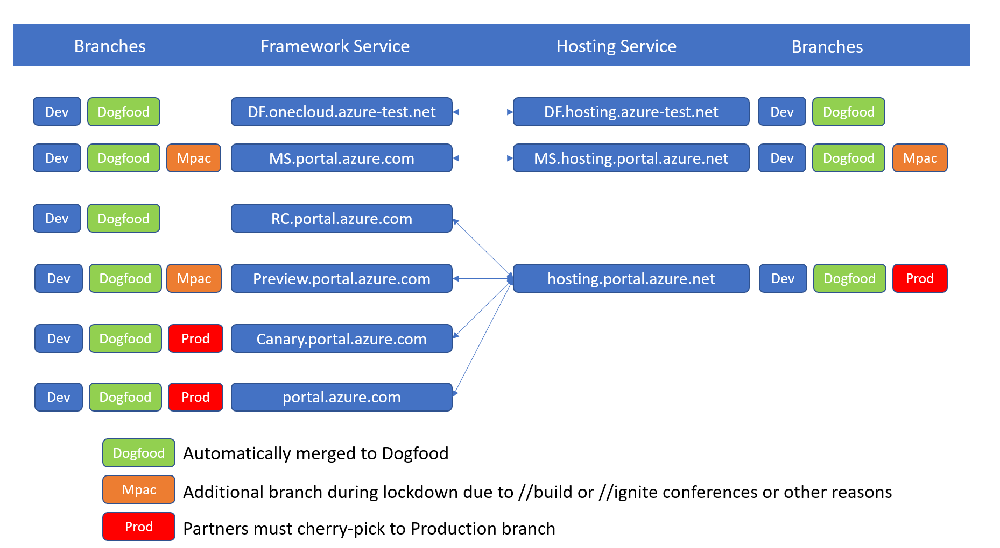

<a name="portal-extensions"></a>
# Portal Extensions

<a name="portal-extensions-introduction"></a>
## Introduction

If you are working on an Azure service and want to expose UI to your customers in the Azure portal then this is the right starting point. The portal has an extension model where each team that builds UI creates and deploys an extension. This process requires a relationship to be established between your team and the central portal team. This document walks you through the process of onboarding your team and starting that relationship.

<a name="portal-extensions-step-by-step-process-overview"></a>
## Step by Step Process overview

Onboarding a service, or developing a Portal extension, has three phases: onboarding, development, and deployment. The process is specified in the following image.


<a name="phase-1-onboarding"></a>
# Phase 1 - Onboarding

<a name="phase-1-onboarding-kickoff-meeting"></a>
## Kickoff Meeting

There are lots of docs here. We recommend you send mail to [ibiza-onboarding@microsoft.com](<mailto:ibiza-onboarding@microsoft.com?subject=Kickoff Meeting Request&body=My team would like to meet with you to learn about the Azure onboarding process.>) and request a kickoff meeting. Someone from our team will spend 30 minutes walking through the process at a high level. We can point you in the right direction regarding the latest patterns and practices. We can also answer any questions you have. Finally, we can talk about how the relationship between our teams is managed.

<a name="phase-1-onboarding-onboard-with-related-teams"></a>
## Onboard with related teams

Onboarding to Azure all up is a big task that spans many teams. The doc you are reading will help you onboard to the portal, but there are many other teams you will need to work with to get your entire service up and running. These include, but are not limited to the following teams.

**NOTE:**  Contact information for these teams is [available here](https://aka.ms/portalfx/onboarding/partners)

1. Azure Resource Manager Team

    Reach out to this team to onboard your resource provider.
    <!--TODO: Locate distribution list for this purpose.  -->

1. Azure Marketing Team


1. Support Team

   For integrating with the support system and UX integration.

1. Azure.com team

   For a presence on the marketing site.

1. Billing team

   To register meters and other billing related activities.

1. AAD onboarding

   Reach out to AAD onboarding if the new extension service needs special permissions besides just calling your own resource provider servers.  If the extension requires additional built-in support for standard Graph or ARM APIs, submit a partner request at the site located at [https://aka.ms/portalfx/uservoice](https://aka.ms/portalfx/uservoice).

1. Azure fundamentals and compliance

    The Azure Fundamentals are a set of tenets to which each Azure service is expected to adhere. The Azure Fundamentals program is described in the document located at [https://aka.ms/azurefundamentals](https://aka.ms/azurefundamentals). The document also identifies the stakeholders and contacts for each of the tenets.

1. Security and privacy reviews

1. Start the CSS onboarding process with the CSS team at least three months previous to public preview. This process may coincide with the following step. For more information about development phases, see [top-extensions-developmentPhases.md](top-extensions-developmentPhases.md).

1. Nearly 70% of Azure users are from outside of the United States. Therefore, it is important to make Azure a globalized product. There are a few requirements under the "Internationalization" criteria that your extension is required to support.  This is the same set of languages that are supported by Azure Portal for GA. For more information about internationalization requirements, see [https://aka.ms/AzureGR](https://aka.ms/AzureGR). For onboarding localization, please reach out to Bruno Lewin and the Internationalization team at <a href="mailto:ibiza-interntnl@microsoft.com?subject=Onboarding localization">Internationalization team</a>.

1. Decide on a name and URLs for the extension.  You may need to contact emailing <a href="mailto:ibiza-onboarding@microsoft.com?subject=Name and URLs for new Extension">ibiza-onboarding@microsoft.com</a> to ensure that the name and URL's are unique.

1. Schedule a UX feasibility review with the Ibiza team UX contact by emailing <a href="mailto:ibiza-onboarding@microsoft.com?subject=Extension Feasibility Review">ibiza-onboarding@microsoft.com</a>.  Many extensions have been made more successful by setting up early design reviews with the Azure Portal team. Taking the time to review the design gives extension owners an opportunity to understand how they can leverage Azure Portal design patterns, and ensure that the desired outcome is feasible.

While the portal team cannot help directly with all of these factors, see [portalfx-extensions-contacts.md](portalfx-extensions-contacts.md) for a list of items with which we can assist you.

For less common scenarios, you might need to do a custom deployment. For example, if the extension needs to reach server services using certificate based authentication, then there should be controller code on the server that our hosting service does not support. You should be very sure that  a custom hosting solution is the correct solution previous to developing one.


<a name="phase-1-onboarding-join-dls-and-request-permissions"></a>
## Join DLs and request permissions

Request the following permissions to stay current on product roadmaps, get news on latest features, and receive invites for ibiza related events.

* PMs and Developer Leads should join the `ibizapartners PM`  group [here](https://idweb/IdentityManagement/aspx/common/GlobalSearchResult.aspx?searchtype=e0c132db-08d8-4258-8bce-561687a8a51e&content=ibizapartners-pm&popupFromClipboard=%2Fidentitymanagement%2Faspx%2FGroups%2FEditGroup.aspx%3Fid%3Dacc725b5-30aa-4336-9c81-1867762bb945).

* Developers should join the `ibizapartners DEV` group [here](https://idweb/IdentityManagement/aspx/common/GlobalSearchResult.aspx?searchtype=e0c132db-08d8-4258-8bce-561687a8a51e&content=ibizapartners-pm&popupFromClipboard=%2Fidentitymanagement%2Faspx%2FGroups%2FEditGroup.aspx%3Fid%3D109b1485-33c5-4c00-8e85-69d9b6176b9f).

* Developers should join the appropriate group listed on [https://aka.ms/standardaccess](https://aka.ms/standardaccess) to get access to portal telemetry. All groups on this page receive access.

* Developers should join the  `Azure Portal Partner Contributors - 19668(19668)` group by using this link: [https://myaccess](https://myaccess).

* PMs, Developers, and Developer Leads should subscribe to the partner request process by joining the ```Uservoice ``` group at this link:  [https://aka.ms/portalfx/uservoice](https://aka.ms/portalfx/uservoice). For more information about the partner request process, see [top-extensions-partner-request.md](/portal-sdk/generated/top-extensions-partner-request.md).

* PMs, Developers, and Developer Leads  should join Stackoverflow Forums that are located at [https://stackoverflow.microsoft.com](https://stackoverflow.microsoft.com)  to let us know if you have any questions. Remember to tag questions with supported tags that are monitored by the Ibiza team. All supported tags are documented in [portalfx-stackoverflow.md](portalfx-stackoverflow.md).

* Developers who want to contribute to the test framework should join groups from the site located at [https://aka.ms/azuregithub](https://aka.ms/azuregithub).

Ask an onboarding question on [Stackoverflow](https://stackoverflow.microsoft.com/questions/tagged/ibiza-onboarding).

<a name="phase-1-onboarding-get-the-sdk-docs-and-samples-to-your-developers"></a>
## Get the SDK, docs, and samples to your developers

 The [development guide](top-extensions-getting-started.md) located in the main documentation index has all the right pointers.

<a name="phase-2-development"></a>
# Phase 2 - Development

<a name="phase-2-development-develop-your-extension"></a>
## Develop your extension

 The [development guide](top-extensions-getting-started.md) located in the main documentation index has all the right pointers.

<a name="phase-2-development-learn-about-the-hosting-service-plan-your-deployment-strategy"></a>
## Learn about the hosting service / plan your deployment strategy

The Ibiza team provides and operates a common extension hosting service that makes it easy to get your extension into a globally distributed system without having to manage your own infrastructure. For more information see [top-extensions-hosting-service.md](top-extensions-hosting-service.md).

For less common scenarios, you might need to do a custom deployment.

For example, if you need to talk to backend services using certificate-based authentication then you'll need controller code on the server. This is not supported with our hosting service. You should be very sure you require a custom hosting solution before going down this path.

**NOTE**: The deployment can be configured in such a way that the client portion of the extension uses the hosting service while the custom controller code can be deployed separately.
For more information, see [top-extensions-custom-deployment.md](top-extensions-custom-deployment.md).

<a name="phase-2-development-register-the-extension-with-the-portal-product-configuration"></a>
## Register the extension with the portal product configuration

Once the name of the extension is finalized, it is time to register the extension in all environments. This requires a portal deployment and can take time. Our Service Level Agreements are located at [top-extensions-svc-lvl-agreements.md](top-extensions-svc-lvl-agreements.md).  Please plan accordingly.

* For internal partners, the request to register an extension is a pull request, as specified in [top-extensions-publishing.md](top-extensions-publishing.md).

* External teams can submit their requests by reaching out to the <a href="mailto:ibizafxpm@microsoft.com?subject=Onboarding Request: Add <extensionName> to the Portal&body=Extension Name:  <br><br>Company:  <br><br>Brand or Suite:  <br><br>Product or Component:  <br><br> URLs: <br><br>Production: main.<extensionName>.ext.<company>.com<br><br>  Contact info: <br><br>Business Contacts <br><br> Dev leads: <br><br> PROD on-call email for live site incidents: <br><br>">ibizafxpm team</a> with an onboarding request.

* **NOTE**: Extension names must use standard extension name format, as in the example located [here](/portal-sdk/generated/top-extensions-configuration.md#configuration-file-locations-and-structure).

* **NOTE**:  Extension URLs adhere to the naming requirements located in [portalfx-extensions-cnames.md](portalfx-extensions-cnames.md).

* Show your asset types.

<a name="phase-3-deployment"></a>
# Phase 3 - Deployment

<a name="phase-3-deployment-release-kind"></a>
## Release kind

There are three typical release kinds: private preview, public preview, and Global Availability (GA). For the purposes of deployment public preview and GA are the same. The only difference is that the UI may show preview labels and disclaimers where appropriate. For more information about the three kinds of releases, see  [top-extensions-developmentPhases.md](top-extensions-developmentPhases.md).

<a name="phase-3-deployment-private-preview"></a>
## Private preview

For a private preview, the goal is to hide your experience to the general public, but show it to a limited audience. This procedure assumes that the discoverable entry point in the product is the All Services menu, also known as the Browse menu.

Hiding or showing items in the all services menu is controlled by the extension configuration that gets deployed with your extension. The following  example shows how to set it up.
To do so, you should make a change to hide all your asset types in the environments you wish to stay hidden in. See [hiding assets](portalfx-assets.md#How-to-hide-your-asset-in-different-environments) for help with the change.

When in the hidden state, users will not be able to browse to or search for the entry point of the extension. However, you can distribute a special link like the following one that enables the entry point by using a feature flag.
https://portal.azure.com?extensionName_hideassettypes=none


A few notes about this path:
* Any user that receives this URL will be able to see your entry point.
* Any users who receives a deep link to blades within your extension will be able to see that experience even without the feature flag
* If the extension is integrated into the Marketplace, then that team has its own way of hiding Marketplace items. Contact <a href="mailto:1store@microsoft.com?subject=Integrating a New Extension into the Marketplace">1store@microsoft.com </a> for more details.

<a name="phase-3-deployment-public-preview-or-ga"></a>
## Public preview or GA

You are required to check the quality of your extension. We have standardized ways of measuring reliability and performance at key areas. If you have a private preview then we have already collected this data for you.

There is no blocking exit criteria, which means you do not have to prove that the extension's performance and reliability are in the required range. However, once you ship, the Portal team will monitor the quality of the extension. Extensions that do not meet the required quality bar will be flagged in executive reviews and will be asked to improve their quality as soon as possible.

When you are ready for all users to see your experience, you will enable your entry point as shown in the following example and then deploy your extension.

<a name="steps-to-portal-onboarding"></a>
<a name="steps-to-portal-onboarding"></a>
# Steps to Portal onboarding

Azure portal onboarding steps listed below assumes that all new services have completed the onboarding meeting with [ibiza-onboarding@microsoft.com](mailTo:ibiza-onboarding@microsoft.com) team and that you have downloaded the Azure portal SDK to start the development of your extension. If you have not had either the onboarding meeting or have developed the extension, please discuss with the Azure portal team on the requirements.

**NOTE: Azure portal Onboarding process is common for all clouds.**

<a name="steps-to-portal-onboarding-pre-onboarding-checks-must-do-s"></a>
## Pre-Onboarding Checks - Must Do&#39;s

1) Before onboarding to Azure portal, please take a moment to understand the different repositories, branches and environments we have in Azure portal and **[SLAs](top-extensions-svc-lvl-agreements.md)** for onboarding.

1) Azure portal onboarding involves 3 different repositories. Framework, Hosting Services and Alerting.

2) Portal framework and hosting services have Dev, Dogfood and Production Branches. All changes to config files must be raised to Dev branch only.

2) Raise both Framework and Hosting Service PRs together to speed  up onobarding.

2) Dogfood config changes can only be applied to Dogfood environment and endpoints that are accessible only by Microsoft employees.

2) Production config changes are applied to RC, Mpac, Preview and Production environments.

3) Once a PR completes in Dev branch, the change gets merged to Dogfood branch automatically.

3) From Dogfood branch, the change is deployed to RC, Mpac and Preview environments.

4) Partners must validate all changes deployed in framework branches of RC or Mpac thoroughly before cherry-picking the commit to Production branch.

4) Partners must cherry-pick Hosting Service changes from Dev Branch to Production of Hosting Service for the hosting service change to be available to use in either Framework environments of RC, Mpac, Preview OR Production.

5) Partners must onboard to all public and sovereign clouds at the same time and update the respective configs.

6) **[Hide all assets](portalfx-assets.md#how-to-hide-or-show-your-asset-in-different-environments)** in sovereign clouds if you do not intend to show your experiences in those clouds.

7) By onboarding to Azure portal you agree to keeping your extension up to date regularly with the latest supported SDK. You will recieve IcM alerts ranging from Sev-4 to Sev-2 if you fail to upgrade your SDK before required time limit.

8) Portal SDK has a 120-day backward compatibility and we start firing alerts when the SDK age is 60days. Extension owners are responsible for any outages caused due to an aged SDK that is out of support.

9) IcM Service/Team and feedback email address mentioned in the Portal config must be updated immediately if there is a change in these details or ownership transfer of the service. Failing to update these details will make the service orphaned services.

10) Portal team reserves the right to remove any orphaned services from portal that cause services alerts or failures due to an unsupported SDK version or instability issues for the rest of the portal.

<a name="steps-to-portal-onboarding-service-or-feature-deprecation-checks-must-do-s"></a>
## Service or Feature Deprecation Checks - Must Do&#39;s

1) Ensure that the users are given advance notice about the deprecation of a feature or service when removing the corresponding experience from Azure portal.

2) Notify users via Azure blog, Azure status updates or email about the intended deprecation plan and provide migration to alternative features or service.

3) Users will continue to see the currently loaded extension version until their browser is refreshed. Hence it is advised that you monitor the telemetry for usage before turning off service or feature.

4) Any alerts configured for you service in the Alerting repository will be removed only after the corresponding configuration changes are fully removed from the extensions config json files and deployed to Production. We also need to wait for stable build before we stop firing the alerts for a deprecated extension.

**NOTE:** *Partner must cherry-pick changes made in both Azure portal framework and hosting services from Dev branch to Production branch for the changes to be deployed to Production/Public clouds. Partners are responsible for completing the PR and cherry-picking the changes from Dev Branch to Production Branch. Portal team does NOT merge these changes automatically*



1) Understand the deployment schedules and **[SLAs](top-extensions-svc-lvl-agreements.md)** for Portal framework and Hosting service repositories.

2) Portal team has a process of freezing deployments during special events like //build //Ignite //Inspire etc. Any changes to Production branch will NOT be honored during this freeze time. Please plan your Preview/Release of your service accordingly.

3) Portal team does an automatic merge from Dogfood branch to Mpac and Mpac to Production during special events like conferences. During all other times, partners MUST always cherry-pick the changes from Dev branch to Production branch for the respective changes to go live.

4) National cloud deployments take 2 weeks more than Production branch.

5) Always work with Azure portal onboarding contact about your release dates before you commit timelines to release the product or any Marketing communications.

6) All exceptions to bypass SLAs and fasttrack deployments will require Partner level approval on both sides. All exception during major events will require VP level approval.


*Note : Step 1 and Step 2 below can be done in parallel and required to complete the Portal onboarding. Step 3 is optional unless the onboarding service requires dedicated tokens.*

<a name="steps-to-portal-onboarding-step-1-hosting-service"></a>
<a name="steps-to-portal-onboarding-step-1-hosting-service"></a>
## Step 1 - Hosting Service

To use the Extension Hosting Service after you have developed your extension, you will have to onboard onto the Extension Hosting service separately. You will have to follow the steps in [this document](/portal-sdk/generated/top-extensions-hosting-service.md#) to have your extension to be ready for deploying onto the hosting service. The reason we have the steps below is to let you do these things in parallel. Developers should join the  `Azure Portal Partner Contributors - 19668(19668)` group by using this link: [https://myaccess](https://myaccess).
1) Create storage account for each environment
eg: Dogfood, Prod, Mooncake, Fairfax and BlackForest
2) Create a container under the storage account with anonymous read access


3) Upload the [config.json](/portal-sdk/generated/top-extensions-hosting-service.md#step-6-upload-safe-deployment-config) and the [generated zip file](/portal-sdk/generated/top-extensions-hosting-service.md#step-1-generate-hosting-service-versioned-zip-file) from your build.

**NOTE**:  You can make changes to hosting service configuration and raise a pull request for a self-service onboarding to hosting service

4) Create a new branch in the [hosting service repository](https://msazure.visualstudio.com/One/_git/AzureUX-PortalHostingSvc/branches) based on the dev branch


5) Update the hosting service configuration for appropriate environment(eg: [config.dogfood.json](https://msazure.visualstudio.com/One/_git/AzureUX-PortalHostingSvc?path=%2Fsrc%2FRDPackages%2FExtensionHost%2Fconfig.dogfood.json&version=GBdev),
[config.prod.json](https://msazure.visualstudio.com/One/_git/AzureUX-PortalHostingSvc?path=%2Fsrc%2FRDPackages%2FExtensionHost%2Fconfig.prod.json&version=GBdev),
[config.ff.json](https://msazure.visualstudio.com/One/_git/AzureUX-PortalHostingSvc?path=%2Fsrc%2FRDPackages%2FExtensionHost%2Fconfig.ff.json&version=GBdev),
[config.mc.json](https://msazure.visualstudio.com/One/_git/AzureUX-PortalHostingSvc?path=%2Fsrc%2FRDPackages%2FExtensionHost%2Fconfig.mc.json&version=GBdev), [config.bf.json](https://msazure.visualstudio.com/One/_git/AzureUX-PortalHostingSvc?path=%2Fsrc%2FRDPackages%2FExtensionHost%2Fconfig.bf.json&version=GBdev) by editing and adding a new line for the [extension route prefix](https://github.com/Azure/portaldocs/blob/dev/portal-sdk/generated/top-extensions-hosting-service.md#step-1-generate-hosting-service-versioned-zip-file) entry in the "hostExtensionConfigs" section as shown below.


6) Commit and Create a pull request to the Dev Branch.
7) Create a hosting service onboarding [workitem](https://aka.ms/extension-hosting-service/onboarding) and this to the pull request.
8) Send email to [ibiza-onboarding@microsoft.com](mailTo:ibiza-onboarding@microsoft.com) with the pull request link to get the approval.
9) Once the hosting service PR for Dev branch is completed, partners MUST cherry-pick this commit from Dev branch to Production branch of hosting services.

Note:  Incorrect or insufficient information in the workitem could delay the onboarding process.

<a name="steps-to-portal-onboarding-how-to-verify-if-hosting-service-onboarding-is-complete"></a>
<a name="steps-to-portal-onboarding-how-to-verify-if-hosting-service-onboarding-is-complete"></a>
## How to verify if hosting service onboarding is complete?

1. Check Hosting Service API Diagnostics log for [Dogfood](https://hosting.onecloud.azure-test.net/api/diagnostics) or [Production](https://hosting.portal.azure.net/api/diagnostics) or [Mooncake](https://hosting.azureportal.chinacloudapi.cn/api/diagnostics) or [Fairfax](https://hosting.azureportal.usgovcloudapi.net/api/diagnostics) or [Blackforest](https://hosting.azure-api.de/api/diagnostics) in web browser.

2. Press Ctrl+F to find your extension routeprefix that registered for your service. Eg: storage


<a name="steps-to-portal-onboarding-step-2-portal-framework"></a>

3. Check [Commit Search](https://aka.ms/portalfx/commits) with the commit id and [Hosting Service Release Dashboard](https://dev.azure.com/msazure/One/_dashboards/dashboard/25be4cd4-4fbd-45c9-b257-79baf530abbe).

<a name="steps-to-portal-onboarding-step-2-portal-framework"></a>
## Step 2 - Portal Framework
1) Register your extension with Azure portal framework by raising a pull request to the appropriate extension config json. eg: [extensions.dogfood.json](https://msazure.visualstudio.com/One/_git/AzureUX-PortalFx?path=%2Fsrc%2FRDPackages%2FOneCloud%2FExtensions.dogfood.json&version=GBdev), [extensions.prod.json](https://msazure.visualstudio.com/One/_git/AzureUX-PortalFx?path=%2Fsrc%2FRDPackages%2FOneCloud%2FExtensions.prod.json&version=GBdev), [extensions.ff.json](https://msazure.visualstudio.com/One/_git/AzureUX-PortalFx?path=%2Fsrc%2FRDPackages%2FOneCloud%2FExtensions.ff.json&version=GBdev), [extensions.mc.json](https://msazure.visualstudio.com/One/_git/AzureUX-PortalFx?path=%2Fsrc%2FRDPackages%2FOneCloud%2FExtensions.mc.json&version=GBdev), [extensions.bf.json](https://msazure.visualstudio.com/One/_git/AzureUX-PortalFx?path=%2Fsrc%2FRDPackages%2FOneCloud%2FExtensions.bf.json&version=GBdev) etc,.
2) Increment the extension count in [DeploymentSettingsTestConstants.cs](https://msazure.visualstudio.com/One/_git/AzureUX-PortalFx?path=%2Fsrc%2FStbPortal%2FWebsite.Server.Tests%2FDeploymentSettingsTestConstants.cs&version=GBdev)

3) Always raise the PR to the Dev branch
4) For Prod config chanages, once the PR is approved, please cherry pick the change to Prod after thoroughly testing the portal in MPAC endpoint. Portal team does not auto merge the changes to Production branches
5) Always cherry-pick the change from Dev to Prod branch. ***This is a new change to the cherry-picking process as we will deploy to Mpac by default from Dev branch.***
6) Here is a sample PR change for dogfood branch.

Note : Dogfood config does not require creating a CNAME entry for extensions as all extensions use the common DNS endpoint. Onboarding to Production config will require the CNAME created with route prefix.

    {
        "name": "Microsoft_Azure_DemoExtension",
        "feedbackEmail": "demoextPMDev@microsoft.com",
        "flags": "SupportsPrewarming",
        "resourceAccess": [
            {
                "name": "",
                "resource": "https://management.core.windows.net/"
            },
            {
                "name": "self",
                "resource": "abcd18b0-9c38-48c9-a847-e1ef3af0602d"
            },
            {
                "name": "graph",
                "resource": "https://graph.windows.net/",
                "oAuthClientId": "abcd18b0-9c38-48c9-a847-e1ef3af0602d"
            },
            {
                "name": "microsoft.graph",
                "resource": "https://graph.microsoft.com/",
                "oAuthClientId": "abcd18b0-9c38-48c9-a847-e1ef3af0602d"
            }
        ],
        "serviceTreeId": "abcdbde1-a1b3-41da-be44-e3fa76a3ffc6",
        "icm": {
            "service": "Demo IcM Service",
            "team": "Azure Demo UX"
        },
        "hostingServiceName": "demoextension"
    }

7) [Hide all assets](portalfx-assets.md#how-to-hide-your-asset-in-different-environments) in your extension code before updating the framework config. By doing this, you can control when the assets can be shown and when you want to go live in Production.

Note : Extension name cannot be changed once onboarding is complete. It will require a new onboarding and redirecting to the new extension.

    {
        "name": "Microsoft_Azure_NewDemoExtension",
        "feedbackEmail": "demoextPMDev@microsoft.com",
        "redirectTo": "Microsoft_Azure_DemoExtension",
        "serviceTreeId": "abcdb46d-bf43-4fef-a148-0d740e595d62",
        "icm": {
            "service": "Azure Demo IcM",
            "team": "Demo Team"
        },
        "hostingServiceName": "demoextension"
    }

<a name="steps-to-portal-onboarding-how-to-verify-if-portal-framework-onboarding-is-complete"></a>
<a name="steps-to-portal-onboarding-how-to-verify-if-portal-framework-onboarding-is-complete"></a>
## How to verify if portal framework onboarding is complete?

1. Add a comment in the workitem associated with the pull request to get notified of deployment.

2. If the changes are deployed you should find them in the API diagnostics log in respective branches [DF](https://df.onecloud.azure-test.net/api/diagnostics), [RC](https://rc.portal.azure.com/api/diagnostics), [MPAC](https://ms.portal.azure.com/api/diagnostics) or [PROD](https://portal.azure.com/api/diagnostics).


Note : Please DO NOT get the pull request approved, bypassed or completed without hosting service onboarding complete and required DNS entries created.

<a name="steps-to-portal-onboarding-step-3-aad-onboarding"></a>

3. Check [Commit Search](https://aka.ms/portalfx/commits) with the commit id and [Portal Framework Release Dashboard](https://dev.azure.com/msazure/One/_dashboards/dashboard/adf2732d-f4a9-476d-a7a7-7ab7aab4a2ad).

<a name="steps-to-portal-onboarding-step-3-aad-onboarding"></a>
## Step 3 - AAD Onboarding

NOTE: ARM tokens obtained during portal login are meant only for calling ARM. For all other purposes, please create a 1st party App.

1) Register your 1st party AAD app from **[First Party Portal](https://firstpartyportal.msidentity.com/RegisterApp)**

2) Go to Provisioning tab and select **unknown** in the dropdown for **How will you make your application available to customers** and in the **"Provide more detail"** section, add **"This app will be used by Azure portal extension to call graph and other backend services"**.

3) Go to the **Owners** tab and use an email enabled security group that you and your team are part of **domain\securitygroup** as the **Owners Security Group**

4) Use the following Subject Name Issuer in the authentication tab.

<a name="steps-to-portal-onboarding-subject-name-and-issuer-for-each-cloud"></a>
## Subject Name and Issuer for each cloud

Note: DO NOT ADD ALL ENTRIES IN ONE ENVIRONMENT. MUST BE ADDED ONLY TO CORRESPONDING ENVIRONMENT

| Cloud | Subject Name | Issuer |
| ----------- | ------- | -------- |
| PPE | ext.df.onecloud.azure-test.net | AME |
| PROD | ext.mgmt.portal.azure.com | AME |
| Fairfax/Arlington | ext.mgmt.portal.azure.us | AME |
| Mooncake/Gallatin | extaadame.mgmt.portal.azure.cn | AME |
| BlackForest | ext.mgmt.portal.microsoftazure.de | DTrust |

*Important : Add both PROD and Fairfax Subject Name and Issuer in Prod App if you need to use the AAD App in Fairfax Extension. As AAD is not approving new apps for AAD Fairfax environment, Prod app is required to be promoted to Arlington environment in AAD to be used in Fairfax cloud. Consider Arlington as Fairfax. As Arlington environment in AAD is a readonly and gets settings from PROD app, we recommend updating required Fairfax settings in the PROD AAD app so that the settings get synced in the background to Arlington app.

7) Add any other required fields as appropriate and submit your application.

8) After the PPE app is approved, you can edit and go to the app's environment section and promote to the Prod branch. Similarly you can promote to other environments if the Prod app is approved.

9) You can then use the app in the portal framework extension configuration for your extension.

Note: When using resourceAccess on server side, use extension config as follows

    {
        "name": "Microsoft_Azure_DemoExtension",
        "feedbackEmail": "demoextPMDev@microsoft.com",
        "flags": "SupportsPrewarming",
        "resourceAccess": [
            {
                "name": "",
                "resource": "https://management.core.windows.net/"
            },
            {
                "name": "self",
                "resource": "abcd18b0-9c38-48c9-a847-e1ef3af0602d"
            },
            {
                "name": "graph",
                "resource": "https://graph.windows.net/",
                "oAuthClientId": "abcd18b0-9c38-48c9-a847-e1ef3af0602d"
            },
            {
                "name": "microsoft.graph",
                "resource": "https://graph.microsoft.com/",
                "oAuthClientId": "abcd18b0-9c38-48c9-a847-e1ef3af0602d"
            }
        ],
        "serviceTreeId": "abcdbde1-a1b3-41da-be44-e3fa76a3ffc6",
        "icm": {
            "service": "Demo IcM Service",
            "team": "Azure Demo UX"
        },
        "hostingServiceName": "demoextension"
    }

Note: When using resourceAccess on client side, use extension config as follows

    {
        "name": "Microsoft_Azure_DemoExtension",
        "feedbackEmail": "demoextPMDev@microsoft.com",
        "flags": "SupportsPrewarming",
        "oAuthClientId": "abcd18b0-9c38-48c9-a847-e1ef3af0602d",
        "serviceTreeId": "abcdbde1-a1b3-41da-be44-e3fa76a3ffc6",
        "icm": {
            "service": "Demo IcM Service",
            "team": "Azure Demo UX"
        },
        "hostingServiceName": "demoextension"
    }

**IMPORTANT NOTE: *Partners are responsible for making sure the AAD app has all the required permissions and pre-authorization to access intended resources.***
<!--
TODO - Add an example after the feature is ready (ETA is March or April )
-->


<a name="steps-to-portal-onboarding-useful-links"></a>
## Useful links

| Link | Description |
| ----------- | ------- |
| [Getting Started](https://aka.ms/portalfx/onboarding/gettingstarted) | How To: Getting started with Azure portal SDK |
| [Architecture](https://aka.ms/portalfx/onboarding/architecture)     | Azure portal architecture  |
| [Onboarding PPT](https://aka.ms/portalfx/onboarding/ppt)     | Azure portal Onboarding Powerpoint Slides  |
| [Samples Playground](https://aka.ms/portalfx/onboarding/ppt)     | Azure portal Samples Playground  |
| [Authentication in Azure portal](https://aka.ms/portalfx/auth)     | How To: Azure portal authentication  |
| [Azure portal Release Pipeline](https://dev.azure.com/msazure/One/_dashboards/dashboard/adf2732d-f4a9-476d-a7a7-7ab7aab4a2ad)     | Check Framework Service release pipeline  |
| [Hosting Service Release Pipeline](https://dev.azure.com/msazure/One/_dashboards/dashboard/25be4cd4-4fbd-45c9-b257-79baf530abbe)     | Check Hosting Service release pipeline   |
| [Check Framework Commits](https://commits.azurewebsites.net/#repos/AzureUX-PortalFx/commits)     | Check commit status for Framework   |
| [Check Hosting Service Commits](https://commits.azurewebsites.net/#repos/AzureUX-PortalHostingSvc/commits)     | Check commit status for Hosting Service   |
| [Simonp-Sites Commits](http://simonp-sites/commits/search)     | Alternative tool for framework commit status   |
| [Simonp-Sites Pipeline](http://simonp-sites/pipeline)     | Alternative tool for pipeline   |
| [Simonp-Sites Environments](http://simonp-sites/environments)     | Alternative tool for environments   |


You can ask developer community questions on Stackoverflow with the tag [ibiza-onboarding](https://stackoverflow.microsoft.com/questions/tagged/ibiza-onboarding) or use the following for specific areas of Ibiza.


<a name="steps-to-portal-onboarding-stackoverflow-tags"></a>
## Stackoverflow Tags

| Link |
| ----------- |
| [ibiza-accessibility](https://stackoverflow.microsoft.com/questions/tagged/ibiza-accessibility) |
| [ibiza-alert](https://stackoverflow.microsoft.com/questions/tagged/ibiza-alert) |
| [ibiza-az](https://stackoverflow.microsoft.com/questions/tagged/ibiza-az) |
| [ibiza-blades-parts](https://stackoverflow.microsoft.com/questions/tagged/ibiza-blades-parts) |
| [ibiza-breaking-changes](https://stackoverflow.microsoft.com/questions/tagged/ibiza-breaking-changes) |
| [ibiza-browse](https://stackoverflow.microsoft.com/questions/tagged/ibiza-browse) |
| [ibiza-controls](https://stackoverflow.microsoft.com/questions/tagged/ibiza-controls) |
| [ibiza-controls-grid](https://stackoverflow.microsoft.com/questions/tagged/ibiza-controls-grid) |
| [ibiza-create](https://stackoverflow.microsoft.com/questions/tagged/ibiza-create) |
| [ibiza-data](https://stackoverflow.microsoft.com/questions/tagged/ibiza-data) |
| [ibiza-development](https://stackoverflow.microsoft.com/questions/tagged/ibiza-development) |
| [ibiza-forms](https://stackoverflow.microsoft.com/questions/tagged/ibiza-forms) |
| [ibiza-hosting-service](https://stackoverflow.microsoft.com/questions/tagged/ibiza-hosting-service) |
| [ibiza-hubs](https://stackoverflow.microsoft.com/questions/tagged/ibiza-hubs) |
| [ibiza-localization-global](https://stackoverflow.microsoft.com/questions/tagged/ibiza-localization-global) |
| [ibiza-missing-docs](https://stackoverflow.microsoft.com/questions/tagged/ibiza-missing-docs) |
| [ibiza-notifications](https://stackoverflow.microsoft.com/questions/tagged/ibiza-notifications) |
| [ibiza-onboarding](https://stackoverflow.microsoft.com/questions/tagged/ibiza-onboarding) |
| [ibiza-performance](https://stackoverflow.microsoft.com/questions/tagged/ibiza-performance) |
| [ibiza-sdkupdate](https://stackoverflow.microsoft.com/questions/tagged/ibiza-sdkupdate) |
| [ibiza-security-auth](https://stackoverflow.microsoft.com/questions/tagged/ibiza-security-auth) |
| [ibiza-telemetry](https://stackoverflow.microsoft.com/questions/tagged/ibiza-telemetry) |
| [ibiza-test](https://stackoverflow.microsoft.com/questions/tagged/ibiza-test) |
