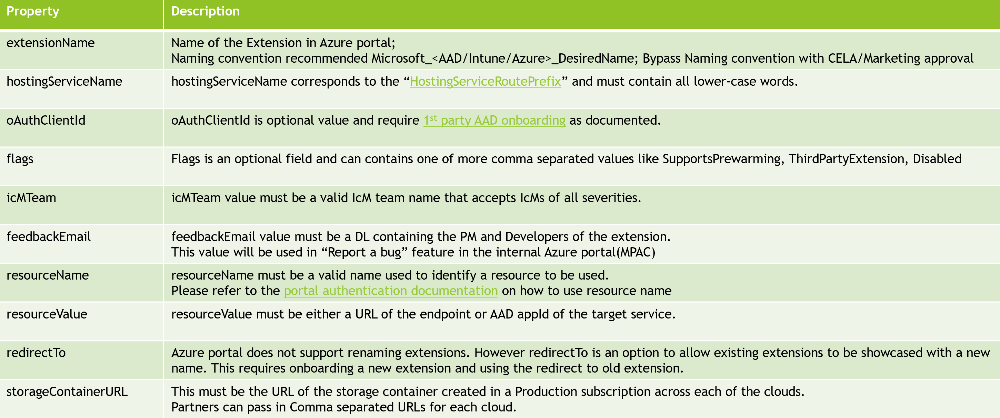

# Self-served onboarding using ServiceTree

## Introduction

Self-served onboarding using ServiceTree will be the only onboarding process required to onboard any new service/extension or manage existing extensions in Azure portal.

## Azure Onboarding Overview

## Highlights

1) Azure portal onboarding self-served using the service tree​

2) Partners won't be required to update any configuration files in Azure portal repositories.​

 3) No more pull requests for onboarding unless otherwise required in special cases​

 4) Partners can onboard to the Azure portal using service tree as soon as they are ready OR along with​

    1) Ring Onboarding​
    2) ARM RP
    3) Tech Support

 5) Portal team will pull the configuration from service and deploy the configuration to all clouds​

## Onboarding Requirements

1.	All services must be registered in Service Tree

2.	Services must decide on the name of their extension before onboarding

3.	Service must check with Marketing or CELA if required about the service name

4.	Services must have a dedicated IcM service and team for the Portal extension.

5.	Services must onboard to Azure Support and have required PESID

6.	Services must have Support Topics created for their Product.

7.	All services are responsible for their Preview and GA level KPIs as defined by Azure Global.

8.	A service tree id can be associated with one or more Azure portal extensions.

9.	Ex: Azure Portal, IaaS Experiences, AAD, Intune

10.	Third Party services must have a VP/Partner sponsor at Microsoft
11.	Partners must update their SDK version every 60-120-days
12.	Partners must acknowledge and resolve IcM alerts fired for extensions
13.	SDK age alerts or other extension related service health alerts must be resolved with high priority
14.	Orphaned services or extensions must be removed from Portal

## Ownership-transfer Requirements

1.	Transferring of ownership of a service or extension in Azure portal must be informed to Azure portal

2.	Partners must update SDK to the latest supported version before ownership transfer
3.	Partners must update the IcM service and team if ownership is transferred
4.	Feedback email DL must be updated with new team members
5.	Partners must not delete or update any information in the service tree without engaging Azure portal

## Off-boarding Requirements

1.	Deprecation or retiring experience requires 90 days notice to customers

2.	Service tree to provide an option to hide portal experience
3.	Hide option can be updated only in the backend by either Azure Portal team
4.	Service tree entries must not be removed or cleared without informing the Azure portal team
5.	Service tree entries must remain intact for 1year post the retirement
6.	Azure portal team must be engaged for any service change to deprecate experience

## Governance

1.	Portal onboarding automation to detect changes in config and log telemetry on all CRUD events

2.	Raise alerts on configuration validation failures
3.	Raise alerts on resource deletion
4.	Raise alerts on using “redirectTo”
5.	Raise alerts on Extension removal
6.	Prevent users from using “Disabled” value in flags unless is a custom domain

## Validations

## Portal config elements

Please post your onboarding questions on Stackoverflow using the tag [ibiza-onboarding](https://stackoverflow.microsoft.com/questions/tagged/ibiza-onboarding) or email [Onboarding Team](mailTo:ibiza-onboarding@microsoft.com)
