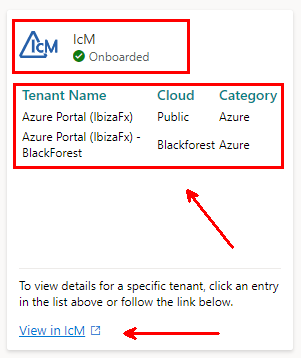
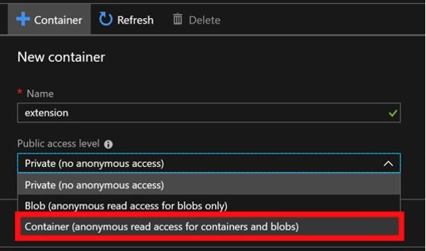
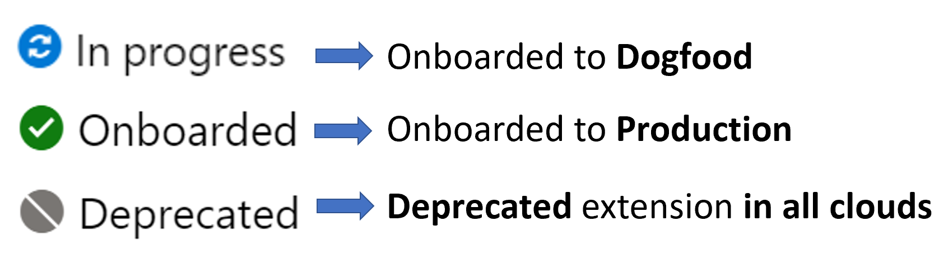
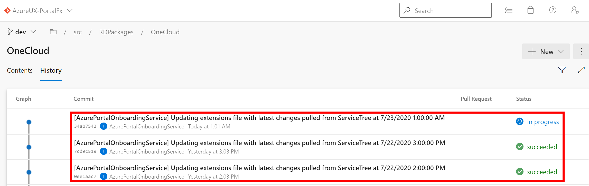

<a name="azure-portal-onboarding-using-easy-start"></a>
# Azure portal onboarding using Easy Start

<a name="azure-portal-onboarding-using-easy-start-introduction"></a>
## Introduction

This document is for Microsoft owned and operated services to integrate with the Azure Portal.

If you are not a Microsoft team building a new Azure service and looking to integrate with the Azure Portal, this is not the correct document for you. Please go [here](top-isv-index.md) for docs to learn how a ISV can integrate with the Azure Portal.

Azure portal onboarding process is updated and teams looking to onboard new extensions or updating/removing existing extensions do NOT need to raise pull requests going forward. Azure portal has migrated the extension configuration for all clouds to service tree. Partner teams can now manage the configuration through Easy Start onboarding site.

<a name="azure-portal-onboarding-using-easy-start-overview"></a>
## Overview

* Azure portal onboarding is now available through [EasyStart Onboarding](https://aka.ms/portalfx/easystart).

* Azure portal onboarding is self-served using the service tree​ metadata

* Partners won't be required to update any configuration files in Azure portal repositories.​

* No need to raise pull requests or cherry-picking changes across different branches for onboarding or updating configuration.

* Partners can onboard to the Azure portal using Easy Start experience that will update the corresponding service tree database.

* Portal team will pull the configuration from service tree and deploy the configuration to all clouds​ and across all portal and hosting service branches

* Any manual updates to the Azure portal configuration using pull requests will be discarded or overridden by our automation pipeline.

* Always update the extension configuration using the recommended tools that update the service tree database in the proper format required by Azure portal onboarding automation process.

* Any updates to service tree database directly using tools other than recommended could corrupt the configuration and will impact your service availability.

<a name="step-by-step-process-overview"></a>
# Step by Step Process overview

Onboarding a service or developing a Portal extension has three phases: onboarding, development, and deployment. The process is specified in the following image.


<a name="phase-1-onboarding"></a>
# Phase 1 - Onboarding

<a name="phase-1-onboarding-kickoff-meeting"></a>
## Kickoff Meeting

<a name="phase-1-onboarding-kickoff-meeting-already-own-an-extension-in-portal"></a>
### Already own an extension in Portal

* If your **extension is already onboarded** to either Dogfood or Public clouds and **need to onboard to other environments/clouds** in Portal, you can **skip this meeting** and go directly to the [Onboarding requirements](#onboarding-requirements) section.

<a name="phase-1-onboarding-kickoff-meeting-who-needs-these-meetings"></a>
### Who needs these meetings

* If you have scenarios that do NOT use an ARM RP(Resource Provider) or do NOT belong to Azure or need a customized experience in the Portal, we recommended you setup a meeting with the Azure portal onboarding team.

* If you're planning on hosting an internal-only service, a 3rd party service, or a non-Microsoft owned service, you must schedule a meeting with the onboarding team to get the required approvals and then start onboarding.

* If you have scenarios that do NOT require a full-fledged extension, and plan to surface your existing web interface through Azure portal, you can send a meeting invite to the Azure portal onboarding team.

<a name="phase-1-onboarding-kickoff-meeting-before-scheduling-a-meeting-with-the-onboarding-team"></a>
### Before scheduling a meeting with the onboarding team

* Make sure the person onboarding the extension is part of the admins group for the service tree entry where the new portal extension will be created. Ref [EasyStart](https://aka.ms/portalfx/easystart)

* The name of the extension must be decided by the service owner(s) and their leadership as appropriate.

* Both the IcM service and team must be configured in service tree and visible from the [EasyStart](https://aka.ms/portalfx/easystart)

* Onboarding requires an existing "email enabled security group" to serve as a feedback email for the extension, and the person onboarding must be part of this group.

* For each of the environments that you're trying to onboard, a separate storage account must be created. The account must have a container with anonymous read access permission for blobs and containers. The account must be attached to a production subscription and available for use during onboarding.

There are lots of docs here. We recommend you send an email to [ibiza-onboarding@microsoft.com](<mailto:ibiza-onboarding@microsoft.com?subject=Kickoff Meeting Request&body=My team would like to meet with you to learn about the Azure onboarding process.>) and request a kickoff meeting. Someone from our team will spend 30 minutes walking you through the process at a high level. We can point you in the right direction regarding the latest patterns and practices. We can also answer any questions you have. Finally, we can talk about how the relationship between our teams are managed.

<a name="phase-1-onboarding-onboard-with-related-teams"></a>
## Onboard with related teams

Onboarding to Azure is a big task that spans many teams. The doc you're reading will help you onboard to the portal, but there are many other teams you will need to work with to get your entire service up and running. These include, but are not limited to the following:

**NOTE:**  Contact information for these teams is [available here](https://aka.ms/portalfx/onboarding/partners)

1. Azure Resource Manager Team

    Reach out to this team to onboard your resource provider.
    <!--TODO: Locate distribution list for this purpose.  -->

1. Azure Marketing Team


1. Support Team

   For integrating with the support system and UX integration.

1. Azure.com team

   For a presence on the marketing site.

1. Billing team

   To register meters and other billing related activities.

1. AAD onboarding

   Reach out to AAD onboarding if the new extension service needs special permissions besides just calling your own resource provider servers. If the extension requires additional built-in support for standard Graph or ARM APIs, submit a partner request here: [https://aka.ms/portalfx/uservoice](https://aka.ms/portalfx/uservoice).

1. Azure fundamentals and compliance

   The Azure Fundamentals are a set of tenets to which each Azure service is expected to adhere. The Azure Fundamentals program is described in the document here: [https://aka.ms/azurefundamentals](https://aka.ms/azurefundamentals). That document also identifies the stakeholders and contacts for each of the tenets.

1. Security and privacy reviews

1. Start the CSS onboarding process with the CSS team at least three months prior to public preview. This process may coincide with the following step. For more information about development phases, see [top-extensions-developmentPhases.md](top-extensions-developmentPhases.md).

1. Nearly 70% of Azure users are from outside of the United States. Therefore, it is important to make Azure a globalized product. There are a few requirements under the "Internationalization" criteria that your extension is required to support. For more information about internationalization, Global Readiness requirements, see https://aka.ms/AzureGR. Please reach out through Contact -> Contact CELA Global Readiness team through https://aka.ms/GRWeb for inquire.

1. To get your service localized to Azure Portal languages, see more information at https://aka.ms/AzureLoc in this doc set. For localization enablement questions and Localization platform onboarding request, please follow procedures outlined at [https://aka.ms/AllAboutLoc](https://aka.ms/AllAboutLoc).

1. Decide on a name and any URLs for the extension. You may need to contact <a href="mailto:ibiza-onboarding@microsoft.com?subject=Name and URLs for new Extension">ibiza-onboarding@microsoft.com</a> to ensure that the name and URLs are unique.

1. Schedule a UX feasibility review with the Ibiza team UX contact by emailing <a href="mailto:ibiza-onboarding@microsoft.com?subject=Extension Feasibility Review">ibiza-onboarding@microsoft.com</a>.  Many extensions have been made more successful by setting up early design reviews with the Azure Portal team. Taking the time to review the design gives extension owners an opportunity to understand how they can leverage Azure Portal design patterns, and ensure that the desired outcome is feasible.

While the portal team cannot help directly with all of these factors, see [portalfx-extensions-contacts.md](portalfx-extensions-contacts.md) for a list of items with which we can assist you.

For less common scenarios, you might need to do a custom deployment. For example, if your extension needs to reach server services using certificate-based authentication, then there would be controller code on the server that our hosting service does not support. You should make certain that a custom hosting solution is the correct solution prior to developing one.


<a name="phase-1-onboarding-join-dls-and-request-permissions"></a>
## Join DLs and request permissions

 

Join the following groups to stay current on the Ibiza product road map, get news on latest features, and receive invites for Ibiza related events.

* PMs and Developer Leads should join the `Project Ibiza Partners - PMs`  group [here](https://idweb.microsoft.com/IdentityManagement/aspx/groups/AllGroups.aspx?popupFromClipboard=https%3A%2F%2Fidweb.microsoft.com%2Fidentitymanagement%2Faspx%2FGroups%2FEditGroup.aspx%3Fid%3Dacc725b5-30aa-4336-9c81-1867762bb945%26UOCInitialTabName%3DGroupingMembers).

* Developers should join the `Project Ibiza Partners - Engineering teams` group [here](https://idweb.microsoft.com/IdentityManagement/aspx/groups/AllGroups.aspx?popupFromClipboard=https%3A%2F%2Fidweb.microsoft.com%2Fidentitymanagement%2Faspx%2FGroups%2FEditGroup.aspx%3Fid%3D109b1485-33c5-4c00-8e85-69d9b6176b9f%26UOCInitialTabName%3DGroupingMembers).

* Instructions to get access to Ibiza telemetry can be found [here](top-telemetry.md#viewing-telemetry)

* PMs, Developers, and Developer Leads should subscribe to the partner request process by joining the ```Uservoice ``` group at this link:  [https://aka.ms/portalfx/uservoice](https://aka.ms/portalfx/uservoice). For more information about the partner request process, see [top-extensions-partner-request.md](/portal-sdk/generated/top-extensions-partner-request.md).

* PMs, Developers, and Developer Leads  should join Stackoverflow Forums that are located at [https://stackoverflow.microsoft.com](https://stackoverflow.microsoft.com)  to let us know if you have any questions. Remember to tag questions with supported tags that are monitored by the Ibiza team. All supported tags are documented in [portalfx-stackoverflow.md](portalfx-stackoverflow.md).

* Developers who want to contribute to the test framework should join groups from the site located at [https://aka.ms/azuregithub](https://aka.ms/azuregithub).


<a name="phase-1-onboarding-get-the-sdk-docs-and-samples-to-your-developers"></a>
## Get the SDK, docs, and samples to your developers

 The [development guide](README.md#development-guide) located in the main documentation index has all the right pointers.

<a name="phase-1-onboarding-get-the-sdk-docs-and-samples-to-your-developers-onboarding-requirements"></a>
### Onboarding Requirements

* All **services must be registered in Service Tree** and contain a **valid service tree id with an IcM team registered for each cloud** that the portal extension is onboarding to.

* Services must **decide on the name of the extension** before onboarding. **Obtain necessary leadership approval** for the name that you intend to use to **avoid changing the name** in future.

* Service must **check with Marketing or CELA** if required about the service name

* Services must have a **dedicated IcM service and team** for the Portal extension per cloud.

* Services must **onboard to Azure Support** and have required PESID. Please reach out to Azure supportability champs.

* Services must have **clearly defined Support Topics** created for their Product along with **corresponding root cause topics**.

* **Service owners are responsible** for their Preview and GA level KPIs as defined by Azure Global or Azure portal or Azure compliance teams.

* A **service tree id can be associated with one or more Azure portal extensions**. Eg: Azure Portal, IaaS Experiences, AAD, Intune

* **Third Party services must have a VP/Partner level sponsor** at Microsoft and must always be onboarded with the help of Azure portal team's guidance

* Partners must **[hide assets](portalfx-assets.md#how-to-hide-or-show-your-asset-in-different-environments)** in the environments that they do not want to show the portal extension specific assets.

* Portal **[deployment SLAs](top-extensions-svc-lvl-agreements.md)** may **change based on the leadership guidance or other company events like //build, //ignite or other conferences**

* Partners must **update their SDK version every 60-120-days** failing which the extension may not work as expected and cause live site incidents.

* Partners must **acknowledge and resolve IcM alerts** fired for extensions to avoid escalations.

* **SDK age alerts** or other extension related service health alerts **must be resolved** with high priority

* **Orphaned services or extensions** must be removed from Portal using the **deprecation** option.

* Partners must **create storage accounts for each of the environments** in the respective clouds and subscriptions. **Dogfood and Public environments can use storage accounts from Public subscriptions**

* **Partners are responsible for any delays in onboarding** to any cloud as **portal automation deploys the changes from service tree** as provided for a given extension.

* **Insufficient data** in the extension configuration **could affect the extension availability and performance**.

* **Service tree entries must not be removed** or cleared without informing the Azure portal team **if you own an active extension** in Azure portal.

<a name="phase-1-onboarding-get-the-sdk-docs-and-samples-to-your-developers-required-and-optional-fields"></a>
### Required and Optional fields

Please review the following required and optional fields for Portal extension.

| Field Name | Description | Required | Sample |
| ----------- | ------------------------------------------------- | -------- | -------- |
| Extension Name | Name of the extension | True | Microsoft_Azure_DemoExtension |
| Hosting Service Name | Name of the extension | True | demoextension |
| Feedback Email | Email enabled security group consisting of PMs and Developers of the extension | True | demoextPMDev@microsoft.com |
| Icm Team Id | Team Id of the IcM for the given cloud | True | 12345 (numeric values only) |
| Storage Container URL | URL of the storage container in the given cloud with Anonymous read access | True | https://demostorage.core.windows.net/containername |
| Redirect To | Required only if you intend to redirect the new extension to an existing one owned by your team | False | Microsoft_Azure_OldDemoExtension |
| 1st Party AAD App ID | This should be a 1st party AAD App owned by your team | False | demoextension |
| Flags | Pre-defined flags as listed | False | SupportsPrewarming, Disabled, ThirdPartyExtension |

<a name="phase-1-onboarding-get-the-sdk-docs-and-samples-to-your-developers-resource-access"></a>
### Resource Access

* Please use the **[new resourceAccess client side configuration model](top-extensions-authentication-procedures.md#migrating-resource-access-configuration)** for all extensions

* **Adding/Updating server side resourceAccess section is not supported** with the new onboarding model as we are moving to a client side resource access model.

* Please **migrate your existing extensions** to the **[new resourceAccess client side configuration model](top-extensions-authentication-procedures.md#migrating-resource-access-configuration)**

* Partners who **require resourceAccess to call other backend services like graph, keyvault** or other custom services, must **use client side configuration** to add resourceAccess.

* If you have scenarios that **need help updating resourceAccess or migrating to new model**, please post your onboarding questions on Stack Overflow using the tag [ibiza-onboarding](https://stackoverflow.microsoft.com/questions/tagged/ibiza-onboarding) and email [Onboarding Team](mailTo:ibiza-onboarding@microsoft.com).

<a name="phase-1-onboarding-get-the-sdk-docs-and-samples-to-your-developers-step-by-step-guide-to-portal-onboarding"></a>
### Step By Step guide to Portal onboarding

* Visit Easy Start onboarding  **https://aka.ms/portalfx/easystart/**

* Click **Onboard a new extension** OR **Manage an extension**

**Enter Extension Name**


<a name="phase-1-onboarding-get-the-sdk-docs-and-samples-to-your-developers-step-by-step-guide-to-portal-onboarding-extension-name"></a>
#### <strong>Extension Name</strong>

* Enter a unique Extension Name as per **naming convention "Microsoft_Azure_ExtensionName"**.
* Please **check with Marketing team or your leadership team** before deciding a name and onboard to Azure portal.​
* Extension Name **cannot be renamed**.
* Extension Name **must be common across all clouds**
* Extension Name is shown in the URL and get stamped in user settings when accessing specific resource types.

**Extension Details**


<a name="phase-1-onboarding-get-the-sdk-docs-and-samples-to-your-developers-step-by-step-guide-to-portal-onboarding-hosting-service-name"></a>
#### <strong>Hosting Service Name</strong>

* **Must be unique** across all extensions.

* Used in the extension's csproj file as **HostingServiceRoutePrefix**. [More Info](top-extensions-hosting-service.md#build-configuration).

<a name="phase-1-onboarding-get-the-sdk-docs-and-samples-to-your-developers-step-by-step-guide-to-portal-onboarding-feedback-email-address"></a>
#### <strong>Feedback Email Address</strong>

* Please enter a valid **email enabled security group** with the list of PMs and Developers responsible for handling any issues with this extension.

* User adding/updating the extension configuration must be part of the feedback email group.

<a name="phase-1-onboarding-get-the-sdk-docs-and-samples-to-your-developers-step-by-step-guide-to-portal-onboarding-icm-team"></a>
#### <strong>IcM Team</strong>

* Please select a valid **IcM Team** of the registered IcM service and team for this extension.

* IcM Team must support all clouds and must have assignable property set to true. Please ensure all Silos are enabled in the IcM.

* You can use the same IcM team for Dogfood and Production extensions.

* Sovereign clouds must have their own valid IcM Team or existing Team must support the Sovereign cloud.

**Note:** IcM Teams are shown in Easy Start. Please click on the entries under Tenant Name on the IcM Tile.



<a name="phase-1-onboarding-get-the-sdk-docs-and-samples-to-your-developers-step-by-step-guide-to-portal-onboarding-storage-container-url"></a>
#### <strong>Storage Container URL</strong>

* Please enter a valid **storage container URL**.

* **Dogfood and Production extensions** can create storage accounts in public cloud subscription.

* **Sovereign clouds must always use respective cloud storage account** from the corresponding cloud subscription. **Eg: Fairfax storage account must be created in Fairfax subscription**.

* Create **separate storage account for each environment**
eg: Dogfood, Prod, Mooncake and Fairfax

* **Create a container** under the storage account with **anonymous read access**.

* Upload the [config.json](top-extensions-hosting-service.md#step-6-upload-safe-deployment-config) and the [generated zip file](top-extensions-hosting-service.md#step-1-generate-hosting-service-versioned-zip-file) from your build.


<a name="phase-1-onboarding-get-the-sdk-docs-and-samples-to-your-developers-step-by-step-guide-to-portal-onboarding-redirect-to"></a>
#### <strong>Redirect To</strong>

* This is **applicable only if you already have an extension registered in your service that you would like to redirect to**.

* Since **Azure portal does not allow renaming of extensions**, our **recommendation is to create a new extension and redirect to old one** using this option.

* Extensions are **NOT required to create a storage account to redirect extension** or specify one if you intend to redirect to an existing extension. Extensions **must specify the hosting service name that is used by the previous extension**.

<a name="phase-1-onboarding-get-the-sdk-docs-and-samples-to-your-developers-step-by-step-guide-to-portal-onboarding-st-party-aad-app-id"></a>
#### <strong>1st party AAD App Id</strong>

* All **extensions must [register a 1st party AAD app](#aad-onboarding) if you are calling graph or other backend services**.

* Extensions **do NOT need 1st party AAD app if you only call ARM**

* Do **NOT** use multiple 1st party AAD apps in one extension.

* Extensions may use one AAD app across multiple extensions.

<a name="phase-1-onboarding-get-the-sdk-docs-and-samples-to-your-developers-step-by-step-guide-to-portal-onboarding-flags"></a>
#### <strong>Flags</strong>

* All new extension onboarding must use **"SupportsPrewarming"**.

* Do NOT use **"Disabled"** unless you require hiding your extension during development stages.

<!-- docs#thirdpartyflag -->

* **"ThirdPartyExtension"** must be used if the service is non-Microsoft. **Not using the ThirdPartyExtension for non-Microsoft services is considered as security and privacy violation** and could potentially leak user data.

* Any **services calling services outside of Microsoft and NOT using ThirdPartyExtension flag will be removed** from Azure portal.

<!-- docs#thirdpartyflag -->

<a name="phase-1-onboarding-get-the-sdk-docs-and-samples-to-your-developers-step-by-step-guide-to-portal-onboarding-flights"></a>
#### <strong>Flights</strong>

* Flights are named versions that can be loaded in **[MPAC](https://ms.portal.azure.com)**. [See more](top-extensions-flighting.md#mpac-flighting)

* You can add a flighted version to the config.json in your extension package and specify that name in this field.

<a name="phase-1-onboarding-get-the-sdk-docs-and-samples-to-your-developers-frequently-asked-questions"></a>
### Frequently Asked Questions

* ***I am unable to update my existing extension as the next button is disabled. What am I doing wrong?***

    * New onboarding process requires all extensions to be onboarded to be onboarded to Dogfood configuration prior to onboarding to Production or National clouds.

    * **Missing Dogfood configuration** may cause extensions not to show "Next" button

    * **Check the IcM** Team which must be a valid IcM team for your service. See above requirements for IcM Team Id.

    * You can **fill in the values for dogfood configuration** as per your existing production configuration in this section and continue to next screen.

    * You are **recommended to use a different storage account** for the dogfood environment.

    * You can **disable your dogfood extension if you do not intend to use** this.

* ***I do NOT plan to onboard to Sovereign clouds immediately. Can I skip them?***

    * All services that are in scope for **National/Sovereign clouds are required to onboard to the respective clouds as per the guidelines provided by Azure Global team**.

    * Please **reach out to Azure Global team** to check for the timelines and requirements on onboarding to National/Sovereign clouds.

* **Where can I find IcM Team Id?**

    * You check the **[IcM Tenant Details](https://icm.ad.msft.net/imp/ManageTenants.aspx)** for your service.

<a name="phase-1-onboarding-get-the-sdk-docs-and-samples-to-your-developers-how-to-verify-onboarding-status"></a>
### How to verify onboarding status



* **Easy Start** shows the **onboarding status** for each extension that is onboarded.

    * **In-Progress** - Indicates the extension is **onboarded only to Dogfood configuration**.

    * **Onboarded** - Indicates the extension is **onboarded to Production**.

    * **Deprecated** - Indicates the extension is **deprecated from all clouds**.

<a name="phase-1-onboarding-get-the-sdk-docs-and-samples-to-your-developers-how-to-verify-onboarding-status-note-deprecated-extension-configuration-will-not-be-written-to-azure-portal-configuration-however-this-information-continues-to-exist-in-service-tree-database-for-governance-reasons-and-partners-can-choose-to-revert-if-needed"></a>
#### Note : Deprecated extension configuration will not be written to Azure portal configuration. However this information continues to exist in Service tree database for governance reasons and partners can choose to revert if needed

* **Portal onboarding service checks every hour** for any updates to the services tree database and reads the extension metadata from service tree database and **updates the portal extension configuration files** (Extension.*.json) in Azure portal framework repository **for all branches**


* You can verify the commits written to the Portal Framework repositories using the commit link from the [Deployment Status Dashboard](https://aka.ms/portalfx/deploymentstatus)

* **Search or select** your extension and click on corresponding woritem or commit URI links to view the details.

<a name="phase-1-onboarding-get-the-sdk-docs-and-samples-to-your-developers-how-to-verify-deployment-status"></a>
### How to verify deployment status

* The user who updated or onboarded the extension should have received an email with the workitem that corresponds to the change they made in EasyStart.

* Please open the woritem and check the deployment tab to the right.

* Alternatively you visit **https://aka.ms/portalfx/deploymentstatus** to get the workitem link

* **Search or select** your extension and check the details.

* Click the workitem URL or commit URL from the dashboard to open the corresponding change or track deployment.

<a name="phase-1-onboarding-get-the-sdk-docs-and-samples-to-your-developers-ownership-transfer-requirements"></a>
### Ownership-transfer Requirements

* Visit [EasyStart](https://aka.ms/portalfx/easystart) and click on **Manage an extension** and then choose **Transfer Extension**
* Transferring ownership of a portal extension from [EasyStart](https://aka.ms/portalfx/easystart) requires the user to be part of the admins group on both current and target services.

* Partners must update SDK to the latest supported version before ownership transfer

* Partners must update the IcM service and team if ownership is transferred along with the feedback email address of the new owners

* Make sure storage accounts used in the extension across all clouds are owned by the new owners and there is no disruption to the services.

<a name="phase-1-onboarding-get-the-sdk-docs-and-samples-to-your-developers-off-boarding-deprecation-of-service"></a>
### Off-boarding / Deprecation of service

* Deprecation or retiring experience of any service that is in GA requires 90 days notice to customers and services in Public Preview require 30days notice to customers.

* Service owners can deprecate the service from [EasyStart](https://aka.ms/portalfx/easystart) and this will remove the configuration for all clouds from Portal repository.

* **Deprecating an extension in a single cloud is NOT supported via EasyStart** and extension owners must either disable their extension or hide all assets from the extension.

* Contact Azure Portal Onboarding team if you need to deprecate an extension in a particular cloud only.

<a name="phase-1-onboarding-get-the-sdk-docs-and-samples-to-your-developers-aad-onboarding"></a>
### AAD Onboarding

NOTE: ARM tokens obtained during portal login are meant only for calling ARM. For all other purposes, please create a 1st party App.

* Register your 1st party AAD app from **[First Party Portal](https://firstpartyportal.msidentity.com/RegisterApp)**

* Go to Provisioning tab and select **unknown** in the dropdown for **How will you make your application available to customers** and in the **"Provide more detail"** section, add **"This app will be used by Azure portal extension to call graph and other backend services"**.

* Go to the **Owners** tab and use an email enabled security group that you and your team are part of **domain\securitygroup** as the **Owners Security Group**

* Update the **Subject Name Issuer in the authentication tab**, **Reply URI** and the **App Owners** as recommended in **[this document](https://aka.ms/portalfx/SNI)**.

* Add any other required fields as appropriate and submit your application.

* After the PPE app is approved, you can create a new app for Production environment and go to the app's environment section and promote to the other clouds environments if the Prod app is approved.

**IMPORTANT NOTE: *Partners are responsible for making sure the AAD app has all the required permissions and pre-authorization to access intended resources.***
<!--
TODO - Add an example after the feature is ready (ETA is March or April )
-->

<a name="phase-2-development"></a>
# Phase 2 - Development

<a name="phase-2-development-develop-your-extension"></a>
## Develop your extension

 The [development guide](top-extensions-getting-started.md) located in the main documentation index has all the right pointers.

<a name="phase-2-development-learn-about-the-hosting-service-plan-your-deployment-strategy"></a>
## Learn about the hosting service / plan your deployment strategy

The Ibiza team provides and operates a common extension hosting service that makes it easy to get your extension into a globally distributed system without having to manage your own infrastructure. For more information see [top-extensions-hosting-service.md](top-extensions-hosting-service.md).

For less common scenarios, you might need to do a custom deployment.

For example, if you need to talk to backend services using certificate-based authentication then you'll need controller code on the server. This is not supported with our hosting service. You should be very sure you require a custom hosting solution before going down this path.

**NOTE**: The deployment can be configured in such a way that the client portion of the extension uses the hosting service while the custom controller code can be deployed separately.
For more information, see [top-extensions-custom-deployment.md](top-extensions-custom-deployment.md).

<a name="phase-2-development-register-the-extension-with-the-portal-product-configuration"></a>
## Register the extension with the portal product configuration

Once the name of the extension is finalized, it is time to register the extension in all environments. This requires a portal deployment and can take time. Our Service Level Agreements are located at [top-extensions-svc-lvl-agreements.md](top-extensions-svc-lvl-agreements.md).  Please plan accordingly.

* Use EasyStart to perform initial registration, as well as any registration updates in the future. See top of this document for details.

* **NOTE**: Extension names must use standard extension name format, as in the example located [here](/portal-sdk/generated/top-extensions-configuration.md#configuration-file-locations-and-structure).

* **NOTE**:  Extension URLs adhere to the naming requirements located in [portalfx-extensions-cnames.md](portalfx-extensions-cnames.md).

* Show your asset types.

<a name="phase-2-development-onboarding-to-out-of-the-box-alerts-for-your-extension"></a>
## Onboarding to out-of-the-box alerts for your extension

In order to ensure that all teams meet quality standard to be included in the Azure Portal, we require teams onboard to our out-of-the box alerting infrastructure. This will not require any deployment on your part, but only submitting a PR with a JSON configuration specifying your thresholds, which you can learn more about in our [alerting onboarding documentation](./top-telemetry-alerting.md)

The following alerts are required:
1. Extension SDK Age (automatically opted-in by default when onboarded to alerting)
1. Performance
1. Availability

<a name="phase-2-development-onboarding-to-a-b-testing"></a>
## Onboarding to A/B Testing

Ibiza offers out-of-the-box A/B testing and feature flighting through the [ExP Experimentation Platform](https://expdocs.azurewebsites.net/azureexp.html).

To learn how you can integrate your extension and learn more, visit the [Ibiza Experimentation website](https://aka.ms/Ibizaexperimentation)

<a name="phase-3-deployment"></a>
# Phase 3 - Deployment

<a name="phase-3-deployment-release-kind"></a>
## Release kind

There are three typical release kinds: private preview, public preview, and Global Availability (GA). For the purposes of deployment public preview and GA are the same. The only difference is that the UI may show preview labels and disclaimers where appropriate. For more information about the three kinds of releases, see  [top-extensions-developmentPhases.md](top-extensions-developmentPhases.md).

<a name="phase-3-deployment-private-preview"></a>
## Private preview

For a private preview, the goal is to hide your experience to the general public, but show it to a limited audience. This procedure assumes that the discoverable entry point in the product is the All Services menu, also known as the Browse menu.

Hiding or showing items in the all services menu is controlled by the extension configuration that gets deployed with your extension. The following  example shows how to set it up.
To do so, you should make a change to hide all your asset types in the environments you wish to stay hidden in. See [hiding assets](portalfx-assets.md#How-to-hide-your-asset-in-different-environments) for help with the change.

When in the hidden state, users will not be able to browse to or search for the entry point of the extension. However, you can distribute a special link like the following one that enables the entry point by using a feature flag.
https://portal.azure.com?extensionName_hideassettypes=none

A few notes about this path:

* Any user that receives this URL will be able to see your entry point.

* Any users who receives a deep link to blades within your extension will be able to see that experience even without the feature flag

* If the extension is integrated into the Marketplace, then that team has its own way of hiding Marketplace items. Contact <a href="mailto:1store@microsoft.com?subject=Integrating a New Extension into the Marketplace">1store@microsoft.com </a> for more details.

<a name="phase-3-deployment-public-preview-or-ga"></a>
## Public preview or GA

You are required to check the quality of your extension. We have standardized ways of measuring reliability and performance at key areas. If you have a private preview then we have already collected this data for you.

There is no blocking exit criteria, which means you do not have to prove that the extension's performance and reliability are in the required range. However, once you ship, the Portal team will monitor the quality of the extension. Extensions that do not meet the required quality bar will be flagged in executive reviews and will be asked to improve their quality as soon as possible.

When you are ready for all users to see your experience, you will enable your entry point as shown in the following example and then deploy your extension.

<a name="phase-3-deployment-public-preview-or-ga-useful-links"></a>
### Useful links

| Link | Description |
| ----------- | ------- |
| [Architecture](https://aka.ms/portalfx/onboarding/architecture)     | Azure portal architecture  |
| [Getting Started](https://aka.ms/portalfx/onboarding/gettingstarted) | How To: Getting started with Azure portal SDK |
| [Gallery Packages](https://github.com/Azure/portaldocs/blob/master/gallery-sdk/generated/index-gallery.md#gallery-overview) | How To: Getting started with Gallery Packages |
| [Onboarding PPT](https://aka.ms/portalfx/onboarding/ppt)     | Azure portal Onboarding Powerpoint Slides  |
| [Samples Playground](https://aka.ms/portalfx/playground)     | Azure portal Samples Playground  |
| [Authentication in Azure portal](https://aka.ms/portalfx/auth)     | How To: Azure portal authentication  |
| [Azure portal Release Pipeline](https://dev.azure.com/msazure/One/_dashboards/dashboard/adf2732d-f4a9-476d-a7a7-7ab7aab4a2ad)     | Check Framework Service release pipeline  |
| [Hosting Service Release Pipeline](https://dev.azure.com/msazure/One/_dashboards/dashboard/25be4cd4-4fbd-45c9-b257-79baf530abbe)     | Check Hosting Service release pipeline   |
| [Check Framework Commits](https://commits.azurewebsites.net/#repos/AzureUX-PortalFx/commits)     | Check commit status for Framework   |
| [Check Hosting Service Commits](https://commits.azurewebsites.net/#repos/AzureUX-PortalHostingSvc/commits)     | Check commit status for Hosting Service   |
| [Commit History](https://commits.azurewebsites.net/#repos/AzureUX-PortalHostingSvc/commits)     | Check commit status for Hosting Service   |
| [Simonp-Sites Commits](http://simonp-sites/commits/search)     | Alternative tool for framework commit status   |
| [Simonp-Sites Pipeline](http://simonp-sites/pipeline)     | Alternative tool for pipeline   |
| [Simonp-Sites Environments](http://simonp-sites/environments)     | Alternative tool for environments   |

You can ask developer community questions on Stackoverflow with the tag [ibiza-onboarding](https://stackoverflow.microsoft.com/questions/tagged/ibiza-onboarding) or use the following for specific areas of Ibiza.

<a name="phase-3-deployment-stackoverflow-forums"></a>
## Stackoverflow Forums

The Ibiza team strives to answer the questions that are tagged with Ibiza tags on the Microsoft [Stackoverflow](https://stackoverflow.microsoft.com) Web site within 24 hours. If you do not receive a response within 24 hours, please reach out to the owner associated with the tag.

To help the Azure UI team answer your questions, the submissions are categorized into various topics that are marked with tags.
To read forum submissions, enter the following in the address bar of your browser:

```https://stackoverflow.microsoft.com/questions/tagged/<ibizaTag>```

To ask a question in a forum, enter the following in the address bar of your browser.

```https://stackoverflow.microsoft.com/questions/ask?tags=<ibizaTag>```

where

**ibizaTag**:  One of the tags from the following table, without the angle brackets.

You can also click on the links in the table to open the correct Stackoverflow forum.

| Tag | Purpose | Owner | Contact |
| ----------------------------------------------------------------------------------------------------- | --------------------------------------------------------------------------------------------- | ------------------- | ------- |
| [ibiza](https://stackoverflow.microsoft.com/questions/tagged/ibiza) | This is a generic Ibiza tag that should only be used when none of the below tags apply to your question. The 24 hour response SLA does not apply to this tag as someone from the Ibiza team has to triage the question and send it to the appropriate owner. Please use one of the below tags when possible and resort to this tag only when none of the other tags apply. | Shrisha Kumar | |
| [ibiza-accessibility](https://stackoverflow.microsoft.com/questions/tagged/ibiza-accessibility) | Questions regarding accessibility onboarding, best practices, supported accessible controls, etc. Also, questions regarding the accessibility bug process and exception process. | Christopher Scrosati | <a href="mailto:ibiza-accessibility@microsoft.com?subject=Stackoverflow: Accessibility">ibiza-accessibility@microsoft.com </a> |
| [ibiza-alert](https://stackoverflow.microsoft.com/questions/tagged/ibiza-alert)|A tag for questions related to the alerting and monitoring framework that Ibiza provides for extension owners.| Jesse Vasquez | |
| [ibiza-az](https://stackoverflow.microsoft.com/questions/tagged/ibiza-az) | Questions related to the '`Az`' FX feature that renders a standard HTML page into a Blade or Part (rendered in a child IFrame). | Brad Olenick | |
| [ibiza-blades-parts](https://stackoverflow.microsoft.com/questions/tagged/ibiza-blades-parts) | A tag for all questions related to Ibiza Blades, Parts (Tiles), Commands. | Hee Ju Kim | |
| [ibiza-breaking-changes](https://stackoverflow.microsoft.com/questions/tagged/ibiza-breaking-changes) | Breaking changes that are are insufficiently documented on [https://aka.ms/portalfx/breaking](https://aka.ms/portalfx/breaking) | Shrisha Kumar | |
| [ibiza-browse](https://stackoverflow.microsoft.com/questions/tagged/ibiza-browse) | The primary navigation path in the Azure Portal. Browse consists of the Browse/Services menu, the resource list blade, and pinned part. Browse supports ARM subscription resources, ARM tenant resources, as well as custom data or simply launching your own blade. Learn more at [https://aka.ms/portalfx/browse](https://aka.ms/portalfx/browse). | Tanya Yang | |
| [ibiza-cli](https://stackoverflow.microsoft.com/questions/tagged/ibiza-cli) | Use for questions regarding usage of `ap` CLI i.e. the CLI used by extension developers, ap CLI [docs](https://aka.ms/portalfx/apclidoc) and video demonstrating setup, features and usage of the CLI is [here](https://aka.ms/portalfx/apcli) | Shrisha Kumar | |
| [ibiza-controls](https://stackoverflow.microsoft.com/questions/tagged/ibiza-controls) | Tag for questions related to Ibiza's control library | Christopher Scrosati | |
| [ibiza-controls-grid](https://stackoverflow.microsoft.com/questions/tagged/ibiza-controls-grid) | A tag specially for questions related to Ibiza's Grid controls. | Christopher Scrosati | |
| [ibiza-create](https://stackoverflow.microsoft.com/questions/tagged/ibiza-create) | A tag for questions related to Ibiza's resource create experiences and provisioning APIs. | Ayesha Ghaffar | |
| [ibiza-data](https://stackoverflow.microsoft.com/questions/tagged/ibiza-dashboard) | A tag for questions related to ibiza dashboards. | Santhosh Somayajula | |
| [ibiza-data](https://stackoverflow.microsoft.com/questions/tagged/ibiza-data) | A tag for questions related to the Batch API that Ibiza supports. | Ayesha Ghaffar | |
| [ibiza-declarative](https://stackoverflow.microsoft.com/questions/tagged/ibiza-declarative) | A tag for questions related to declarative extension development. Learn [more](top-declarative.md). | Shrisha Kumar | |
| [ibiza-development](https://stackoverflow.microsoft.com/questions/tagged/ibiza-development) | A tag for questions related local development of extensions like IDE integration, side-loading etc. | Shrisha Kumar | |
| [ibiza-experimentation](https://stackoverflow.microsoft.com/questions/tagged/ibiza-experimentation) | A tag for questions related ibiza experimentation. | Ayesha Ghaffar | |
| [ibiza-forms](https://stackoverflow.microsoft.com/questions/tagged/ibiza-forms) | An Ibiza monitored tag for questions related to Azure Portal forms. | Christopher Scrosati | |
| [ibiza-formbuilder](https://stackoverflow.microsoft.com/questions/tagged/ibiza-formsbuilder) | An Ibiza monitored tag for questions related to formbuilder. | Shrisha Kumar | |
| [ibiza-hosting-service](https://stackoverflow.microsoft.com/questions/tagged/ibiza-hosting-service) | Questions related to the Hosting Service. For questions related to on-boarding to the Hosting Service, please use the ibiza-onboarding tag. | Shrisha Kumar | |
| [ibiza-hubs](https://stackoverflow.microsoft.com/questions/tagged/ibiza-hubs) | Questions related to the Hubs extension. | Ayesha Ghaffar | |
| [ibiza-localization-global](https://stackoverflow.microsoft.com/questions/tagged/ibiza-localization-global) | Questions related to Localization or globalization within the portal. Guidence on what is or is not supported, and current languages that the Portal supports. | Shrisha Kumar | |
| [ibiza-missing-docs](https://stackoverflow.microsoft.com/questions/tagged/ibiza-docs) | Topics that are not included in [https://aka.ms/portalfx/docs](https://aka.ms/portalfx/docs), are incomplete, or are difficult to understand | Shrisha Kumar | |
| [ibiza-notifications](https://stackoverflow.microsoft.com/questions/tagged/ibiza-notifications) | Tag for questions related to notifications in the Azure Portal. | Joseph Kim | |
| [ibiza-onboarding](https://stackoverflow.microsoft.com/questions/tagged/ibiza-onboarding) | A tag for questions related to on-boarding a new extension to the Azure Portal or onboarding to the Hosting Service | Santhosh Somayajula | |
| [ibiza-performance](https://stackoverflow.microsoft.com/questions/tagged/ibiza-performance) | Questions related to Ibiza performance. | Brad Olenick | <a href="mailto:ibiza-perf@microsoft.com?subject=Stackoverflow: Performance">ibiza-perf@microsoft.com </a> |
| [ibiza-react](https://stackoverflow.microsoft.com/questions/tagged/ibiza-react) | Questions related to Ibiza React views development. | Austin Luo | |
| [ibiza-sdkupdate](https://stackoverflow.microsoft.com/questions/tagged/ibiza-sdkupdate) | Issues encountered during updating from one version of the ibiza sdk to another, for example,  **NuGet**, **Node Modules**, **PowerShell**, or **AzureUX-TemplateExtension** project template-related issues | Shrisha Kumar | |
| [ibiza-security-auth](https://stackoverflow.microsoft.com/questions/tagged/ibiza-security-auth) | Questions related to Portal Authentication, Security model, AAD onboarding, Ibiza extension onboarding. Please provide details on your extension name and requirements/scenarios. | Santhosh Somayajula | |
| [ibiza-telemetry](https://stackoverflow.microsoft.com/questions/tagged/ibiza-telemetry) | All questions regarding Ibiza-Telemetry | Jesse Vasquez | ibiza-telemetry@microsoft.com |
| [ibiza-test](https://stackoverflow.microsoft.com/questions/tagged/ibiza-test) | The CSharp test framework `Microsoft.Portal.TestFramework` and the nodejs test framework `@microsoft/azureportal-test` and `@microsoft/azureportal-ut` | Shrisha Kumar | |

