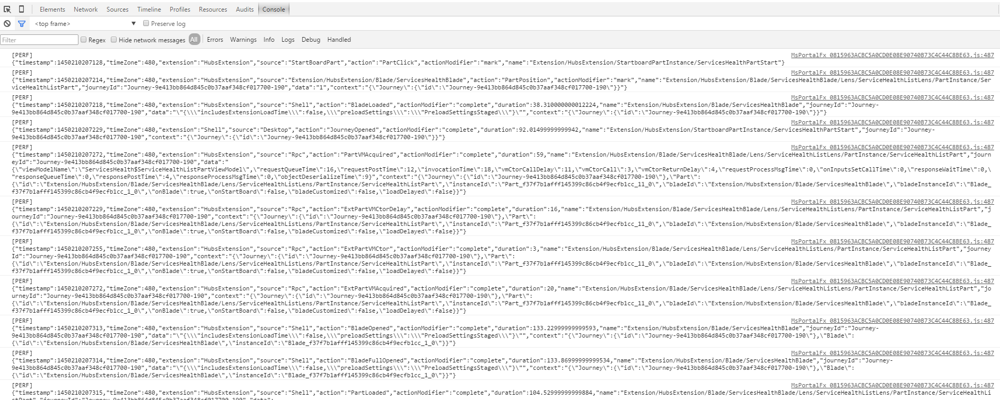
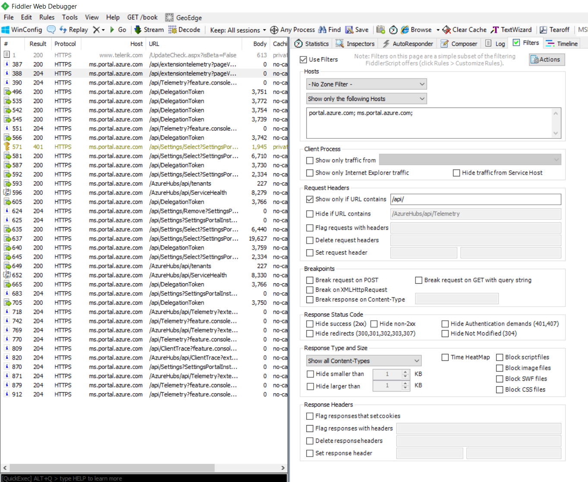

* [Overview](#overview)
    * [Viewing telemetry](#overview-viewing-telemetry)
        * [Permissions](#overview-viewing-telemetry-permissions)
        * [Telemetry reports and dashboards](#overview-viewing-telemetry-telemetry-reports-and-dashboards)
        * [Custom queries](#overview-viewing-telemetry-custom-queries)
    * [Logging telemetry](#overview-logging-telemetry)
        * [Onboarding to ExtTelemetry/ExtEvents tables](#overview-logging-telemetry-onboarding-to-exttelemetry-extevents-tables)
        * [On Hosting Service](#overview-logging-telemetry-on-hosting-service)
        * [Logging telemetry to ExtTelemetry table](#overview-logging-telemetry-logging-telemetry-to-exttelemetry-table)
        * [Logging errors/warnings to ExtEvents table](#overview-logging-telemetry-logging-errors-warnings-to-extevents-table)
        * [Verifying live telemetry](#overview-logging-telemetry-verifying-live-telemetry)


<a name="overview"></a>
# Overview

The framework offers a common telemetry solution which as you develop and deploy your extension will track any common actions users take throughout your experience. If you wish to track specific actions in a custom manner that is also possible.

The common set of actions is viewable via our Power BI reports and the Kusto explorer (a query editor). If you chose to log your extension telemetry to the framework's tables then that will also be viewable via the Kusto explorer.

Ask questions on: [https://stackoverflow.microsoft.com/questions/tagged?tagnames=ibiza-telemetry](https://stackoverflow.microsoft.com/questions/tagged?tagnames=ibiza-telemetry)

<a name="overview-viewing-telemetry"></a>
## Viewing telemetry

To view the telemetry which is logged throughout the portal you will first need permissions, then you will gain access to our Power BI reports and the Kusto cluster for custom queries.

<a name="overview-viewing-telemetry-permissions"></a>
### Permissions

All Azure employees should have access to our Kusto clusters. The way permissions are granted is through inheritance of the overall AAD group (`REDMOND\AZURE-ALL-PSV` for teams in C+E, for teams outside `REDMOND\AZURE-ALL-FPS`). We do not grant individuals access to the kusto, you will need to join your respective team's group. To inherit the valid permissions your team should have a standard access group you can join in //ramweb or //myaccess and that group should be configured to have the correct permissions.

If you don't have access, please follow the below steps:

1. Visit [http://aka.ms/standardaccess](http://aka.ms/standardaccess)
1. On the standard access page you will find a table of team projects 'Active ​Azure  Team Projects'
1. Search the table for your team's group (if you are unware of which group to join ask your colleagues)
1. Once you have found the correct group join that group via //myaccess or reach out to team's support alias for further help.
1. Ensure your request has been approved, if you have been denied for any reason please follow up with the group support alias.

<a name="overview-viewing-telemetry-permissions-what-if-i-can-t-find-a-group"></a>
#### What if I can&#39;t find a group

If you are unable to find a group to join within the table, you may need to create a new group. First confirm that with your colleagues, there may be a group that is named non-intuitively.

If there is still no group you can join, you will need to create a new group. To do that please follow documentation on [http://aka.ms/standardaccess](http://aka.ms/standardaccess).
Look for the link named ['Azure RBAC Getting Started Guide'](http://aka.ms/portalfx/telemetryaccess/newgroup).
There are various steps to follow, unfortunately the Ibiza team do not own this process. The standard access team have step by step videos you can use to follow along. If you need further assistance with creating a new group please contact the 'MyAccess' support team.

For all other questions please reach out to [Ibiza Telemetry](mailto:ibiza-telemetry@microsoft.com).

<a name="overview-viewing-telemetry-permissions-programmatic-access"></a>
#### Programmatic access

Please note that we already offer pretty extensive and customized alerting for extensions that may reduce (often eliminates) the need for you to request programmatic accesses. Please see https://aka.ms/portalfx/docs/alerting for more details.
However, if you require programmatic access, we're onboarding partners to our dedicated AzPortalPartner follower cluster. To see the steps to proceed, please review our [onboarding instructions](https://github.com/Azure/portaldocs/blob/master/portal-sdk/generated/portalfx-telemetry-getting-started.md#programmatic-access).

Kusto.Explorer: [Application](http://kusto-us/ke/Kusto.Explorer.application)

<a name="overview-viewing-telemetry-telemetry-reports-and-dashboards"></a>
### Telemetry reports and dashboards

Following are some of the dashboards that we support. If you do not have access to any of these please follow our [permissions documentation](#permissions).


| Name | Link |
| ---- | ------------ |
| Portal Extension insights | [https://aka.ms/portalfx/workbooks/extension](http://aka.ms/portalfx/workbooks/extension) |
| Portal High-usage Performance Dashboard | [https://aka.ms/portalfx/performance/viewer](https://aka.ms/portalfx/performance/viewer) |


| Name |  Metrics Docs |
| ---- | ------------ |
| Performance Docs | [top-extensions-performance.md](top-extensions-performance.md) |
| Reliability Docs | [portalfx-reliability.md](portalfx-reliability.md) |
| Create Telemetry Docs | [portalfx-telemetry-create.md](portalfx-telemetry-create.md) |
| How to analyze client errors | [portalfx-telemetry-extension-errors.md](portalfx-telemetry-extension-errors.md) |

<a name="overview-viewing-telemetry-custom-queries"></a>
### Custom queries

If the Power BI reports do not expose the exact information you need or you are carrying out some investigation, you may want to author a custom query to view the data.

<a name="overview-viewing-telemetry-custom-queries-connecting-to-the-cluster"></a>
#### Connecting to the cluster

All the portal telemetry is accessible via Kusto, for more information on Kusto please see their [documentation](http://kusto.azurewebsites.net/docs).

In order to start querying you will need the [Kusto.Explorer](http://kusto-us/ke/Kusto.Explorer.application), once you have the Kusto.Explorer you can connect to the 'Azportalpartner' cluster to execute your custom queries.

<a name="overview-viewing-telemetry-custom-queries-connecting-to-the-cluster-kusto-cluster-info"></a>
##### Kusto Cluster Info

Name: Azportalpartner
Data Source: [https://azportalpartner.kusto.windows.net](https://azportalpartner.kusto.windows.net)

<a name="overview-viewing-telemetry-custom-queries-supported-databases"></a>
#### Supported databases

Our Kusto cluster, [https://azportalpartner.kusto.windows.net](https://azportalpartner.kusto.windows.net), contains the following databases:

| Name | Details |
| ---- | ------- |
| AzPtlCosmos | This is our main telemetry database. Data here is deduped, geo-coded, expanded and **filtered**. All the official dashboards\reports are based on this table. It is highly encouraged that this database is used for your needs. The non aggregated data is persisted for less than 30 days and excludes test traffic, this database also holds the aggregate and look up tables, these are both stored for a much longer period of time. |
| AzurePortal | There will be many scenarios where you may want to debug your issues. For e.g., debugging perf issues. To look at diagnostic events, this is the right table to use. This is the raw data coming from MDS directly to Kusto and it is unprocessed. Data here is persisted for less than 30 days. To filter out test traffic when doing queries on this database, you should use `| where userTypeHint == ""`. |

> **Important:** Data in AzPtlCosmos will only include rows where the action is present in their respective allow lists. If you need to query for actions that are not present in these tables, Kusto supports [cross-databases queries](https://kusto.azurewebsites.net/docs/queryLanguage/query_language_syntax.html?q=cross) allowing you to query the ClientTelemetry or ExtTelemetry directly from the AzurePortal database.

<a name="overview-viewing-telemetry-custom-queries-supported-tables"></a>
#### Supported tables

| Database | Table Name | Details |
| -------- | ---------- | ------- |
| AzPtlCosmos | ClientTelemetry | This contains telemetry logged by Framework and Hubs. In this table, you can find all the telemetry events (e.g. BladeLoaded, PartLoaded) which are logged by default for any extension which is registered in the portal. |
| AzPtlCosmos | ExtTelemetry | This contains extension telemetry. As an extension author, you may log additional telemetry to this table. *Note*: Your extension will log to this table only if you have onboarded to the telemetry services provided by Framework. |
| AzurePortal | ClientTelemetry | This contains all raw telemetry logged by Framework and Hubs. |
| AzurePortal | ClientEvents | This table contains errors and warnings thrown from Framework and Hubs IFrame. |
| AzurePortal | ExtTelemetry | This contains all raw telemetry logged by any of the extensions logging to the Framework's telemetry pipeline. |
| AzurePortal | ExtEvents | This table contains errors and warnings thrown from an extension's IFrame. Your extension will log to this table only if you have previously [onboarded to ExtTelemetry/ExtEvents tables](#logging-telemetry) |

<a name="overview-viewing-telemetry-custom-queries-kusto-functions"></a>
#### Kusto Functions

Functions in the databases are available for exploration but are mainly intended for internal usage and are subject to change at any time. If you need to take any dependency on those functions please contact [Ibiza telemetry](ibiza-telemetry@microsoft.com)

<a name="overview-viewing-telemetry-custom-queries-table-structures"></a>
#### Table structures

<a name="overview-viewing-telemetry-custom-queries-table-structures-clienttelmetry-azptlcosmos"></a>
##### ClientTelmetry (AzPtlCosmos)

| Field Name | Details |
| ---------- | ------- |
| AcceptLanguage | This field indicates the language and locale that the user's browser is emitting. |
| Action | This represents an event in the Portal. |
| ActionModifier | This is used in tandem with the Action field. This represents a status of a particular Action. So for BladeReady for eg., you will see ActionModifier values of start, complete & cancel |
| Area | This field usually gives the extension name associated with the particular Action. This is derived from either then Name field or the Source field depending on the Action |
| Blade  | This field gives the Blade name associated with the particular Action. This is derived from either then Name field or the Source field depending on the Action |
| BrowserId | This is an identify which represents a given instance of the users browser, a single ID may span multiple users if they switch accounts. |
| BrowserFamily | This field represents the name of the Browser used by the User. This is derived from the UserAgent field |
| BrowserMajorVersion | This field represents the Major Version of the Browser used by the User. This is derived from the UserAgent field |
| BrowserMinorVersion | This field represents the Minor Version of the Browser used by the User. This is derived from the UserAgent field |
| BuildNumber | This is the version which the portal server is currently running |
| ClientTime | This field gives the actual time of the event in milliseconds since midnight Jan 1st 1970 in the client's timezone. This is a good field to reconstruct the precise sequence of events. |
| Data | The Data field is the most dynamic field in telemetry. It is a JSON object with no set structure. They often contain information specific to a particular Action.  |
| DataCenterId | The short identifier of azure datacenters which this telemetry was sent to. |
| Duration | This field gives the duration a particular Action took to complete. This value is non-zero only for Actions with ActionModifier having values either "complete", "succeeded", etc. The time is in milliseconds. |
| Host | This field identifies the environment which the user was accessing when the telemetry is logged |
| JourneyId | This field provides the journey ID for each action. A journey is basically a tiny sub-session within which a user navigates a flow of blades. This ID allows us to identify the actions that the user took within any given journey, etc... |
| Lens | This field gives the Lens name associated with the particular Action. This is derived from either then Name field or the Source field depending on the Action |
| Name | The Name field usually changes it's format based on the Action. This field is usually used to identify the extension\Blade\Lens\Part associated with a particular Action. In most scenarios, it usually has the following format `Extension/<extensionName>/Blade/<BladeName>/Lens/<LensName>/PartInstance/<PartName>` |
| SessionId | This represents each sessions that the user opens. SessionId refreshes everytime a user logs in\refreshes. |
| Part | This field gives the Part name associated with the particular Action. This is derived from either then Name field or the Source field depending on the Action |
| PreciseTimeStamp | This field gives the time the batched event was logged by the server. It is in UTC. |
| TenantId | This field identifies the tenant the user signed in under. |
| UserId | This field identifies a user by PUID. We can use this to perform queries like daily active users, unique users using my feature, etc. |
| UserAgent | This represents the user agent of the user's browser. This is a standard UserAgentString - [User Agent](https://en.wikipedia.org/wiki/User_agent) |
| UserCity | This represents the City that the User has used the Portal from. We derive this from the Users Client IP. |
| UserCountry | This represents the Country/Region that the User has used the Portal from. We derive this from the Users Client IP. |

<a name="overview-viewing-telemetry-custom-queries-table-structures-exttelmetry-azptlcosmos"></a>
##### ExtTelmetry (AzPtlCosmos)

Follows the same format as ClientTelemetry but also includes:

| Field Name | Details |
| ---------- | ------- |
| LoggingExtension | Name of the extension who logged the particular telemetry event |

<a name="overview-viewing-telemetry-custom-queries-table-structures-clienttelmetry-azureportal"></a>
##### ClientTelmetry (AzurePortal)

> Note the casing difference between AzurePortal and AzPtlCosmos

| Field Name | Details |
| ---------- | ------- |
| activityId | This field has no use for extension authors, this is used for an internal infrastructure concept. |
| acceptLanguage | This field indicates the language and locale that the user's browser is emitting. |
| action | This represents an event in the Portal. |
| actionModifier | This is used in tandem with the Action field. This represents a status of a particular Action. So for BladeReady for eg., you will see ActionModifier values of start, complete & cancel |
| browserId | This is an identify which represents a given instance of the users browser, a single ID may span multiple users if they switch accounts. |
| buildNumber | This is the version which the portal server is currently running **This is not the version the client is running for that see clientVersion** |
| clientRequestId | This contains a guid which is also sent to any service which the telemetry event corresponds to. You can use this to join events across the client and server. |
| clientTime | This field gives the actual time of the event in milliseconds since midnight Jan 1st 1970 in the client's timezone. This is a good field to reconstruct the precise sequence of events. **This is in milliseconds since 01/01/1970, you will need to convert it to a datetime object for easy reading** |
| clientTimeZone | This field determines the user's timezone offset from GMT in minutes. |
| clientVersion | This is the version which the user's client was running when they logged the telemetry event. |
| data | The Data field is the most dynamic field in telemetry. It is a JSON object with no set structure. They often contain information specific to a particular Action.  |
| duration | This field gives the duration a particular Action took to complete. This value is non-zero only for Actions with ActionModifier having values either "complete", "succeeded", etc. The time is in milliseconds. |
| journeyId | This field provides the journey for each action. A journey is basically a tiny sub-session within which a user navigates a flow of blades. This ID allows us to identify the actions that the user took within any given journey, etc... |
| name | The Name field usually changes it's format based on the Action. This field is usually used to identify the extension\Blade\Lens\Part associated with a particular Action. In most scenarios, it usually has the following format `Extension/<extensionName>/Blade/<BladeName>/Lens/<LensName>/PartInstance/<PartName>` |
| requestUri | This field is the Uri used to log the telemetry against but is also a great way to identify which environment the event came from |
| source | This field identifies the common area for which the action was logged within. |
| sessionId | This represents each sessions that the user opens. SessionId refreshes everytime a user logs in\refreshes. |
| preciseTimeStamp | This field gives the time the batched event was logged by the server. It is in UTC. |
| tenantId | This field identifies the tenant the user signed in under. |
| userAgent | This represents the user agent of the user's browser. This is a standard UserAgentString - [User Agent](https://en.wikipedia.org/wiki/User_agent) |
| userId | This field identifies a user by PUID. We can use this to perform queries like daily active users, unique users using my feature, etc. |
| userTypeHint | If this field is not empty it indicates that the traffic logging the corresponding event is not genunie traffic and may be developing, testing or previewing features with feature flags. To exlcude test traffic from your queries you should use `| where userTypeHint == ""` |

<a name="overview-viewing-telemetry-custom-queries-table-structures-exttelmetry-azureportal"></a>
##### ExtTelmetry (AzurePortal)

| Field Name | Details |
| ---------- | ------- |
| extension | Name of the extension who logged the particular telemetry event |

<a name="overview-viewing-telemetry-custom-queries-tracked-actions"></a>
#### Tracked Actions

| Category | Action | Details |
| -------- | ------ | ------- |
| Blade | BladeLoadErrored | Triggered when loading a blade failed. **This event is used to track blade errors in our reliability metrics.** |
| Blade | BladeFullReady | The blade's constructor, onInitialize/onInputsSet have resolved and if the blade contains any parts, all part's constructor and onInputsSet have also resolved. |
| Blade | BladeClosed | Fired when the blade is disposed, logs the `TotalTimeBladeOpen` in milliseconds under the action's data column |
| Blade | CommandExecuted | When any of the Commands on a blade is clicked - like start, stop, etc. |
| MenuBlade | MenuBladeFullReady | Log once per load a menu blade, fired once both the menu and the initially load child are both ready. |
| Part | PartClick | Triggered when a part is clicked. |
| Part | PartErrored | Triggered when loading a part failed. **This event is used to track part errors in our reliability metrics.** |
| Part | PartReady | Triggered when the part has resolved onInputsSet(). |
| Portal Ready | TotalTimeToPortalReady | Tracks the time it takes to load the portal (load the splash screen and show the startboard or start rendering the blade if it was a deep link). |
| Portal Ready | TotalTimeToStartBoardReady | Tracks the time to load the portal and show the startboard. |
| Portal Ready | TotalTimeToDeepLinkReady | This event is triggered only if a user is using a deep link to call up the portal. It tracks the time it takes to load the portal and start rendering the deep linked blade. |
| Extension | ExtensionLoad | Measures the total time it takes to load an extension breaking down all the steps in the data object |
| Create | CreateFlowLaunched | Triggered when a user expresses the intent to create a resource in the Portal by launching its create blade. This event is mostly logged from the Marketplace extension. This event can be found mostly in ExtTelemetry table (where the logs from Marketplace extension go) and only partially in ClientTelemetry table. |
| Create | ProvisioningStarted, ProvisioningEnded | Triggered when a new deployment started/ended. This event is being logged for both custom and ARM deployments. |
| Create | CreateDeploymentStart, CreateDeploymentEnd | Triggered only if the deployment is done using the ARM Provisioner provided by Framework. For ARM deployments, the order of the logged events for a deployment is: "ProvisioningStarted", "CreateDeploymentStart", "CreateDeploymentEnd" and "ProvisioningEnded".         Note that "CreateDeploymentStart" and "CreateDeploymentEnd" are only logged if the deployment is accepted by ARM. "CreateDeploymentStart"/"CreateDeploymentEnd" logs contain the correlationId that can be used to search for the deployment's status in ARM. |
| Side Bar | SideBarItemClicked | When one of the items on the Side Bar (except + or Browse All) is clicked.|
| Side Bar | SideBarFavorite | When a resource type is marked as a favorite |
| Side Bar | SideBarUnFavorite | When a resource type is removed as a favorite |

<a name="overview-viewing-telemetry-custom-queries-common-queries"></a>
#### Common queries

> For a list of all our Kusto Tips & Tricks see our [Wiki](https://teams.microsoft.com/l/entity/com.microsoft.teamspace.tab.wiki/tab::d26de556-656a-4142-9720-e2ef5ac85470?context=%7B%22subEntityId%22%3A%22%7B%5C%22pageId%5C%22%3A2%2C%5C%22sectionId%5C%22%3A4%2C%5C%22origin%5C%22%3A2%7D%22%2C%22channelId%22%3A%2219%3Afc154cefe9cd42df8df5043ed68d8016%40thread.tacv2%22%7D&tenantId=72f988bf-86f1-41af-91ab-2d7cd011db47) in our Teams Community Forum. 

<a name="overview-viewing-telemetry-custom-queries-common-queries-extension-load-performance-and-usage"></a>
##### Extension load performance and usage

Ensure to replace the `name` filter with your extension.

[Link to query](https://azportalpartner.kusto.windows.net:443/AzurePortal?query=H4sIAAAAAAAEAGWQzUrEQBCE74LvUOwpgTm4sAt6iBcRVlAQjA8wmSnXhsxMmB804sM7ieCKHvrQVR9Fdd%2bMQp97jnTMcT4%2f%2b8TbKyPxGGkksRfHp6zdhOsO%2bhia7c62J6okxn6eeBCf0XXYbE6eNlmCX9Xb90yf6nYftP2HPAQrL8K4oia4aWTmL8prx9U7lCH9RK1AKs7pKB%2fEkpzQwYTic9MqPNdqi2C%2flaXpnVXYVWtiNPVqGZkaW6JeSijsLxQu61ztWwwzBvHN3ycobG2LL8lS1HY0AQAA)

```txt
ClientTelemetry
| where PreciseTimeStamp >= ago(14d)
| where userTypeHint == ""
| where action == "ExtensionLoad"
| where actionModifier == "complete"
| where name == "HubsExtension"
| summarize Loads = count(), Users = dcount(userId, 4), percentiles(duration, 50, 80, 95) by bin(PreciseTimeStamp, 1d)
```

<a name="overview-viewing-telemetry-custom-queries-common-queries-blade-performance-and-usage"></a>
##### Blade performance and usage

Ensure to replace the `name` filter with your desired blade.

[Link to query](https://azportalpartner.kusto.windows.net:443/AzurePortal?query=H4sIAAAAAAAEAGVQyUrEQBC9C%2f5DMacEGsaBGdBDPDgoIyjIGD%2bg0%2f10CnoJvaARP95Oe4jooQ71Nl7V3jBc6mFgkcJ0fvZF7ycE0FOA4oieLZ6TtCNddyTffLPZ6nZR5YjQTyMO7BJ1Ha1WCydVYu8qemOkxl025gipp3%2baR6%2f5lRGqVnk7GiT8UjlpUbnbjwQXi2N9yENctpq%2fPiL6HBRitcZsrQz8CXrwUkfqSPnsUtMKeimtZ0D%2fIPMR91rQtlAjSoBLbBAbnYOc6wnaXQi6LHO1a2mYaGDX%2fP2PoI1u6RvdstLiTwEAAA%3d%3d)

```txt
ClientTelemetry
| where PreciseTimeStamp >= ago(14d)
| where userTypeHint == ""
| where action == "BladeFullReady"
| where actionModifier == "complete"
| where name == "Extension/HubsExtension/Blade/Resources"
| summarize Loads = count(), Users = dcount(userId, 4), percentiles(duration, 50, 80, 95) by bin(PreciseTimeStamp, 1d)
```

<a name="overview-viewing-telemetry-custom-queries-common-queries-part-performance-and-usage"></a>
##### Part performance and usage

Ensure to replace the `name` filter with your desired part.

[Link to query](https://azportalpartner.kusto.windows.net:443/AzurePortal?query=H4sIAAAAAAAEAGVQwUrDQBC9C%2f7D0FMCgVpoQQ%2fxoAgtKBSNHzDZfepCdjfMTqgRP95NeojoYQ7z3puZN%2b%2b%2bcwjaoIOHynh58U2nDwjoKDAuoXEeL8q%2bp9ua%2bD0Wm60tF9WQIM3YY%2b%2bCUl3TarVwbNTFMKNHFn0G2%2fEf%2fRSte3OQWWai7zsofqkCe8zcw6cipDyx3g9tWrpsTrSNLHY6cghJORis7ySe0nlRGrxncV%2bgx8g2UU0mDkGLsqLXbH8C7BmZvjnYiraZ6iEmJ%2bM6pMIOwpPZinZXFV3nutmV1I7UulD8DaqijS3pB%2fS%2bcDJYAQAA)

```txt
ClientTelemetry
| where PreciseTimeStamp >= ago(14d)
| where userTypeHint == ""
| where action == "PartReady"
| where actionModifier == "complete"
| where name == "Extension/HubsExtension/StartboardPartInstance/Browse"
| summarize Loads = count(), Users = dcount(userId, 4), percentiles(duration, 50, 80, 95) by bin(PreciseTimeStamp, 1d)
```

<a name="overview-viewing-telemetry-custom-queries-common-queries-extension-load-reliability"></a>
##### Extension load reliability

Ensure to replace the `name` filter with your extension.

[Link to query](https://dataexplorer.azure.com/clusters/azportalpartner/databases/AzurePortal?query=H4sIAAAAAAAAA5WRXUvDMBSG7/srDr1qXcEVdltBRFHYRGz9AWlyqgfyUZIUrfjjTTbWleJEL5Pz8eR9ciMJtW9QokJvx+QL3t/QIjxZ5OSwIYW1Z6qHqwrYq8nKjcinpsGhbcYe70l7qCpI06nEuCej95e3Hx61C6etYeLUoZlC4EZ7RtpBuhunvsdQiX1uUIpZ+kSoB87RuW6QcYeDKgwO2lOXHTg7I6gjtHseN6qX6DHNC7hjJFH8ZYhpjjLNk2IGewn53HFYHKdj6gdRwG/oAjYTPW7515LDU+KKBNoRWtLZ8jsKKEUARIdBFEZzAp5REmtJkh/r7XWgZd4IM7QSs4XAHC7hXA1Wc2t5DhdQrtc/UmKy86STvTO4md7V0tWM64z10cMiHnP8GxeLizG9AgAA)

```txt
ClientTelemetry
| where PreciseTimeStamp >= ago(14d)
| where userTypeHint == ""
| where action == "ExtensionLoad"
| where name contains "MyExtensionName"
| summarize SuccessfulLoads = countif(actionModifier == "complete"), FailedLoads = countif(actionModifier == "cancel")
, SuccessfulUsersLoads = dcountif(userId, actionModifier == "complete", 4), FailedUserLoads = dcountif(userId, actionModifier == "cancel", 4)
 by bin(PreciseTimeStamp, 1d), name
| extend ReliabilitySLA = (todouble(SuccessfulLoads) / todouble(SuccessfulLoads + FailedLoads)) * 100
| extend ReliabilityUserSLA = (todouble(SuccessfulUsersLoads) / todouble(SuccessfulUsersLoads + FailedUserLoads)) * 100
| sort by ReliabilitySLA asc
```


<a name="overview-viewing-telemetry-custom-queries-common-queries-blade-load-reliability"></a>
##### Blade load reliability

Ensure to replace the `name` filter with your extension.

[Link to query](https://dataexplorer.azure.com/clusters/azportalpartner/databases/AzurePortal?query=H4sIAAAAAAAAA42RXUvDMBSG7/crXnrVasENdltBZUNhimzzB6TNmR5Ik5EPtOKPN0G31WLR2/PxPjlPbhST9ltS1JK33eQDry9kCY+WGna05ZY2XrR7XFYQzyafzWVxHAqO7Lbb0y1rj6pClh1bWrSExmgvWDtk993izZN2bPRD7JzmRONjDayRZ9dKSFoGpdYkZJeV+KqsjJALa40lmSW2C20rLL8TNqFpyLldUGnGoYrEoD3v8u/Y9KZBalFiKViR/GvlJ7bswZ7i2e6wLg/7ScadLDGOLjE/0lPGvyP6T0khE9Qdatb58JdKzGREJPlRFCXlEmtSLGpW7LvN6irycm+kCbWifCCwwAXGejjveysKnGE2nf5KSbeNk072RnA9vedDWz2uM9YnD4PzhGs+AWwXMmfUAgAA)

```txt
ClientTelemetry
| where PreciseTimeStamp >= ago(14d)
| where userTypeHint == ""
| where name contains "MyExtensionName"
| where action in ("BladeFullReady", "BladeLoadErrored")
| summarize SuccessfulLoads = countif(action == "BladeFullReady"), FailedLoads = countif(action == "BladeLoadErrored")
, SuccessfulUsersLoads = dcountif(userId, action == "BladeFullReady", 4), FailedUserLoads = dcountif(userId, action == "BladeLoadErrored", 4)
 by bin(PreciseTimeStamp, 1d), name
| extend ReliabilitySLA = (todouble(SuccessfulLoads) / todouble(SuccessfulLoads + FailedLoads)) * 100
| extend ReliabilityUserSLA = (todouble(SuccessfulUsersLoads) / todouble(SuccessfulUsersLoads + FailedUserLoads)) * 100
| sort by ReliabilitySLA asc
```

<a name="overview-viewing-telemetry-custom-queries-common-queries-part-load-reliability"></a>
##### Part load reliability

Ensure to replace the `name` filter with your extension.

[Link to query](https://dataexplorer.azure.com/clusters/azportalpartner/databases/AzurePortal?query=H4sIAAAAAAAAA42R0UrDMBSG7/cUP71qXcEVdltBZKIwZWzzAdLmTA+kyUhStOLDm4hbS1nRy+Sc/3w5X+4Uk/Z7UtSQt93sC+9vZAkbSzU72nNDOy+aI25KiFeTFkuZnZtaR3bfHemBtUdZIknOJS0aQm20F6wdkqdu9eFJOzb6OVT6PlH7cAfWSJONsH5LQnZJjp/DylpjSSaR6NqmEZY/Cbu2rsm5Q6vWRkiHMnBa7fmQ/g6LL+lnZTnuBSuSf3T3sHyAeAkrulNSnqJx8UeZ4yIwx/LMjPH/pk8PiPkZqg4V63T8DzkKGaZHvUEKRakSW1IsKlbsu936NqBSb6RpK0XpSFaGa0zVMB+KyjJcoVgsLlLiWtOk3tkEbiB1PhY14DpjffQwWk+4+hsx2fOFtgIAAA==)

```txt
ClientTelemetry
| where PreciseTimeStamp >= ago(14d)
| where userTypeHint == ""
| where name contains "MyExtensionName"
| where action in ("PartReady", "PartErrored")
| summarize SuccessfulLoads = countif(action == "PartReady"), FailedLoads = countif(action == "PartErrored")
, SuccessfulUsersLoads = dcountif(userId, action == "PartReady", 4), FailedUserLoads = dcountif(userId, action == "PartErrored", 4)
 by bin(PreciseTimeStamp, 1d), name
| extend ReliabilitySLA = (todouble(SuccessfulLoads) / todouble(SuccessfulLoads + FailedLoads)) * 100
| extend ReliabilityUserSLA = (todouble(SuccessfulUsersLoads) / todouble(SuccessfulUsersLoads + FailedUserLoads)) * 100
| sort by ReliabilitySLA asc
```

<a name="overview-viewing-telemetry-custom-queries-common-queries-per-extension-feedback"></a>
##### Per extension feedback

Ensure to update the `experienceFilter` filter to use your extension name.

[Link to query](https://aka.ms/portalfx/kusto/feedback)

```txt
let experienceFilter = "Extension/HubsExtension/";
ClientTelemetry
| where userTypeHint == ""
| where action == "GenericFeedback"
| where actionModifier == "mark"
| where data contains experienceFilter
| extend data = parsejson(['data'])
| extend extension = data.currentBladeInfo.extensionName
| extend view = data.currentBladeInfo.bladeName
| where view contains experienceFilter
| extend comments = data.comments
| extend emotion = data.emotion
| extend env = tostring(split(requestUri, '/', 2)[0])
| extend region = tostring(split(serverId, '-',2)[0])
| project PreciseTimeStamp, userId, sessionId, region, env, extension, view, emotion, comments
| sort by PreciseTimeStamp desc
```

<a name="overview-logging-telemetry"></a>
## Logging telemetry

There are two options for collecting telemetry and error/warning logs. You can either configure and use the Portal Framework's built-in telemetry services or you can utilize an entirely custom telemetry system.

> We advise you to use the telemetry controller provided by Framework in order to take advantage of the system which is already in place.
> Information should be collected in a way that that ensures no personally identifiable information (PII) is captured. It is very important for security and compliance reasons that PII data is not sent to telemetry services and you should have practices in place to ensure that this is enforced.

<a name="overview-logging-telemetry-onboarding-to-exttelemetry-extevents-tables"></a>
### Onboarding to ExtTelemetry/ExtEvents tables
To start using the built-in controller provided by Framework for collecting telemetry and error/warning logs, set the enablePortalLogging flag.

<a name="overview-logging-telemetry-on-hosting-service"></a>
### On Hosting Service
Update your extensions `Content/Config/default.json` to set enablePortalLogging.

```json
{
  ...
  "enablePortalLogging": true,
  ...
}
```

<a name="overview-logging-telemetry-on-hosting-service-legacy-selfhost-approach"></a>
#### Legacy selfhost approach
To start using the built-in controller provided by Framework for collecting telemetry and error/warning logs, just add `this.EnablePortalLogging = true;` in the constructor of your extension definition class:

```cs
  public Definition(ApplicationConfiguration applicationConfiguration)
  {
      this.EnablePortalLogging = true;
  }
```

You can read [here](portalfx-telemetry-logging.md) more details about using the telemetry controller provided by Framework.

<a name="overview-logging-telemetry-logging-telemetry-to-exttelemetry-table"></a>
### Logging telemetry to ExtTelemetry table

To log telemetry, you can call the `trace` method as shown below:

```ts
  MsPortalFx.Base.Diagnostics.Telemetry.trace({
      extension: "Microsoft_Azure_NewExtension",
      source: "Links",
      action: "LinkClicked",
      name: "Recommended",
      data: {...}
  });
```

Telemetry logs go to ExtTelemetry table, which is available in Kusto in both AzurePortal and AzPtlCosmos databases.
The recommended format for `name` column is 'Extension/Microsoft_Azure_NewExtension/Blade/NewBladeName', if the event is related to a blade.
Do not stringify the `data` and `context` columns passed to the logs as the trace function does so automatically. Passing stringified versions of these parameters will result in hard to parse double-encoded strings in the back-end logs.

> Every 60 seconds, when an extension's telemetry logs reach above 500 events per user per browser tab, we stop logging ExtTelemetry events utill the next 60 seconds window is started. In addition a telemetry throttled IcM alert is triggered to notify the extension partner.

<a name="overview-logging-telemetry-logging-errors-warnings-to-extevents-table"></a>
### Logging errors/warnings to ExtEvents table

To log errors/warnings, you can call the `error`/`warning` methods as shown below:

```ts
  var log = new MsPortalFx.Base.Diagnostics.Log("logging_area");
  log.warning(errorMessage, code, args);
  log.error(errorMessage, code, args);
```

Args can be provided for additional information to get logged together with the message. Pass it as an object and do not stringify it before passing it through.

Errors and warnings are logged to ExtEvents table, which is available in Kusto only in AzurePortal database.

**NOTE:** Verbose logging is currently disabled in mpac/production, in order to prevent overly aggressive logging. We recommend you to use verbose logging only for debugging.

We have built [Extension Errors Dashboard](portalfx-telemetry-extension-errors.md) for giving you the ability to analyze easier the errors and warnings thrown by your extension.

**NOTE:**  In the charts from [Extension Errors Dashboard](portalfx-telemetry-extension-errors.md), we aggregate the error messages by omitting the text which is within double quotes (") or single quotes ('). We consider those parts to be the dynamic part of the message (e.g. an id, a timestamp etc.). For example, a message like [Could not find part "PartName1"] will be treated as [Could not find part ""]. Please use this format for all the logged error messages, if you want them to be aggregated by our queries.

<a name="overview-logging-telemetry-verifying-live-telemetry"></a>
### Verifying live telemetry

<a name="overview-logging-telemetry-verifying-live-telemetry-using-console-logs"></a>
#### Using Console Logs

1. Enable Console Telemetry - [https://portal.azure.com/?feature.consoletelemetry=true](https://portal.azure.com/?feature.consoletelemetry=true)
1. Hit F12 and view the "Console" Tab.
1. You will be able to see most of all telemetry logs within this window. The only known **Action** that doesn’t show up here is **CreateFlowLaunched**
    

<a name="overview-logging-telemetry-verifying-live-telemetry-using-fiddler"></a>
#### Using Fiddler

1. Install Fiddler - [http://www.telerik.com/fiddler](http://www.telerik.com/fiddler)
1. Open Fiddler and configure the "Filters" as below
    
1. Open Portal and you should see all relevant telemetry logs emitted here.

> If the sign in flow would normally require 2FA (i.e. you are not already signed in), Fiddler will break the sign in flow
> Fiddler can capture your passwords
