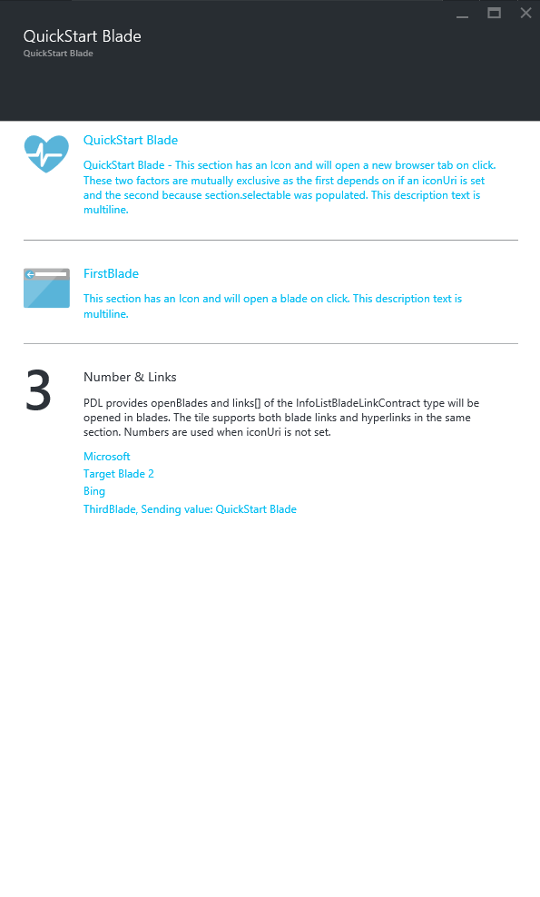
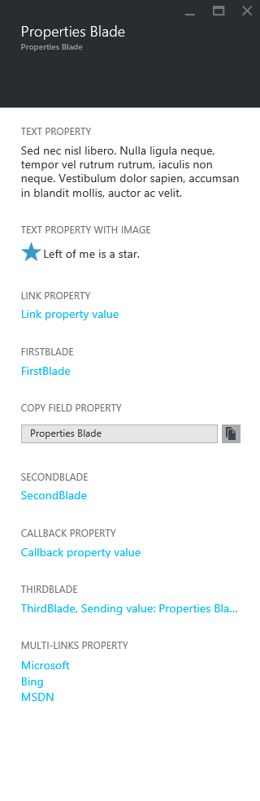
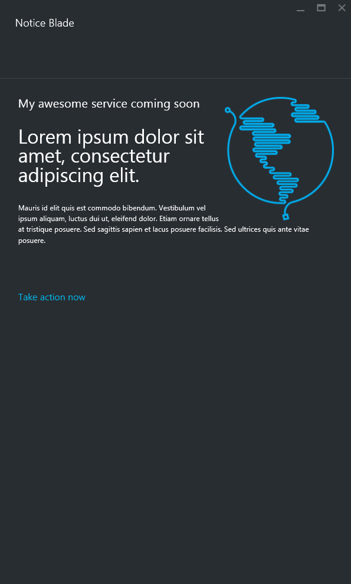
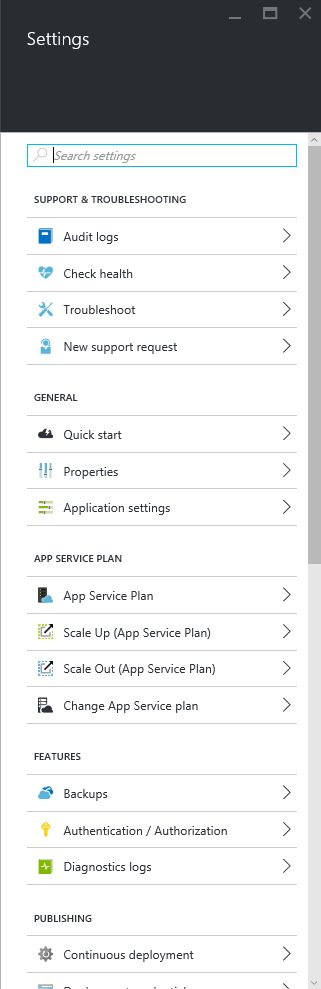

## Introduction to Blade Kinds
Blade Kinds are common implementations of Blade experience which offer consistent UI and are easily implemented. Blade Kinds provide a simplified programming model with a closed UI. 

All you need to provide is the ViewModel. Advantages you receive beyond is simplicity; when the Blade Kinds are updated, you can use the updates and the layout without having to change your implementation.

Defining a Blade using a Blade Kind in PDL is a simplified version of the typical Blade PDL. All you need is to define multiple view models, typically a view model for the blade and a view model for the part.

```xml
<azurefx:QuickStartBlade ViewModel="" PartViewModel=""/>
```

To learn more about each of the Blade Kinds, start with the following topics:

- [QuickStart Blade](portalfx-blades-bladeKinds-quickStart.md)
- [Properties Blade](portalfx-blades-bladeKinds-properties.md)
- [Notice Blade](portalfx-blades-bladeKinds-notice.md)
- [Setting List Blade](portalfx-blades-bladeKinds-settingList.md)

 ### QuickStart Blade
The QuickStart blade that provides a Blade which gives users a convenient way to learn how to use your service. Every services should have a QuickStart Blade.



Defining a QuickStart Blade requires only a view model to define the blade and a view model to define the part.

The PDL to define a QuickStart Blade:

`\Client\Blades\BladeKind\BladeKinds.pdl`

```xml
<azurefx:QuickStartBlade Name="QuickStartBlade"
                        ViewModel="{ViewModel Name=QuickStartBladeViewModel, Module=./BladeKind/ViewModels/BladeKindsViewModels}"
                        PartViewModel="{ViewModel Name=InfoListPartViewModel, Module=./BladeKind/ViewModels/InfoListPartViewModel}"
                        Parameter="info"/>
```
The TypeScript view model to define the Blade view model:

`\Client\Blades\BladeKind\ViewModels\BladeKindsViewModels.ts`

```ts
/**
 * The quick start blade view model for blade kinds.
 */
export class QuickStartBladeViewModel extends MsPortalFx.ViewModels.Blade {
    /**
     * Blade view model constructor.
     *
     * @param container Object representing the blade in the shell.
     * @param initialState Bag of properties saved to user settings via viewState.
     * @param dataContext Long lived data access object passed into all view models in the current area.
     */
    constructor(container: MsPortalFx.ViewModels.ContainerContract, initialState: any, dataContext: BladesArea.DataContext) {
        super();
        this.title(ClientResources.quickStartBladeTitle);
        this.subtitle(ClientResources.bladesLensTitle);
        this.icon(MsPortalFx.Base.Images.Polychromatic.Info());
    }

    /**
     * Invoked when the Part's inputs change.
     */
    public onInputsSet(inputs: any): MsPortalFx.Base.Promise {
        this.subtitle(inputs.info.text);
        return null; // No need to load anything
    }
}
```

The TypeScript view model to define the part view model:


`\Client\Blades\BladeKind\ViewModels\InfoListPartViewModel.ts`


```ts
/**
 * This sample uses the base class implementation. You can also implement the
 * interface MsPortalFx.ViewModels.Parts.InfoList.ViewModel.
 */
export class InfoListPartViewModel extends MsPortalFx.ViewModels.Parts.InfoList.ViewModel {
    private _text: KnockoutObservableBase<string>;
    private _bladeWithInputs: KnockoutObservableBase<MsPortalFx.ViewModels.DynamicBladeSelection>;

    /**
     * Initialize the part.
     */
    constructor(container: MsPortalFx.ViewModels.PartContainerContract, initialState: any, dataContext: BladesArea.DataContext) {
        super(initialState);

        this._text = ko.observable<string>("");

        var thirdBladeDisplayValue = ko.pureComputed(() => {
            return "{0} {1}".format(ExtensionDefinition.BladeNames.thirdBlade + ClientResources.sendingValue, this._text());
        });

        var infoListDesc1 = ko.pureComputed(() => {
            return "{0} - {1}".format(this._text(), ClientResources.infoListDesc1);
        });

        this._bladeWithInputs = ko.observable<MsPortalFx.ViewModels.DynamicBladeSelection>({
            detailBlade: ExtensionDefinition.BladeNames.thirdBlade,
            detailBladeInputs: {}
        });

        // add a section to open an external webpage.
        this.addSection(
            this._text,
            infoListDesc1,
            ClientResources.htmlSiteMSDNAddress,
            MsPortalFx.Base.Images.HeartPulse());

        // add a section to open a blade.
        this.addSection(
            ExtensionDefinition.BladeNames.firstBlade,
            ClientResources.infoListDesc3, {
                detailBlade: ExtensionDefinition.BladeNames.firstBlade,
                detailBladeInputs: {}
            }, MsPortalFx.Base.Images.Polychromatic.Browser());

        // add a secion that can have a list of links.
        this.addSection(
            ClientResources.infoListTitle2,
            ClientResources.infoListDesc2,
            [
                new Vm.Parts.InfoList.Link(
                    ClientResources.htmlSiteMicrosoftName,
                    ClientResources.htmlSiteMicrosoftAddress
                    ),
                new Vm.Parts.InfoList.Link(
                    ClientResources.targetBlade2Title,
                    {
                        detailBlade: ExtensionDefinition.BladeNames.secondBlade,
                        detailBladeInputs: {}
                    }
                    ),
                new Vm.Parts.InfoList.Link(
                    ClientResources.htmlSiteBingName,
                    ClientResources.htmlSiteBingAddress
                    ),
                new Vm.Parts.InfoList.Link(
                    thirdBladeDisplayValue,
                    this._bladeWithInputs
                    )
            ]);
    }

    /**
     * All sections should be added in the constructor, and should be updated via observables.
     */
    public onInputsSet(inputs: any): MsPortalFx.Base.Promise {
        var text = inputs.info.text;

        this._text(text);

        // update the blade binding with inputs value
        this._bladeWithInputs({
            detailBlade: ExtensionDefinition.BladeNames.thirdBlade,
            detailBladeInputs: {
                id: text
            }
        });


        return null; // No need to load anything
    }
}
```

 
### Properties Blade

The Properties blade that provides a Blade which gives users a convenient way access the properties of your service. 



Defining a Properties Blade requires only a view model to define the blade and a view model to define the part.

The PDL to define a Properties Blade:

`\Client\Blades\BladeKind\BladeKinds.pdl`

```xml
  <azurefx:PropertiesBlade Name="PropertiesBlade"
                           ViewModel="{ViewModel Name=PropertiesBladeViewModel, Module=./BladeKind/ViewModels/BladeKindsViewModels}"
                           PartViewModel="{ViewModel Name=PropertiesPartViewModel, Module=./BladeKind/ViewModels/PropertiesPartViewModel}"
                           Parameter="info"/>
```
The TypeScript view model to define the Blade view model:

`\Client\Blades\BladeKind\ViewModels\BladeKindsViewModels.ts`

```ts
/**
 * The properties blade view model for blade kinds.
 */
export class PropertiesBladeViewModel extends MsPortalFx.ViewModels.Blade {
    /**
     * Blade view model constructor.
     *
     * @param container Object representing the blade in the shell.
     * @param initialState Bag of properties saved to user settings via viewState.
     * @param dataContext Long lived data access object passed into all view models in the current area.
     */
    constructor(container: MsPortalFx.ViewModels.ContainerContract, initialState: any, dataContext: BladesArea.DataContext) {
        super();
        this.title(ClientResources.propertiesBladeTitle);
        this.icon(MsPortalFx.Base.Images.Polychromatic.Info());
    }

    /**
     * Invoked when the Part's inputs change.
     */
    public onInputsSet(inputs: any): MsPortalFx.Base.Promise {
        this.subtitle(inputs.info.text);
        return null; // No need to load anything
    }
}
```

The TypeScript view model to define the part view model:


`\Client\Blades\BladeKind\ViewModels\PropertiesPartViewModel.ts`


```ts
/**
 * Properties part view model.
 */
export class PropertiesPartViewModel extends MsPortalFx.ViewModels.Parts.Properties.ViewModel {
    private _text: KnockoutObservableBase<string>;
    private _bladeWithInputs: KnockoutObservableBase<MsPortalFx.ViewModels.DynamicBladeSelection>;

    constructor(container: MsPortalFx.ViewModels.PartContainerContract, initialState: any, dataContext: BladesArea.DataContext) {
        super(initialState);

        var longTextProperty = new MsPortalFx.ViewModels.Parts.Properties.TextProperty(ClientResources.textPropertyLabel, ko.observable<string>(ClientResources.textPropertyValue));
        longTextProperty.wrappable(true);

        this._text = ko.observable<string>("");

        this.addProperty(longTextProperty);
        this.addProperty(new MsPortalFx.ViewModels.Parts.Properties.LinkProperty(ClientResources.linkPropertyLabel, ClientResources.microsoftUri, ClientResources.linkPropertyValue));

        this.addProperty(new MsPortalFx.ViewModels.Parts.Properties.OpenBladeProperty(
            ExtensionDefinition.BladeNames.firstBlade,
            ExtensionDefinition.BladeNames.firstBlade, {
                detailBlade: ExtensionDefinition.BladeNames.firstBlade,
                detailBladeInputs: {}
            }));

        this.addProperty(new MsPortalFx.ViewModels.Parts.Properties.CopyFieldProperty(ClientResources.copyFieldPropertyLabel, this._text));

        this.addProperty(new MsPortalFx.ViewModels.Parts.Properties.OpenBladeProperty(
            ExtensionDefinition.BladeNames.secondBlade,
            ExtensionDefinition.BladeNames.secondBlade, {
                detailBlade: ExtensionDefinition.BladeNames.secondBlade,
                detailBladeInputs: {}
            }));

        this.addProperty(new MsPortalFx.ViewModels.Parts.Properties.CallbackProperty(ClientResources.callbackPropertyLabel, ClientResources.callbackPropertyValue, () => {
            alert(this._text());
        }));

        this._bladeWithInputs = ko.observable<MsPortalFx.ViewModels.DynamicBladeSelection>({
            detailBlade: ExtensionDefinition.BladeNames.thirdBlade,
            detailBladeInputs: {}
        });

        var thirdBladeDisplayValue = ko.pureComputed(() => {
            return ExtensionDefinition.BladeNames.thirdBlade + ClientResources.sendingValue + this._text();
        });

        this.addProperty(new MsPortalFx.ViewModels.Parts.Properties.OpenBladeProperty(
            ExtensionDefinition.BladeNames.thirdBlade,
            thirdBladeDisplayValue,
            this._bladeWithInputs
        ));

        var multiLinks = ko.observableArray<MsPortalFx.ViewModels.Parts.Properties.Link>([
            {
                text: ClientResources.htmlSiteMicrosoftName,
                uri: ClientResources.htmlSiteMicrosoftAddress
            },
            {
                text: ClientResources.htmlSiteBingName,
                uri: ClientResources.htmlSiteBingAddress
            },
            {
                text: ClientResources.htmlSiteMSDNName,
                uri: ClientResources.htmlSiteMSDNAddress
            }
        ]);

        this.addProperty(new MsPortalFx.ViewModels.Parts.Properties.MultiLinksProperty(ClientResources.multiLinksPropertyLabel, multiLinks));
    }

    /**
     * All properties should be added in the constructor, and use observables to update properties.
     */
    public onInputsSet(inputs: any): MsPortalFx.Base.Promise {
        var text = inputs.info.text;

        this._text(text);

        // update the blade binding with inputs value
        this._bladeWithInputs({
            detailBlade: ExtensionDefinition.BladeNames.thirdBlade,
            detailBladeInputs: {
                id: text
            }
        });

        return null;
    }
}

```

 ### Notice Blade
The Notice blade that provides a Blade which gives you a convenient way to display a announcements to your users, such as coming soon features. 



Defining a notice Blade requires only a view model to define the blade and a view model to define the part.

The PDL to define a Properties Blade:

`\Client\Blades\BladeKind\BladeKinds.pdl`

```xml
  <azurefx:NoticeBlade Name="NoticeBlade"
                       ViewModel="{ViewModel Name=NoticeBladeViewModel, Module=./BladeKind/ViewModels/BladeKindsViewModels}"
                       PartViewModel="{ViewModel Name=NoticePartViewModel, Module=./BladeKind/ViewModels/NoticePartViewModel}"
                       Parameter="info"/>
```
The TypeScript view model to define the Blade view model:

`\Client\Blades\BladeKind\ViewModels\BladeKindsViewModels.ts`

```ts
/**
 * The notice blade view model for blade kinds.
 */
export class NoticeBladeViewModel extends MsPortalFx.ViewModels.Blade {
    /**
     * Blade view model constructor.
     *
     * @param container Object representing the blade in the shell.
     * @param initialState Bag of properties saved to user settings via viewState.
     * @param dataContext Long lived data access object passed into all view models in the current area.
     */
    constructor(container: MsPortalFx.ViewModels.ContainerContract, initialState: any, dataContext: BladesArea.DataContext) {
        super();
        this.title(ClientResources.noticeBladeTitle);
    }

    /**
     * Invoked when the Part's inputs change.
     */
    public onInputsSet(inputs: any): MsPortalFx.Base.Promise {
        this.subtitle(inputs.info.text);
        return null; // No need to load anything
    }
}
```

The TypeScript view model to define the part view model:

`\Client\Blades\BladeKind\ViewModels\NoticePartViewModel.ts`

```ts
/**
 * Notice part view model.
 */
export class NoticePartViewModel extends MsPortalFx.ViewModels.Controls.Notice.ViewModel {
    /**
     * View model constructor.
     *
     * @param container Object representing the part in the shell.
     * @param initialState Bag of properties saved to user settings via viewState.
     * @param dataContext Long lived data access object passed into all view models in the current area.
     */
    constructor(container: MsPortalFx.ViewModels.PartContainerContract, initialState: any, dataContext: BladesArea.DataContext) {
        super();

        this.title(ClientResources.comingSoonTitle);
        this.description(ClientResources.comingSoonDescription);
        this.callToActionText(ClientResources.comingSoonAction);
        this.callToActionUri(ClientResources.microsoftUri);
        this.imageType(MsPortalFx.ViewModels.Controls.Notice.ImageType.ComingSoon);
    }

    /**
     * Update header based on service name.
     *
     * @param inputs Collection of inputs passed from the shell.
     * @returns A promise that needs to be resolved when data loading is complete.
     */
    public onInputsSet(inputs: any): MsPortalFx.Base.Promise {
        var serviceName = inputs.info.serviceName,
            header = ClientResources.comingSoon.format(serviceName);

        this.header(header);

        return null;
    }
}
```

 
### Setting List Blade

The Setting List Blade that provides a Blade which gives you a convenient way to display give your users access to a list of your service's settings.



Defining a Settings Blade requires only a view model to define the blade and a view model to define the part.

The PDL to define a Settings Blade:

`\Client\Blades\BladeKind\BladeKinds.pdl`

```xml
  <azurefx:SettingListV2Blade Name="SettingListBlade"
                            ViewModel="{ViewModel Name=SettingListBladeViewModel, Module=./BladeKind/ViewModels/BladeKindsViewModels}"
                            PartViewModel="{ViewModel Name=SettingListPartViewModel, Module=./BladeKind/ViewModels/SettingListPartViewModel}"
                            Parameter="id"/>
```

The TypeScript view model to define the Blade view model:

`\Client\Blades\BladeKind\ViewModels\BladeKindsViewModels.ts`

```ts
/**
 * The setting list blade view model for blade kinds.
 */
export class SettingListBladeViewModel extends MsPortalFx.ViewModels.Blade {
    /**
     * Blade view model constructor.
     *
     * @param container Object representing the blade in the shell.
     * @param initialState Bag of properties saved to user settings via viewState.
     * @param dataContext Long lived data access object passed into all view models in the current area.
     */
    constructor(container: MsPortalFx.ViewModels.ContainerContract, initialState: any, dataContext: BladesArea.DataContext) {
        super();
        this.title(ClientResources.settingListBlade);
    }

    public onInputsSet(inputs: any): MsPortalFx.Base.Promise {
        this.subtitle(inputs.id);
        return null; // No need to load anything
    }
}
```

The TypeScript view model to define the part view model:

`\Client\Blades\BladeKind\ViewModels\SettingListPartViewModel.ts`

```ts
/**
 * The view model of the setting list part.
 */
export class SettingListPartViewModel extends MsPortalFx.ViewModels.Parts.SettingList.ViewModelV2 {
    private _propertySettingBladeInputs: KnockoutObservableBase<any>;
    private _keySettingBladeInputs: KnockoutObservableBase<any>;

    constructor(container: MsPortalFx.ViewModels.PartContainerContract, initialState: any, dataContext: BladesArea.DataContext) {
        this._propertySettingBladeInputs = ko.observable({});
        this._keySettingBladeInputs = ko.observable({});

         super(container, initialState, this._getSettings(container),
            {
             enableRbac: true,
             enableTags: true,
             groupable: true
            });
    }

    public onInputsSet(inputs: any): MsPortalFx.Base.Promise {
        var id = inputs.id;
        this.resourceId(id);

        this._propertySettingBladeInputs({ id: id });
        this._keySettingBladeInputs({ id: id });

        return null; // No need to load anything
    }

    private _getSettings(): MsPortalFx.ViewModels.Parts.SettingList.Setting[] {
        var propertySetting = new MsPortalFx.ViewModels.Parts.SettingList.Setting("property", ExtensionDefinition.BladeNames.propertySettingBlade, this._propertySettingBladeInputs),
            keySetting = new MsPortalFx.ViewModels.Parts.SettingList.Setting("key", ExtensionDefinition.BladeNames.keySettingBlade, this._keySettingBladeInputs);

        propertySetting.displayText(ClientResources.propertySetting);
        propertySetting.icon(MsPortalFx.Base.Images.Polychromatic.Controls());
        propertySetting.keywords([ClientResources.user]);

        keySetting.displayText(ClientResources.keySetting);
        keySetting.icon(MsPortalFx.Base.Images.Polychromatic.Key());

        return [propertySetting, keySetting];
    }
}
```

#### Framework settings

One of the goals of the Azure portal is standardizing key interaction patterns across different types of resources so customers can learn them once and apply them everywhere. There a few setting items which are consistent across most resources, to make that process easier the framework will automatically add certain settings but also allow optting in for any which we don't automatically add. All the Framework added settings can always be opted out, by specifying the opt in option as "false". Currently their are only two settings, RBAC and Audit logs (Events), which are added automatically. They are only added if a valid resource id has been specified within the "resourceId()" property on the settingsList viewmodel. The best way to set this is from within the onInputsSet call.

```ts
export class SettingListPartViewModel extends MsPortalFx.ViewModels.Parts.SettingList.ViewModelV2 {
    ...

     public onInputsSet(inputs: any): MsPortalFx.Base.Promise {
        var id = inputs.id;
        this.resourceId(id);

        return null
    }
}
```

#### Tags/RBAC

[Tags] [/documentation/articles/portalfx-tags/] and RBAC (Users) are the most common settings although we don't automatically add Tags, its extremely easy to opt in. We are looking to automatically add Tags in the future, for now if your resource supports tagging please opt in. To opt in set the following in the options parameter of the super call to the SettingsList viewmodel.

```ts
export class SettingListPartViewModel extends MsPortalFx.ViewModels.Parts.SettingList.ViewModelV2 {
    constructor(container: MsPortalFx.ViewModels.PartContainerContract, initialState: any, dataContext: BladesArea.DataContext) {
         super(container, initialState, this._getSettings(container),
            {
             enableRbac: true,
             enableTags: true,
             groupable: true
            });
    }
}
```

#### Support settings

Troubleshooting and support are one of these key experiences. We'd like to provide customers with a consistent gesture so for every resource they can assess its health, check the audit logs, get troubleshooting information, or open a support ticket. Every resource should on-board with Support and opt in to the support settings, see the [on-boarding process] [supportOnboarding]. For any questions regarding the process please reach out to the support adoption alias <AzSFAdoption@microsoft.com>

Enabling the support settings takes slightly more effort due to coordination and validation required with the support extension. For each of the settings you first need to opt in following the same pattern as before through the options parameter within the super call to the SettingsList ViewModel.

```ts
export class SettingListPartViewModel extends MsPortalFx.ViewModels.Parts.SettingList.ViewModelV2 {
    constructor(container: MsPortalFx.ViewModels.PartContainerContract, initialState: any, dataContext: BladesArea.DataContext) {
         super(container, initialState, this._getSettings(container),
            {
             enableSupportHelpRequest: true,
             enableSupportTroubleshoot: true,
             enableSupportResourceHealth: true,
             enableSupportEventLogs: true,
             groupable: true
            });
    }
}
```

Then to test it use the following extension side feature flags, depending on which settings you are testing, **please ensure your extension name is in lower case.**

* ?<extensionname>_troubleshootsettingsenabled=true
* ?<extensionname>_healthsettingsenabled=true
* ?<extensionname>_requestsettingsenabled=true

*Example: ?microsoft_azure_classic_compute_requestsettingsenabled=true*

Next steps:

* [Onboard to support](https://microsoft.sharepoint.com/teams/WAG/EngSys/Supportability/_layouts/15/WopiFrame.aspx?sourcedoc={7210704b-64db-489b-9143-093e020e75b4}&action=edit&wd=target%28%2F%2FCustomerEnablement.one%7Cf42af409-12ab-4ae0-ba49-af361116063b%2FAt%20How-to%20for%20PGs%7C92cd2c56-c400-4a6d-a455-63ef92290ae9%2F%29)


[part]: ../media/portalfx-bladeKinds/BladeKindsIntro.png