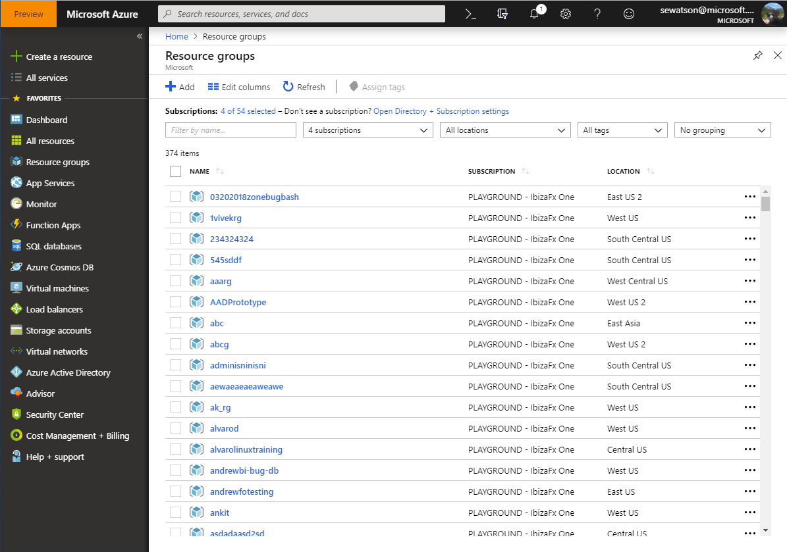

{"gitdown": "contents"}

## Building browse experiences

The Favorites in the left nav and the Browse menu are the primary ways to launch tools and services within the portal. The default favorites are determined by C+E leadership based on the highest grossing services with the most engaged customers. New services will start in the Browse menu and, based on those metrics or the number of favorites surpasses other defaults, the list can be updated.

There are 3 ways you can be surfaced in Browse:

1. ["No-code" Browse](#resources) for ARM resources
2. [Browse service](#assets) for assets that don't use ARM (aka Browse v1)
3. [Custom blade](#blade) if you have a single instance and not a list of resources


<a name="resources"></a>
### No-code Browse

"No-code" Browse automatically queries ARM for resources of a specific type and displays them in a paged grid. Simply define an asset type in PDL, specify the resource type, indicate that it should be visible in the Browse hub, and specify the API version that hubs extension should use to call ARM for the resource type. That's it.

```xml
<AssetType Name="Book" ... >
  <Browse Type="ResourceType" />
  <ResourceType ResourceTypeName="Microsoft.Press/books" ApiVersion="2016-01-01" />
</AssetType>
```



No-code Browse requires the following:

* Asset blade must accept a single `Id` input property
* Asset id must be the resource id (not an object)

<a name="create"></a>
#### Add command
To allow people to create new resources from Browse, you can associate your asset type with a Marketplace item or category:

```xml
<AssetType
    Name="Book"
    MarketplaceItemId="Microsoft.Book"
    MarketplaceMenuItemId="menu/submenu"
    ...>
  <Browse Type="ResourceType" />
  <ResourceType ResourceTypeName="Microsoft.Press/books" ApiVersion="2016-01-01" />
</AssetType>
```

The Browse blade will launch the Marketplace item, if specified; otherwise, it will launch the Marketplace category blade for the specific menu item id (e.g. `gallery/virtualMachines/recommended` for Virtual machines > Recommended). To determine the right Marketplace category, contact the <a href="mailto:1store?subject=Marketplace menu item id">Marketplace team</a>. If neither is specified, the Add command won't be available.

<a name="columns"></a>
#### Customizing columns
By default, no-code Browse only shows the resource name, group, location, and subscription. To customize the columns, add a view-model to the `AssetType` and indicate that you have custom Browse config:

```xml
<AssetType Name="Book" ViewModel="BookViewModel" ... >
  <Browse Type="ResourceType" UseCustomConfig="true" />
  <ResourceType ResourceTypeName="Microsoft.Press/books" ApiVersion="2016-01-01" />
</AssetType>
```

Now, create the asset view-model class that implements the `getBrowseConfig()` function:

```ts
class BookViewModel implements ExtensionDefinition.ViewModels.ResourceTypes.BookViewModel.Contract {

    public getBrowseConfig(): PromiseV<MsPortalFx.Assets.BrowseConfig> {
        ...
    }
}
```

The `getBrowseConfig()` function provides the following configuration options for your Browse blade:

* **`columns`** - List of custom columns the user will be able to choose to display (coming soon)
* **`defaultColumns`** - List of column ids that will be used by default
* **`properties`** - Additional properties used by formatted columns (e.g. HTML formatting)

Start by specifying all possible custom columns you want to make available to customers using `BrowseConfig.columns`. Browse will share the list of standard ARM columns and any custom columns you define with users and let them choose which columns they want to see.

To specify which columns to show by default, save the column ids to `BrowseConfig.defaultColumns`. If any columns require additional data, like HTML-formatted columns that include 2 or more properties, save the additional property names (not the `itemKey`) to `BrowseConfig.properties`. Browse needs to initialize the grid with all the properties you'll use for supplemental data to ensure the grid will be updated properly.

```ts
class BookViewModel implements ExtensionDefinition.ViewModels.ResourceTypes.BookViewModel.Contract {

    public getBrowseConfig(): PromiseV<MsPortalFx.Assets.BrowseConfig> {
        return Q.resolve({
            // columns the user will be able to choose to display (coming soon)
            columns: [
                {
                    id: "author",
                    name: ko.observable<string>(ClientResources.author),
                    itemKey: "author"
                },
                {
                    id: "genre",
                    name: ko.observable<string>(ClientResources.genre),
                    itemKey: "genre",
                    format: MsPortalFx.ViewModels.Controls.Lists.Grid.Format.HtmlBindings,
                    formatOptions: {
                        htmlBindingsTemplate: "<div data-bind='text: genre'></div> (<div data-bind='text: subgenre'></div>)"
                    }
                }
            ],

            // default columns to show -- name always first, subscription always last
            defaultColumns: [
                ResourceColumns.resourceGroup,
                "author",
                "genre"
            ],

            // additional properties used to support the available columns
            properties: [
                "subgenre"
            ]
        });
    }
}
```

Notice that the genre column actually renders 2 properties: genre and subgenre. Because of this, we need to add "subgenre" to the array of additional properties to ensure it gets rendered properly to the grid.

At this point, you should be able to compile and see your columns show up in your Browse blade. Of course, you still need to populate your supplemental data. Let's do that now...

<a name="supplementaldata"></a>
#### Providing supplemental data
In order to specify supplemental data to display on top of the standard resource columns, you'll need to opt in to specifying supplemental data in PDL:

```xml
<AssetType Name="Book" ViewModel="BookViewModel" ... >
  <Browse Type="ResourceType" UseSupplementalData="true" />
  <ResourceType ResourceTypeName="Microsoft.Press/books" ApiVersion="2016-01-01" />
</AssetType>
```

You'll also need to implement the `supplementalDataStream` property and `getSupplementalData()` function on your asset view-model:

```ts
class BookViewModel implements ExtensionDefinition.ViewModels.ResourceTypes.BookViewModel.Contract {

    public supplementalDataStream = ko.observableArray<MsPortalFx.Assets.SupplementalData>([]);

    public getBrowseConfig(): PromiseV<MsPortalFx.Assets.BrowseConfig> {
        ...
    }

    public getSupplementalData(resourceIds: string[], columns: string[]): Promise {
        ...
    }
}
```

After the Browse blade retrieves the first page of resources from ARM, it will call `getSupplementalData()` with the resource ids retrieved from ARM as well as the column ids currently being displayed in the grid. You'll then retrieve *only* the properties required to populate those columns for *only* the specified resource ids. **Do not query all properties for all resources!**

**NOTE:** The current subscriptions API will be deprecated once Browse v2 and Create v3 are complete. When this happens, extensions will no longer have a full list of all subscriptions and will be required to use this streaming data approach, which will significantly improve performance.

```ts
class BookViewModel implements ExtensionDefinition.ViewModels.ResourceTypes.BookViewModel.Contract {

    private _container: MsPortalFx.ViewModels.ContainerContract;
    private _dataContext: any;
    private _view: any;

    constructor(container: MsPortalFx.ViewModels.ContainerContract, initialState: any, dataContext: ResourceTypesArea.DataContext) {
        this._container = container;
        this._dataContext = dataContext;
    }

    ...

    public getSupplementalData(resourceIds: string[], columns: string[]): Promise {
        // NOTE: Do not create the view in the constructor. Initialize here to create only when needed.
        this._view = this._view || this._dataContext.bookQuery.createView(this._container);

        // connect the view to the supplemental data stream
        MsPortalFx.Assets.SupplementalDataStreamHelper.ConnectView(
            this._container,
            view,
            this.supplementalDataStream,
            (book: Book) => {
                return resourceIds.some((resourceId) => {
                    return ResourceTypesService.compareResourceId(resourceId, book.id());
                });
            },
            (book: Book) => {
                // save the resource id so Browse knows which row to update
                var data = <MsPortalFx.Assets.SupplementalData>{ resourceId: book.id() };

                // only save author if column is visible
                if (columns.indexOf("author") !== -1) {
                    data.author = robot.author();
                }

                // if the genre column is visible, also add the subgenre property
                if (columns.indexOf("genre") !== -1) {
                    data.genre = robot.genre;
                    data.subgenre = robot.subgenre;
                }

                return data;
            });

        // send resource ids to a controller and aggregate data into one client request
        return view.fetch({ resourceIds: resourceIds });
    }
}
```

**NOTE:** If you notice that some of the supplemental properties aren't being saved to the grid, double-check that the property names are either listed as the `itemKey` for a column or have been specified in `BrowseConfig.properties`. Unknown properties won't be saved to the grid.

**NOTE:** **Do not pre-initialize data.** Browse will show a loading indicator (coming soon) based on whether or not it's received data. If you initialize any supplemental data, this will inform the grid that loading has completed. Instead, leave cells empty when first displaying them.

Now, you should have supplemental data getting populated. Great! Let's add context menu commands...

<a name="commands"></a>
#### Adding context menu commands
Context menu commands in Browse must take a single `id` input parameter that is the resource id of the specific resource. To specify commands, add the name of the command group defined in PDL to Browse config:

```xml
<CommandGroup Name="BrowseBookCommands">
  ...
</CommandGroup>
```

```ts
class BookViewModel implements ExtensionDefinition.ViewModels.ResourceTypes.BookViewModel.Contract {

    public getBrowseConfig(): PromiseV<MsPortalFx.Assets.BrowseConfig> {
        return Q.resolve({
            // NOTE: Extension (commandGroupOwner) only required if from another extension
            contextMenu: {
                commandGroup: "BrowseBookCommands",
                commandGroupOwner: "<extension name>"
            },
            ...
        });
    }

    ...
}
```

If you need to expose different commands based on some other metadata, you can also specify the the command group in `SupplementalData.contextMenu` in the same way.

<a name="infobox"></a>
#### Adding an informational message/link
If you need to display an informational message and/or link above the list of resources, add an `infoBox` to your Browse config:

```ts
class BookViewModel implements ExtensionDefinition.ViewModels.ResourceTypes.BookViewModel.Contract {

    public getBrowseConfig(): PromiseV<MsPortalFx.Assets.BrowseConfig> {
        return Q.resolve({
            infoBox: {
                image: MsPortalFx.Base.Images.Info(),
                text: resx.browseBookInfoBoxText,

                // optionally specify a blade to launch when the infobox is clicked
                blade: <MsPortalFx.ViewModels.DynamicBladeSelection>{
                    detailBlade: "BookInfoBlade",
                    detailBladeInputs: null
                },

                // ...or link to an external web page
                uri: "http://microsoftpress.com"

                // NOTE: Blade is preferred over link, if both are specified.
            },
            ...
        });
    }

    ...
}
```


<a name="assets"></a>
#### Browse service

The Browse service API provides support for custom data, whether that comes from ARM or another source.

**NOTE:** The Browse service API is no longer being maintained. All efforts have been refocused on our Browse v2 API, which starts with no-code. We'll continue to expand that thru the first half of 2015.

The UI for browse in the portal are implemented as part of the shell. This
means that extension authors are largely responsible for accepting a request
for a browse, reasoning about the browse criteria, and returning a list of
results. Extensions opt into this functionality by creating an asset type and
defining a browse service.

#### Defining an Asset Type permalink-asset-type-non-arm

Asset types provide a way for the shell to understand high level objects in
your extension. Asset types are the portal's way of understanding the
capabilities of a given object. Currently, it defines services for:

  * Browse
  * Create
  * Notifications

The Asset Type is defined in PDL, and opts into various services and
capabilities it supports. The best example of browse can be found in the
samples under `\Client\Hubs\Browse\Browse.pdl`:

```xml
<AssetType Name="Robot"
           Text="Extension.Resources.Strings.robotAssetName"
           Icon="Extension.Resouces.Icons.robotIcon"
           BladeName="RobotBlade"
           PartName="RobotPart">
    <Browse ServiceViewModel="RobotBrowseService" />
    <GridColumns ServiceViewModel="RobotGridColumnsService" />
</AssetType>
```

The fields defined here work as follows:

* **Name** \- Identifier used for the asset type.
* **Text** \- JavaScript literal that stores the human readable name for the asset. See `\Client\Shared\SharedArea.ts`.
* **IconUri** \- JavaScript literal that stores the URI to the icon for the given asset.
* **BladeName** \- Reference to the blade that will be opened when this asset is selected in a list.
* **PartName** \- Reference to the part that will represent the asset on the startboard.
* **Browse ServiceViewModel** \- Class that provides browse services.
* **GridColumn ServiceViewModel** \- Class which provides grid columns services when displaying assets in browse or in resource lists.

An example of each of these classes can be found in the samples under
`\Client\Hubs\Browse\`. This also contains a full reference implementation.

#### Implementing a Grid Column provider

In order to allow the shell to render the UI for your assets, we need to know
a little about the objects which will be returned. Specifically, the shell
needs a list of columns, and the properties on the asset objects which are
going to map to those columns. If you've worked with other grids, the API is
the same as defining a grid schema.

There is a reference implementation available at
`\Client\Hubs\Browse\Services\RobotGridColumnsService.ts`:

```ts
module SamplesExtension.Hubs {
    /**
     * Represents the grid columns service used by the robot asset type.
     */
    export class RobotGridColumnsService implements MsPortalFx.Services.GridColumns {
        /**
         * See interface.
         */
        public includeAssetIcon: boolean;

        /**
         * See interface.
         */
        public columns: MsPortalFx.ViewModels.Controls.Lists.Grid.Column[];

        /**
         * Initialize a new instance of the robot grid columns service.
         *
         * @param initialValue Initial state for the service.
         * @param context Data context for the service.
         */
        constructor(initialValue: any, dataContext: DataContext) {
            var usage = <MsPortalFx.Services.GridColumnsUsage>initialValue;

            // We ignore the usage for this asset type (always show same columns).

            // Return that the system should include the asset icon column along with the other columns for the
            // collection grid.
            this.includeAssetIcon = true;
            this.columns = [
                {
                    id: "name",
                    name: ko.observable<string>(SamplesExtension.Resources.Strings.robotNameColumn),
                    itemKey: "name"
                },
                {
                    id: "status",
                    name: ko.observable<string>(SamplesExtension.Resources.Strings.robotStatusColumn),
                    itemKey: "status"
                },
                {
                    id: "model",
                    name: ko.observable<string>(SamplesExtension.Resources.Strings.robotModelColumn),
                    itemKey: "model"
                },
                {
                    id: "manufacturer",
                    name: ko.observable<string>(SamplesExtension.Resources.Strings.robotManufacturerColumn),
                    itemKey: "manufacturer"
                },
                {
                    id: "os",
                    name: ko.observable<string>(SamplesExtension.Resources.Strings.robotOSColumn),
                    itemKey: "os"
                }
            ];
        }
    }
}
```

### Implementing a Browse provider

Browse provides a simple way to navigate assets in the portal. Implementing
browse is as easy as defining an asset type, adding a grid column service, and
writing the browse service. The workflow for browse is as follows:

1. The user asks for a list of assets.
2. The shell will create a new browse service view model.
3. The service will return an (initially empty) observable array which contains the results.
4. The service will ask it's back-end data source for an updated list of assets.
5. The list will be kept up to date via `MsPortalFx.Data.Loader` polling.
6. When the user closes the browse blade, the `canceled` property on the service is set to `true`.
7. The view model is disposed.

There is a full reference implementation in
`\Client\Hubs\Browse\Services\RobotBrowseService.ts`:

```ts
module SamplesExtension.Hubs {
    /**
     * Represents the browse service used by the robot asset type.
     */
    export class RobotBrowseService implements MsPortalFx.Services.BrowseOperation {
        /**
         * The result set which will contain the results of the browse as they come in.
         */
        public results: KnockoutObservableArray<any>;

        /**
         * This will be set to true to signal the browse operation that it should be canceled.
         */
        public canceled: KnockoutObservable<boolean>;

        /**
         * Initialize a new instance of the robot browse service.
         *
         * @param initialValue Initial state for the service.
         * @param context Data context for the service.
         */
        constructor(initialValue: any, context: DataContext) {
            var criteria = <MsPortalFx.Services.BrowseCriteria>initialValue,
                canceledSubscription: KnockoutSubscription<boolean>,
                dataSubscription: KnockoutSubscription<Robot[]>,
                dataSet = context.robotData.robotsDataSet,
                dataSetName = RobotData.robotsDataSetName;

            this.canceled = ko.observable<boolean>(false);
            this.results = ko.observableArray<any>();

            // Go to the data class and force a refresh of available robots from the server
            MsPortalFx.Data.Loader.forceRefresh(dataSetName).then(() => {
                // This is the mapper to watch a data set and publish mapped changes to the result set.
                dataSubscription = MsPortalFx.Services.DataSetAssetExpansionMapper.connectDataSet<Robot>(
                    dataSet.data, this.results, mapRobotToAssetDetails);
            });

            canceledSubscription = this.canceled.subscribe((canceled) => {
                // disconnect
                this.results = null;
                if (canceledSubscription !== null) {
                    canceledSubscription.dispose();
                    canceledSubscription = null;
                }
                if (dataSubscription !== null) {
                    dataSubscription.dispose();
                    dataSubscription = null;
                }
            });
        }
    }
}
```


<a name="blade"></a>
### Custom blade permalink-browse-custom-blade

If you don't have a list of resources and simply need to add a custom blade to Browse, you can define an asset type with a `Browse` type of `AssetTypeBlade`. This tells Browse to launch the blade associated with the asset type. Note that the asset type doesn't actually refer to an instance of a resource in this case. This is most common for services that are only provisioned once per directory. In this case, the `PluralDisplayName` is used in the Browse menu, but the other display names are ignored. Feel free to set them to the same value.

```xml
<AssetType
    Name="CompanyLibrary"
    BladeName="CompanyLibraryBlade"
    PluralDisplayName="..."
    ... >
  <Browse Type="AssetTypeBlade" />
</AssetType>
```

