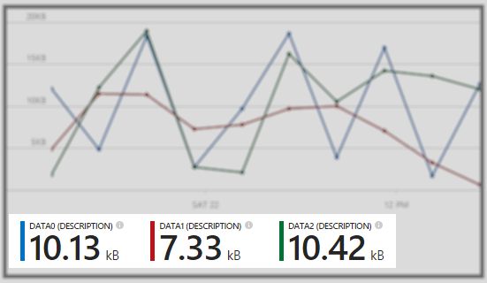

## Charts
Insert chart controls in your experience to allow your users to visualize and analyze their data.

[Chart](../media/portalfx-ui-concepts/chart.png)

In most cases, you will probably want to use the chart [intrinsic part](portalfx-.md). The intrinsic part is maintained by the framework and will provide you with consistent layout with the rest of the portal.

If you are using a custom part template, charts can be added with the following html:

```xml
<div data-bind='pcChart: chartVM' style='height:500px'></div>
```

### Chart views and series views

Our charts include the following **chart view** types which can be used separately or in tandem:

* Line
* Grouped bar
* Stacked bar
* Scatter
* Area
* Stacked area 

Chart views are the high-level view type for your chart.

```ts
// Initialize the view.  This is the code that makes this chart a bar chart.
var barChartView = new MsPortalFx.ViewModels.Controls.Visualization.Chart.BarChartView<string, number>(MsPortalFx.ViewModels.Controls.Visualization.Chart.BarChartType.Grouped);
this.chartVM.views([barChartView]);
```

A sample chart viewmodel with a single chart view type can be found here:
`\Client\Controls\Chart\ViewModels\BarChartViewModels.ts`

A sample chart viewmodel with multiple chart view types can be found here:
`\Client\Controls\Chart\ViewModels\OverlayedViewChartViewModel.ts`

**Series views** are visualizations of individual data series. Series views allow you to modify the color, display name, and interaction behavior of a particular series.

By default, series views will be generated for each of the chart views and each of the data series you add to your chart. For example, let's say you added three data series, seriesA, seriesB, and seriesC to a chart that has two chart views, a bar chart view and a line chart view. Your chart would have 6 series views, a bar chart series view and a line chart series view for each series. This default behavior is ideal for simple charts, especially those with one chart view type.

In some cases you may want to do some more interesting things with series views. Perhaps instead you want seriesA and seriesB to be visualized as bars and seriesC to be visualized as a line. To achieve this behavior you will need to turn off the auto-generate behavior.

```ts
this.chartVM.autogenerateSeriesViews(false);
```

You can then create and specialize your series views however you'd like.

```ts
var lineSeriesView = new MsPortalFx.ViewModels.Controls.Visualization.Chart.LineChartSeriesView<string, number>();
lineSeriesView.seriesName("LineSeries");
lineSeriesView.cssClass("msportalfx-bgcolor-c1");

var barSeriesView = new MsPortalFx.ViewModels.Controls.Visualization.Chart.SeriesView<string, number>(MsPortalFx.ViewModels.Controls.Visualization.Chart.BarChartType.Stacked);
barSeriesView.seriesName("BarSeries");

lineChartView.seriesView([lineSeriesView]);
barChartView.seriesView([barSeriesView]);
```

A good example of using the chart's auto-generated series views functionality is:
`\Client\Controls\Chart\ViewModels\LineChartDateBasedViewModels.ts`

To see a more advanced sample where series views are created explicitly by the extension see
`\Client\Controls\Chart\ViewModels\OverlayedViewChartViewModels.ts`

### Metrics
Metrics are the big data call-outs that pair with our chart controls to give the user interactive peeks into their data. Metrics can be configured manually by handling chart events, calculating values, and passing information to the metrics controls or by setting up metrics rules. 



### Metrics rules
Metrics rules are a rule-based system that automatically hooks up metric values to different user interactions. For instance, by default (when the user is not interacting with the chart area) you may want your chart metrics to show the average value of each data series. This rule can be configured like so:

```ts
metricRule1.scope(Chart.MetricRuleScope.Default);
metricRule1_metric1.aggregationScope(Chart.MetricRuleAggregationScope.AllSeparately);
metricRule1_metric1.aggregationType(Chart.MetricRuleAggregationType.AverageY);
```

With this rule configured, when the user is not interacting with the chart area they will see one metric representing the average value of each data series on the chart.

See the following file for a full example of the metrics rules implementation:
`\Client\Controls\Chart\ViewModels\LineChartDateTimeViewModels.ts`
